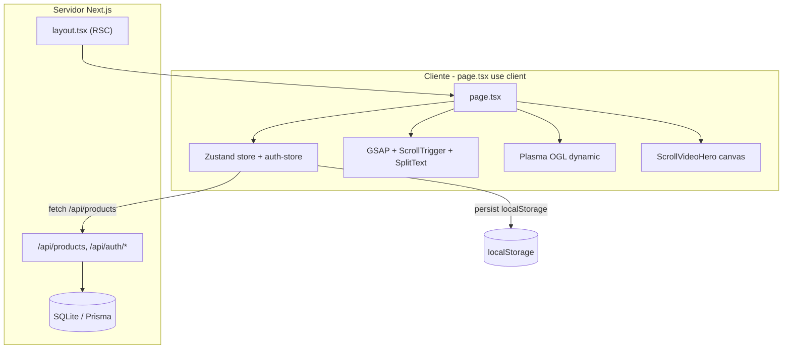

# Auditoría Técnica — N10K E-commerce

> Generada con asistencia de IA en modo solo-análisis. No se ha modificado código.

## 0. Metadatos

| Campo | Valor |
|-------|-------|
| **Fecha** | 2026-06-16 |
| **Modo** | Solo análisis (read-only) |
| **Alcance** | `src/`, `prisma/`, `scripts/`, config (`next.config.ts`, `tsconfig.json`, `tailwind.config.ts`, `postcss.config.mjs`, `eslint.config.mjs`, `components.json`, `Caddyfile`), `public/`, `package.json` |
| **Fuera de alcance detallado** | `examples/`, `.zscripts/`, `download/` (mencionados donde impactan arquitectura) |

### Stack declarado vs verificado

| Tecnología | Versión en `package.json` | Verificado en código |
|------------|---------------------------|----------------------|
| Next.js | `^16.1.1` | ✅ `src/app/` App Router |
| React / React DOM | `^19.0.0` | ✅ |
| TypeScript | `^5` | ✅ `tsconfig.json` |
| Tailwind CSS | `^4` (+ `@tailwindcss/postcss ^4`) | ✅ `globals.css:1`, `postcss.config.mjs:2` |
| Prisma / `@prisma/client` | `^6.11.1` | ✅ `prisma/schema.prisma`, API routes |
| NextAuth | `^4.24.11` | ⚠️ En deps; **0 imports en `src/`** |
| next-intl | `^4.3.4` | ⚠️ En deps; **0 imports en `src/`** |
| TanStack Query | `^5.82.0` | ⚠️ En deps; **0 imports en `src/`** |
| Zustand | `^5.0.6` | ✅ `src/lib/store.ts`, `src/lib/auth-store.ts` |
| Framer Motion | `^12.23.2` | ⚠️ En deps; **0 imports en `src/`** |
| next-themes | `^0.4.6` | ⚠️ En deps; **0 imports en `src/`** |
| GSAP | `^3.15.0` | ✅ `src/lib/gsap-init.ts` + múltiples componentes |
| OGL | `^1.0.11` | ✅ `src/components/n10k/Plasma.tsx` |
| Bun (runtime scripts) | `bun-types ^1.3.4` | ✅ `package.json:8` (`bun .next/standalone/server.js`) |
| z-ai-web-dev-sdk | `^0.0.18` | ⚠️ En deps; **0 imports en `src/`** |
| RHF + Zod | `^7.60.0` / `^4.0.2` | ⚠️ Solo en scaffold `src/components/ui/form.tsx`; **no usado en `n10k/`** |
| Sonner | `^2.0.6` | ⚠️ Wrapper en `src/components/ui/sonner.tsx`; layout usa Radix toast (`toaster.tsx`) |
| JWT / bcrypt | bcrypt ✅; JWT | ⚠️ bcrypt en `auth-utils.ts`; **JWT no verificado en `src/`** |

### Rutas App Router existentes

- `src/app/page.tsx` — única página UI
- `src/app/layout.tsx` — root layout
- `src/app/api/**` — 7 route handlers (`products`, `auth/*`, `newsletter`, `reviews`, `route.ts`)
- **Ausentes:** `loading.tsx`, `error.tsx`, `not-found.tsx`, `middleware.ts` (0 archivos encontrados)

---

## 1. Resumen Ejecutivo

### Veredicto general

N10K es una **landing e-commerce de alto impacto visual** (hero canvas + MP4 8,9 MB, Plasma WebGL, GSAP, glass UI) montada sobre un **scaffold Next.js 16** con capa Prisma/SQLite **parcialmente cableada** y estado de negocio **100 % client-side** (Zustand + `localStorage`). Tras re-auditoría de cobertura (Bloque A), los assets en `public/` **sí están presentes** en este workspace (74 archivos, 16,25 MB), pero el **MP4 del hero concentra el 54 % del peso** [PERF-019] y la extracción secuencial de frames [PERF-001] explica la lentitud extrema en móvil. **No está listo para producción e-commerce** sin resolver bloqueadores de auth, build/deploy, integridad de stock y SEO.

**Puntuación cualitativa:** arquitectura y seguridad **insuficientes**; UX/animaciones **sobre-dimensionadas** para mobile; calidad de código **heterogénea** (scaffold masivo + megacomponentes sin tests).

### Métricas de la auditoría (post Bloque A — 2026-06-16)

| Métrica | Valor |
|---------|-------|
| **Hallazgos totales** | **293** |
| 🔴 Críticos | **17** (5,8 %) |
| 🟠 Altos | **70** (23,9 %) |
| 🟡 Medios | **154** (52,6 %) |
| 🔵 Bajos | **43** (14,7 %) |
| ⚪ Informativos | **9** (3,1 %) |
| **Componentes `n10k/` auditados** | **28** `.tsx` (+ `Plasma.css`) |
| **Hooks auditados** | **5/5** (`use-long-press-video`, `use-scroll-visible`, `use-scroll-animation`, `use-mobile`, `use-toast`) |
| **Scripts `scripts/` auditados** | **11/11** `.mjs` |
| **`public/` peso verificado** | **16,25 MB** / 74 archivos |
| **Tests automatizados** | 0 |

#### Conteo por sección (prefijo)

| Sección | Prefijo | Total | 🔴 | 🟠 | 🟡 | 🔵 | ⚪ |
|---------|---------|-------|----|----|----|----|-----|
| §3 Arquitectura | ARQ | 28 | 2 | 8 | 14 | 3 | 1 |
| §4 Bugs | BUG | 31 | 3 | 8 | 17 | 3 | 0 |
| §5 Rendimiento | PERF | 19 | 2 | 6 | 10 | 1 | 0 |
| §6 Mobile | MOB | 38 | 2 | 11 | 20 | 5 | 0 |
| §7 Anim/WebGL | ANIM | 18 | 1 | 4 | 10 | 2 | 1 |
| §8 Seguridad | SEC | 34 | 6 | 10 | 14 | 1 | 3 |
| §9 Datos | DATA | 29 | 1 | 6 | 17 | 4 | 1 |
| §10 a11y | A11Y | 34 | 0 | 6 | 18 | 9 | 1 |
| §10 SEO | SEO | 14 | 0 | 6 | 5 | 2 | 1 |
| §11 Calidad | QUAL | 10 | 0 | 1 | 5 | 3 | 1 |
| §11 Calidad (Bloque B) | QA | 23 | 0 | 2 | 13 | 8 | 0 |
| §11 Dependencias | DEP | 15 | 0 | 2 | 10 | 3 | 0 |

### Top 10 problemas más críticos

| # | ID | Por qué importa |
|---|-----|-----------------|
| 1 | **PERF-001** + **PERF-019** + **MOB-020** | Hero: descarga 8,9 MB + extracción frame-a-frame bloquea main thread → LCP/TBT catastróficos en 4G. |
| 2 | **SEC-001** + **SEC-002** + **SEC-013** | Auth falsificable (`x-user-id`), sin sesión server, mock localStorage prioriza sobre bcrypt. |
| 3 | **BUG-014** + **BUG-015** | Venta de tallas agotadas — integridad e-commerce rota en UI y quick-add. |
| 4 | **ARQ-002** + **ARQ-020** | Build `standalone` no declarado; script POSIX falla en Windows. |
| 5 | **DATA-010** | SQLite no apto multi-instancia / serverless. |
| 6 | **MOB-030** + **ANIM-003** | ScrollTrigger pin + scrub + redraw canvas → jank severo al scroll en touch. |
| 7 | **BUG-013** | `setState` en render en `ProductDetail` — crash React en navegación producto. |
| 8 | **SEO-003** + **SEO-004** | Catálogo invisible a crawlers; cero URLs producto. |
| 9 | **ARQ-001** + **QA-005** | Monolito client-only; 20+ imports estáticos — bundle inicial inflado. |
| 10 | **SEC-018** + **DATA-024** | Reseñas públicas sin sanitización — vector XSS almacenado. |

### Diagnóstico: por qué la web va lenta en móvil

La lentitud percibida no es un bug aislado sino **cinco capas superpuestas**:

1. **Red (MOB-020, PERF-019):** `hero-banner-hd.mp4` (8856 KB) se descarga antes de pintar; sin variante mobile ni `prefers-reduced-data` [MOB-023].
2. **Main thread (PERF-001, ANIM-001):** Tras descargar el MP4, loop secuencial seek→canvas→`createImageBitmap` (~120 frames) bloquea interacción 3–8 s en gama media.
3. **Doble gate inicial (MOB-006, MOB-033):** `LoadingScreen` GSAP (~1,8 s + safety 3500 ms) **antes** de que termine la extracción — usuario ve spinner prolongado.
4. **Scroll jank (MOB-030, ANIM-003):** Hero pinneado `+=200%` [MOB-002] + redraw canvas por frame de scroll + Plasma WebGL [MOB-024] compiten por GPU/CPU.
5. **Payload imagen (MOB-019, PERF-013):** Catálogo con `` nativo sin `sizes`/srcset; 30+ WebP por SKU a resolución completa [MOB-021]; fuentes Montserrat 5 pesos [MOB-025].

**Quick wins mobile (Fase B roadmap):** [PERF-019] variante video mobile, [MOB-023] reduced-data, [BUG-017] cleanup ScrollTrigger, [MOB-001] safe-area, [PERF-011] lazy modales.

### Bloqueadores críticos (acción inmediata)

1. **Autenticación inexistente en servidor** — [ARQ-010], [SEC-001]…[SEC-003], [SEC-011]…[SEC-015], [BUG-001].
2. **Build/deploy roto o frágil** — [ARQ-002], [ARQ-020].
3. **Hero canvas + MP4 8,9 MB** — [PERF-001], [PERF-019], [ANIM-001], [MOB-020], [MOB-030].
4. **Integridad e-commerce** — [BUG-013], [BUG-014], [BUG-015], [BUG-031] (script ops).
5. **SQLite multi-instancia** — [DATA-010].
6. **SEO/catálogo client-only** — [SEO-003], [SEO-004].

> Roadmap detallado por fases en **§13**. Índice completo en **§2**.

---

## 2. Tabla de Hallazgos (índice)

> **293 hallazgos** ordenados por **severidad** (🔴 → ⚪), luego por prefijo e ID. Clic en ID → salto a detalle en §3–§11. Leyenda esfuerzo: **S** ≤1 día · **M** 2–5 días · **L** >1 semana.  
> **Cobertura Bloque A:** `scripts/` (11), `Caddyfile`, `public/` (peso), 5 hooks, 28 componentes `n10k/*.tsx` — ver §12.8.

| ID | Título | Severidad | Categoría | Esfuerzo |
|----|--------|-----------|-----------|----------|
| ARQ-001 | Monolito Client Component en ruta única sin code-splitting efectivo | 🟠 Alta | App Router | L |
| ARQ-002 | Script de build asume `output: 'standalone'` pero `next.config.ts` no lo declara | 🔴 Crítica | Config | S |
| ARQ-003 | Dependencias declaradas en stack pero sin uso en `src/` | 🟠 Alta | Dependencias | M |
| ARQ-004 | `prisma` CLI en `dependencies` en lugar de `devDependencies` | 🟡 Media | Config | S |
| ARQ-005 | Configuración dual Tailwind 3 + Tailwind 4 (CSS-first) | 🟡 Media | Tailwind | M |
| ARQ-006 | `tailwind.config.ts` `content` no incluye `src/hooks/` ni `src/lib/` | 🔵 Baja | Tailwind | S |
| ARQ-007 | `Caddyfile` sin cabeceras de seguridad, compresión ni caché de estáticos | 🟠 Alta | Infra | M |
| ARQ-008 | Ausencia total de boundaries App Router (`loading`, `error`, `not-found`, `Suspense`) | 🟠 Alta | App Router | M |
| ARQ-009 | `layout.tsx` sin providers de theme, i18n, TanStack Query ni auth session | 🟡 Media | App Router | M |
| ARQ-010 | Tres modelos de autenticación desalineados (NextAuth dep + Zustand localStorage + API `x-user-id` sin emisión client-side) | 🔴 Crítica | Auth | L |
| ARQ-011 | `checkSession()` es no-op pero se invoca en mount de home | 🟠 Alta | Auth | S |
| ARQ-012 | Componentes legacy huérfanos (`HeroSection`, `QuickView`) | 🟡 Media | Organización | S |
| ARQ-013 | Code-splitting limitado a un solo componente (`Plasma`) | 🟡 Media | Rendimiento | M |
| ARQ-014 | Schema Prisma rico (cart/wishlist/orders) vs runtime 100 % Zustand + localStorage | 🟠 Alta | Capa de datos | L |
| ARQ-015 | Scaffold shadcn/ui masivo (~48 componentes, ~7 usados por features N10K) | 🟡 Media | Organización | M |
| ARQ-016 | `allowedDevOrigins` hardcodeados para dominios Z.ai en config de producción | 🟡 Media | Config | S |
| ARQ-017 | Headers de seguridad incompletos en Next (sin CSP, HSTS, Permissions-Policy) | 🟠 Alta | Seguridad | M |
| ARQ-018 | `tsconfig` con `strict: true` pero `noImplicitAny: false` | 🟡 Media | TypeScript | M |
| ARQ-019 | ESLint con reglas críticas desactivadas globalmente | 🟡 Media | Calidad | M |
| ARQ-020 | Script `build` usa `cp` Unix y variables POSIX (`NODE_ENV=`) — frágil en Windows | 🟡 Media | Config | S |
| ARQ-021 | Paquetes scaffold adicionales sin uso en `src/` (dnd-kit, mdxeditor, react-markdown, etc.) | 🟡 Media | Dependencias | S |
| ARQ-022 | Carpetas auxiliares (`examples/`, `download/`) en repo productivo | 🔵 Baja | Organización | S |
| ARQ-023 | `LoadingScreen` Client Component con GSAP en root layout (bloqueo inicial) | 🟡 Media | App Router | M |
| ARQ-024 | `globals.css` monolítico (~2448 líneas) mezclando tokens, utilidades y dominio | 🟡 Media | CSS | L |
| ARQ-025 | Route handler placeholder `/api` sin valor productivo | 🔵 Baja | API | S |
| ARQ-026 | Ausencia de `middleware.ts` (auth, rate-limit, i18n, redirects) | 🟠 Alta | App Router | M |
| ARQ-027 | Productos fetched client-side vía Zustand en lugar de Server Component / RSC cache | 🟡 Media | App Router | M |
| ARQ-028 | GSAP `SplitText` (plugin Club) registrado globalmente | ⚪ Informativa | Licenciamiento | M |
| BUG-001 | Auth mock con contraseñas en texto plano en `localStorage` | 🔴 Crítica | Auth | M |
| BUG-002 | Registro prioriza mock local y llama API en fire-and-forget | 🟠 Alta | Auth | M |
| BUG-003 | `updateProfile` solo muta Zustand; no persiste en servidor | 🟠 Alta | Auth | S |
| BUG-004 | `ScrollVideoHero` sin fallback si falla extracción de frames | 🟠 Alta | Runtime | M |
| BUG-005 | Fallback `ImageBitmap` incorrecto (cast HTMLCanvasElement) | 🟡 Media | Runtime | S |
| BUG-006 | API `/api/newsletter` implementada pero nunca consumida | 🟡 Media | Lógica | S |
| BUG-007 | API `/api/reviews` implementada pero nunca consumida | 🟡 Media | Lógica | M |
| BUG-008 | Compartir producto usa `window.location.href` (siempre URL de home) | 🟡 Media | Lógica | M |
| BUG-009 | `SplitText`/`SplitChars` no reaccionan a cambio de prop `text` | 🟡 Media | React | S |
| BUG-010 | ScrollTriggers pueden quedar con posiciones stale tras hero pin dinámico | 🟡 Media | GSAP | M |
| BUG-011 | Provisioning assets: resuelto en workspace; sin doc clone fresco | 🔵 Baja | Runtime / Deploy | S |
| BUG-012 | `fetchGuard` global mutable — condición de carrera en retry | 🔵 Baja | Estado | S |
| BUG-013 | `setState` durante el render al cambiar producto en `ProductDetail` | 🔴 Crítica | React | S |
| BUG-014 | `handleAddToCart` permite tallas en `outOfStock` | 🔴 Crítica | E-commerce | S |
| BUG-015 | Quick-add y wishlist horizontal ignoran stock de talla | 🟠 Alta | E-commerce | S |
| BUG-016 | `useToast`: `useEffect` con dep `[state]` re-registra listeners | 🟠 Alta | React | S |
| BUG-017 | `ScrollTrigger.create` sin cleanup en tarjetas de `ProductGrid` | 🟠 Alta | GSAP | S |
| BUG-018 | Extracción async hero sin flag de cancelación (setState post-unmount) | 🟠 Alta | Async | M |
| BUG-019 | `defaultColor` accede a `colors[0].name` sin optional chaining | 🟡 Media | Null | S |
| BUG-020 | `fetchProducts` no valida que respuesta sea array | 🟡 Media | Async | S |
| BUG-021 | Catálogo no se re-fetcha tras primer éxito (`productsStatus === 'success'`) | 🟡 Media | E-commerce | M |
| BUG-022 | `JSON.parse` de localStorage sin validar tipo array | 🟡 Media | JSON inseguro | S |
| BUG-023 | Carrito sin tope de cantidad ni validación de inventario | 🟡 Media | E-commerce | M |
| BUG-024 | Totales monetarios con aritmética float sin normalización a centavos | 🟡 Media | E-commerce | M |
| BUG-025 | `SearchModal`: navegación teclado desincronizada con UI sin resultados | 🟡 Media | Lógica | S |
| BUG-026 | `transformProduct` omite campo `slug` | 🟡 Media | TypeScript | S |
| BUG-027 | `Header` menú móvil: texto cuenta sin guard `mounted` | 🟡 Media | Hidratación | S |
| BUG-028 | `FloatingParticles`: `Math.random()` en `useMemo` — riesgo hydration mismatch | 🔵 Baja | Hidratación | S |
| BUG-029 | `handleNotifySubmit` mock sin validación email ni backend | 🟡 Media | Async | M |
| BUG-030 | `auth-store.login` no valida forma de `data.user` | 🟡 Media | Async | S |
| BUG-031 | Script `enable-all-sizes.mjs` anula stock real en DB | 🟠 Alta | Integridad datos / Ops | S |
| PERF-001 | Extracción de frames del hero — coste CPU/RAM extremo en main thread | 🔴 Crítica | Rendimiento | L |
| PERF-002 | Múltiples bucles RAF/GSAP simultáneos en mount | 🟠 Alta | Rendimiento | M |
| PERF-003 | `globals.css` monolítico (~2448 líneas) en critical path | 🟠 Alta | CSS | L |
| PERF-004 | Montserrat: 5 pesos cargados vía `next/font` | 🟡 Media | Fuentes | S |
| PERF-005 | Product cards usan `` nativo en lugar de `next/image` | 🟡 Media | Imágenes | M |
| PERF-006 | `InteractiveBackground`: imagen full-viewport `loading="eager"` sin optimizar | 🟡 Media | LCP | S |
| PERF-007 | `ScrollProgress` provoca re-render React en cada scroll | 🔵 Baja | Rendimiento | S |
| PERF-008 | `ProductGrid.tsx` ~1354 LOC — componente megabundle | 🟡 Media | Bundle | M |
| PERF-009 | Dependencias muertas inflan install y potencial bundle | 🟡 Media | Bundle | S |
| PERF-010 | GSAP+ScrollTrigger+SplitText+OGL en chunk inicial vía imports estáticos | 🟠 Alta | Bundle | M |
| PERF-011 | Modales, sidebars y `ProductDetail` sin `next/dynamic` (solo Plasma lazy) | 🟠 Alta | Code-splitting | M |
| PERF-012 | Secciones below-the-fold montadas en first paint sin diferir | 🟡 Media | Render inicial | M |
| PERF-013 | Catálogo 30+ URLs imagen/producto — payload JSON y `` sin `sizes`/lazy explícito | 🟠 Alta | Imágenes / Red | M |
| PERF-014 | `media-version.ts` + `Cache-Control` corto invalidan caché HTTP de productos | 🟡 Media | Caché | S |
| PERF-015 | `.animate-float` duplicado con `@keyframes` distintos; purge TW4 incompleto | 🟡 Media | CSS | M |
| PERF-016 | Zustand: suscripciones amplias y grid sin virtualización | 🟡 Media | React | M |
| PERF-017 | `/api/products` sin paginación, ISR ni headers de caché; fetch solo client | 🟠 Alta | Red / Datos | M |
| PERF-018 | Tres candidatos `priority` compiten por LCP (LoadingScreen, Header, Hero) | 🟡 Media | LCP / Fuentes | S |
| PERF-019 | `hero-banner-hd.mp4` pesa 8,86 MB — 54 % de `public/` | 🔴 Crítica | Assets / Red / Mobile | M |
| MOB-001 | Sin `safe-area-inset` en nav flotante, WhatsApp y padding de página | 🟠 Alta | Mobile UX | S |
| MOB-002 | Hero scroll-pin `+=200%` — scroll journey largo en pantallas pequeñas | 🟠 Alta | Mobile UX | M |
| MOB-003 | Sección Novedades: video preview solo hover — sin long-press en mobile | 🟡 Media | Mobile UX | S |
| MOB-004 | Marquee tipográfico extremo en mobile (`text-[10rem]` track) | 🟡 Media | Mobile UX | S |
| MOB-005 | `manifest.json` `display: standalone` + `orientation: portrait-primary` | 🟡 Media | PWA | S |
| MOB-006 | LoadingScreen + hero extraction — doble bloqueo percibido al inicio | 🟡 Media | Mobile UX | M |
| MOB-007 | FloatingNavBar: iconos sin label en `< sm` — riesgo de target pequeño | 🔵 Baja | Mobile UX | S |
| MOB-008 | Múltiples listeners `scroll`/`resize` sin consolidación | 🔵 Baja | Mobile Rendimiento | M |
| MOB-009 | `h-screen`/`min-h-screen` (`100vh`) sin `dvh`/`svh` — saltos barra URL iOS | 🟠 Alta | Responsive | S |
| MOB-010 | Frost overlay `.frost-content` solo `@media (hover: hover)` — quick-add invisible en touch | 🟠 Alta | Touch UX | M |
| MOB-011 | FeaturedProducts quick-add `opacity-0 group-hover:opacity-100` sin alternativa táctil | 🟠 Alta | Touch UX | S |
| MOB-012 | Áreas táctiles &lt;44px (header icons, dots carrusel, footer social, cookie dismiss) | 🟡 Media | Touch UX | M |
| MOB-013 | WishlistSection botón eliminar 24×24px + `opacity-0 group-hover:opacity-100` | 🟡 Media | Touch UX | S |
| MOB-014 | SearchModal sin scroll-lock ni focus trap (solo Escape parcial) | 🟠 Alta | Modales / Touch | M |
| MOB-015 | Menú móvil Header: sin Escape, scroll-lock ni focus trap | 🟡 Media | Modales / Touch | M |
| MOB-016 | CookieConsent `z-[70]` tapa FloatingNav/WhatsApp; dismiss (X) `hidden sm:flex` | 🟡 Media | Layout / Touch | S |
| MOB-017 | WishlistSection sin offset bajo Header `fixed` (`h-16`/`h-20`) | 🟡 Media | Responsive | S |
| MOB-018 | Cero atributos `sizes` en `<Image>` de Next.js | 🟠 Alta | Imágenes móvil | M |
| MOB-019 | Catálogo usa `` nativo sin `loading`, `srcset` ni pipeline responsive | 🟠 Alta | Imágenes móvil | L |
| MOB-020 | Hero `hero-banner-hd.mp4` `preload='auto'` + extracción secuencial de frames | 🔴 Crítica | Vídeo móvil | L |
| MOB-021 | Galería producto: 30+ WebP por SKU servidos a resolución completa en modal | 🟠 Alta | Imágenes móvil | M |
| MOB-022 | Vídeos producto sin `poster` ni `preload="none"` hasta interacción | 🟡 Media | Vídeo móvil | S |
| MOB-023 | Sin `prefers-reduced-data` / `navigator.connection.saveData` — assets pesados siempre | 🟠 Alta | Datos / red | M |
| MOB-024 | Plasma WebGL + InteractiveBackground + ScrollVideoHero en misma página | 🟠 Alta | Datos / red | M |
| MOB-025 | Montserrat 5 pesos (`500`–`900`) en payload inicial de fuentes | 🟡 Media | Datos / red | S |
| MOB-026 | Tres `priority` compiten LCP (LoadingScreen, Header, ScrollVideoHero) | 🟡 Media | Imágenes móvil | S |
| MOB-027 | `InteractiveBackground` carga `/brand/bg-n10k.webp` con `loading="eager"` | 🟡 Media | Datos / red | S |
| MOB-028 | Canvas hero DPR hasta `2` vs Plasma cap `1.5` | 🟡 Media | Imágenes / GPU | S |
| MOB-029 | Sin `export const viewport` / `viewportFit: 'cover'` para safe-area | 🟡 Media | Viewport / meta | S |
| MOB-030 | GSAP ScrollTrigger `pin: true` + `scrub: 0.1` + redraw canvas por scroll | 🔴 Crítica | Performance percibida | L |
| MOB-031 | `scroll-behavior: smooth` global + `scrollTo({ behavior: 'smooth' })` en nav | 🔵 Baja | Performance percibida | S |
| MOB-032 | `backdrop-filter`/`backdrop-blur-*` extensivo en glass UI móvil | 🟡 Media | Performance percibida | M |
| MOB-033 | LoadingScreen GSAP ~1.8s + safety 3500ms ignora `prefers-reduced-motion` en JS | 🟡 Media | CLS / Performance percibida | M |
| MOB-034 | ProductDetail vídeo slide `autoPlay` en galería móvil (batería/decodificación) | 🔵 Baja | Vídeo móvil | S |
| MOB-035 | Breakpoint inconsistente: CSS `@media (max-width: 767px)` vs hook `768px` | 🔵 Baja | Responsive | S |
| MOB-036 | SearchModal `mt-[10vh]` — teclado virtual iOS/Android puede tapar input de búsqueda | 🟡 Media | Viewport / meta | S |
| MOB-037 | CookieConsent aparece tras 1500ms fixed bottom — solapa CTAs fijos (shift interacción) | 🟡 Media | CLS móvil | S |
| MOB-038 | `RecentlyViewedSection`: overlay «Ver detalle» solo en hover | 🟡 Media | Touch UX | S |
| ANIM-001 | Hero canvas: extracción secuencial bloquea main thread | 🔴 Crítica | Video | L |
| ANIM-002 | Plasma WebGL: shader con loop 60 iteraciones por píxel | 🟠 Alta | WebGL | M |
| ANIM-003 | GSAP ScrollTrigger `pin: true` en hero compite con scroll nativo | 🟠 Alta | GSAP | M |
| ANIM-004 | JS animations ignoran `prefers-reduced-motion` (solo CSS parcial) | 🟡 Media | a11y | M |
| ANIM-005 | Contención GPU triple: Canvas hero + WebGL Plasma + N× `<video>` en grid | 🟡 Media | GPU | M |
| ANIM-006 | `SplitText` muta DOM accesible — riesgo lectores de pantalla | 🟡 Media | a11y | M |
| ANIM-007 | Newsletter: marquees CSS infinitos + GSAP marquees en misma sesión | 🔵 Baja | Animaciones | S |
| ANIM-008 | Plasma: sin fallback si WebGL2 unavailable | 🟡 Media | WebGL | S |
| ANIM-009 | ScrollVideoHero: `Image` con `ref={logoImgRef}` — ref inválido en Next.js Image | 🟡 Media | Runtime | S |
| ANIM-010 | `ScrollTrigger.create` por tarjeta de producto sin `kill`/`revert` al desmontar | 🟠 Alta | GSAP / Memoria | M |
| ANIM-011 | Framer Motion en deps sin imports — cero conflicto hoy, riesgo ~30 KB si se cablea | ⚪ Info | Dependencias | S |
| ANIM-012 | Plasma: pausa por IO pero no por `document.hidden` (pestaña oculta) | 🟡 Media | WebGL / Batería | S |
| ANIM-013 | ScrollVideoHero: `setState` por frame extraído; sin `rvfc`; sin variante mobile | 🟠 Alta | Canvas / Video | L |
| ANIM-014 | GSAP anima `filter: blur()` en SplitText — propiedad no compositable | 🟡 Media | GSAP / Paint | M |
| ANIM-015 | `InteractiveBackground`: glow anima `left`/`top` cada RAF (layout thrashing) | 🟡 Media | Scroll / Paint | S |
| ANIM-016 | Marquee GSAP `repeat: -1` sin pausa IO ni guard reduced-motion | 🟡 Media | GSAP / CPU | S |
| ANIM-017 | `will-change` en múltiples capas fijas (background, hero, marquees) | 🔵 Baja | Compositing | S |
| ANIM-018 | ≥6 listeners `scroll` sin throttle compartido (ScrollProgress, BackToTop, etc.) | 🔵 Baja | Scroll / INP | M |
| SEC-001 | Header `x-user-id` falsificable — auth API sin firma | 🔴 Crítica | Auth | L |
| SEC-002 | Login/register sin sesión server-side (solo JSON + localStorage) | 🔴 Crítica | Auth | L |
| SEC-003 | Mock auth: contraseñas plaintext en `localStorage` | 🔴 Crítica | Auth | S |
| SEC-004 | `/api/auth/*` sin rate limiting — brute-force y enumeración | 🟠 Alta | Auth | M |
| SEC-005 | Endpoints mutación públicos sin auth ni throttle | 🟠 Alta | API | M |
| SEC-006 | Headers seguridad incompletos (CSP, HSTS) | 🟠 Alta | Config | M |
| SEC-007 | Política contraseña débil (mín. 6 caracteres) | 🟡 Media | Auth | S |
| SEC-008 | Cookie banner cosmético — consent no gatea scripts | 🟡 Media | Privacidad | M |
| SEC-009 | `User.role` retornado al cliente — confianza en RBAC client-side | 🟡 Media | Auth | S |
| SEC-010 | bcrypt cost 10 — aceptable; sin pepper | ⚪ Informativa | Crypto | S |
| SEC-011 | NextAuth en dependencias sin ruta ni configuración — auth fantasma | 🔴 Crítica | Auth | M |
| SEC-012 | JWT inexistente — `auth-utils.ts` solo bcrypt + header falsificable | 🔴 Crítica | Auth | M |
| SEC-013 | Mock `localStorage` prioridad sobre API — bypass bcrypt en login | 🔴 Crítica | Auth | M |
| SEC-014 | `checkSession()` no-op; `/api/auth/me` nunca consumido | 🟠 Alta | Auth | M |
| SEC-015 | Token/sesión en `localStorage` (Zustand persist) — robo vía XSS | 🟠 Alta | Auth | M |
| SEC-016 | Validación Zod ausente en servidor | 🟠 Alta | API | M |
| SEC-017 | `/api/auth/me` PUT sin límites en `name` | 🟠 Alta | Auth | S |
| SEC-018 | Reseñas: `comment`/`userName` sin sanitización — stored XSS | 🟠 Alta | API | M |
| SEC-019 | Reseñas anónimas con `userName` arbitrario — suplantación | 🟠 Alta | API | S |
| SEC-020 | Login carga hash `password` completo — `findUnique` sin `select` | 🟡 Media | Auth | S |
| SEC-021 | `request.json()` sin límite de tamaño en POST — DoS body | 🟡 Media | API | S |
| SEC-022 | Sin protección CSRF para futura auth basada en cookies | 🟡 Media | Auth | M |
| SEC-023 | HSTS ausente en Next y Caddy | 🟡 Media | Config | S |
| SEC-024 | `Permissions-Policy` ausente | 🟡 Media | Config | S |
| SEC-025 | Sin `Content-Security-Policy` | 🟡 Media | Config | M |
| SEC-026 | Caddyfile: proxy dinámico `XTransformPort` — SSRF local | 🟠 Alta | Infra | M |
| SEC-027 | `window.open('_blank')` sin `noopener,noreferrer` | 🟡 Media | Client | S |
| SEC-028 | `User.avatar` en schema sin endpoint — vector futuro | 🟡 Media | Auth | S |
| SEC-029 | Sin `AUTH_SECRET` / `JWT_SECRET` definidos | 🟡 Media | Config | S |
| SEC-030 | `allowedDevOrigins` Z.ai hardcodeados en prod | 🟡 Media | Config | S |
| SEC-031 | `console.error` en catch API loguea error completo | 🔵 Baja | Logs | S |
| SEC-032 | Sin secretos en `NEXT_PUBLIC_*` — superficie limpia | ⚪ Informativa | Secretos | S |
| SEC-033 | `z-ai-web-dev-sdk` en deps sin uso runtime | ⚪ Informativa | Dependencias | S |
| SEC-034 | Prisma parametrizado; filtros API sin validar formato | 🟡 Media | Datos | S |
| DATA-001 | Precios monetarios como `Float` en Prisma (pérdida de precisión) | 🟠 Alta | Schema | M |
| DATA-002 | `Order.status` como `String` libre sin enum Prisma | 🟡 Media | Schema | S |
| DATA-003 | `CartItem` sin constraint unique compuesto (duplicados posibles en DB) | 🟡 Media | Schema | S |
| DATA-004 | `WishlistItem` unique con `colorName` nullable — SQLite semántica NULL | 🔵 Baja | Schema | S |
| DATA-005 | Sin índices en columnas filtradas/ordenadas de `Product` | 🟡 Media | Schema | S |
| DATA-006 | Sin índice en `Review.productId` (filtro principal GET reviews) | 🟡 Media | Schema | S |
| DATA-007 | `ProductSize` sin campo cantidad — solo boolean `outOfStock` | 🟡 Media | Schema | L |
| DATA-008 | Relaciones `onDelete: Cascade` correctas en hijos; User borrado cascada orders/cart | ⚪ Informativa | Schema | M |
| DATA-009 | SQLite como único datasource — límites concurrencia escritura | 🟠 Alta | SQLite | L |
| DATA-010 | SQLite en serverless / multi-instancia: archivo `.db` no compartido | 🔴 Crítica | SQLite | L |
| DATA-011 | 0 migraciones Prisma en repo; solo `db:push` | 🟠 Alta | Prisma | M |
| DATA-012 | Archivo `.db` gitignored — clone fresco sin datos | 🟡 Media | SQLite | M |
| DATA-013 | Cliente Prisma singleton parcial — solo cache global en non-production | 🟡 Media | Prisma Client | S |
| DATA-014 | GET `/api/products` sin paginación ni límite | 🟡 Media | API | M |
| DATA-015 | GET `/api/reviews` sin paginación | 🟡 Media | API | S |
| DATA-016 | Consulta products trae relaciones completas (sin `select` específico en list) | 🔵 Baja | Consultas | M |
| DATA-017 | Sin transacciones en flujos Order + OrderItems + stock (modelo existe, API ausente) | 🟠 Alta | Transacciones | L |
| DATA-018 | Divergencia IDs/slugs: static catalog vs Prisma cuid | 🟠 Alta | Static vs DB | M |
| DATA-019 | Fallback static fuerza `outOfStock: []` ignorando DB stock | 🟡 Media | Static vs DB | S |
| DATA-020 | Fallback static `rating: 0` vs rating Prisma en productos DB | 🔵 Baja | Static vs DB | M |
| DATA-021 | `transformProduct` pierde `slug` en respuesta API DB | 🟡 Media | Static vs DB | S |
| DATA-022 | Newsletter POST: dedupe por email exact case-sensitive | 🟡 Media | Mutaciones | S |
| DATA-023 | Register API: email case-sensitive duplicate check | 🟡 Media | Mutaciones | S |
| DATA-024 | Reviews POST: sin rate limit, sanitización HTML, ni límite longitud | 🟠 Alta | Mutaciones | M |
| DATA-025 | Reviews: sin dedupe por usuario/producto; anónimo total | 🟡 Media | Mutaciones | M |
| DATA-026 | POST review no recalcula `Product.rating` agregado | 🟡 Media | Mutaciones | S |
| DATA-027 | `User.role` string libre sin enum — desalineado con auth client | 🔵 Baja | Schema | S |
| DATA-028 | API products catch-all enmascara errores DB como fallback silencioso | 🟡 Media | API | S |
| DATA-029 | Scripts `scripts/*.mjs` sin wiring en `package.json` ni README ops | 🟡 Media | Ops / Prisma | S |
| A11Y-001 | Sin `<h1>` en toda la aplicación | 🟠 Alta | a11y | S |
| A11Y-002 | `SearchModal` sin `role="dialog"`, `aria-modal` ni focus trap | 🟠 Alta | a11y | M |
| A11Y-003 | Sort dropdown sin ARIA (`aria-expanded`, listbox) | 🟡 Media | a11y | S |
| A11Y-004 | Product cards: `<div onClick>` sin equivalente teclado | 🟡 Media | a11y | M |
| A11Y-005 | SplitText: posible duplicación anuncio screen reader | 🟡 Media | a11y | M |
| A11Y-006 | Wishlist horizontal scroll — scrollbar oculto | 🔵 Baja | a11y | S |
| A11Y-007 | Skip link implementado (punto positivo) | ⚪ Informativa | a11y | — |
| SEO-001 | Sin `sitemap.xml` / `app/sitemap.ts` | 🟠 Alta | SEO | S |
| SEO-002 | Open Graph incompleto — sin imagen, url, locale, Twitter | 🟠 Alta | SEO | S |
| SEO-003 | Catálogo 100 % client-rendered — HTML inicial vacío de productos | 🟠 Alta | SEO | L |
| SEO-004 | Sin URLs por producto ni structured data `Product` | 🟠 Alta | SEO | L |
| SEO-005 | Sin `metadataBase` ni canonical URL | 🟡 Media | SEO | S |
| SEO-006 | Meta `keywords` — bajo valor (deprecado) | ⚪ Informativa | SEO | S |
| A11Y-008 | Menú móvil Header: sin `aria-expanded`, Escape ni focus trap | 🟠 Alta | a11y | M |
| A11Y-009 | Badges carrito/favoritos Header no en `aria-label` | 🟡 Media | a11y | S |
| A11Y-010 | FloatingNavBar: sin `aria-current`; badge carrito fuera del label | 🟡 Media | a11y | S |
| A11Y-011 | FeaturedProducts: `<div onClick>` sin teclado | 🟡 Media | a11y | S |
| A11Y-012 | WishlistSection thumbnail sin teclado | 🟡 Media | a11y | S |
| A11Y-013 | SearchModal input sin `<label>` | 🟡 Media | a11y | S |
| A11Y-014 | Pills categoría sin `aria-pressed` | 🟡 Media | a11y | S |
| A11Y-015 | Swatches color: solo `title` | 🟡 Media | a11y | S |
| A11Y-016 | Tallas agotadas focusables sin `disabled` | 🟡 Media | a11y | S |
| A11Y-017 | Share dropdown sin `aria-expanded` | 🟡 Media | a11y | S |
| A11Y-018 | Vídeos producto sin controles/captions | 🟠 Alta | a11y | M |
| A11Y-019 | Canvas hero sin nombre accesible | 🟠 Alta | a11y | S |
| A11Y-020 | Marquee: texto duplicado no oculto a AT | 🟡 Media | a11y | M |
| A11Y-021 | Testimonials estrellas sin rating accesible | 🟡 Media | a11y | S |
| A11Y-022 | AuthModal errores sin `aria-invalid`/`role="alert"` | 🟠 Alta | a11y | M |
| A11Y-023 | AuthModal tabs sin patrón ARIA | 🟡 Media | a11y | M |
| A11Y-024 | QuickView legacy sin dialog semantics | 🟡 Media | a11y | S |
| A11Y-025 | Lightbox sin focus trap/retorno foco | 🟡 Media | a11y | M |
| A11Y-026 | CookieConsent sin landmark/dialog | 🔵 Baja | a11y | S |
| A11Y-027 | Jerarquía headings rota (extiende A11Y-001) | 🟡 Media | a11y | S |
| A11Y-028 | Dos `<nav>` Header; móvil sin label | 🔵 Baja | a11y | S |
| A11Y-029 | Featured quick-add sin toast/feedback | 🟡 Media | a11y | S |
| A11Y-030 | `scroll-behavior: smooth` sin PRM | 🔵 Baja | a11y | S |
| A11Y-031 | LoadingScreen oculto a SR (`aria-hidden`) | 🟡 Media | a11y | S |
| A11Y-032 | Plasma decorativo sin `aria-hidden` | 🔵 Baja | a11y | S |
| A11Y-033 | Marquee contraste decorativo bajo | 🔵 Baja | a11y | S |
| A11Y-034 | Cantidad producto no anunciada al cambiar | 🔵 Baja | a11y | S |
| SEO-007 | `manifest.json` no enlazado en layout | 🟡 Media | SEO | S |
| SEO-008 | Sin `app/not-found.tsx` | 🟡 Media | SEO | S |
| SEO-009 | `robots.txt` sin `Disallow: /api/` | 🔵 Baja | SEO | S |
| SEO-010 | Breadcrumb UI sin JSON-LD `BreadcrumbList` | 🟡 Media | SEO | M |
| SEO-011 | Share/copy URL siempre homepage | 🟠 Alta | SEO | L |
| SEO-012 | Sin JSON-LD Organization/WebSite | 🟡 Media | SEO | S |
| SEO-013 | CWV en riesgo (LoadingScreen + hero + client shell) | 🟠 Alta | SEO | L |
| SEO-014 | Meta description vs OG inconsistentes | 🔵 Baja | SEO | S |
| QUAL-001 | `next-intl` declarado — 0 uso; strings hardcodeadas ES | 🟡 Media | i18n | L |
| QUAL-002 | Cero tests automatizados | 🟠 Alta | Testing | L |
| QUAL-003 | ESLint desactiva reglas que habrían detectado bugs auditados | 🟡 Media | Lint | M |
| QUAL-004 | Navegación "Contacto" inconsistente Header vs FloatingNav | 🟡 Media | Consistencia | S |
| QUAL-005 | Locales mixtos (`es` vs `es-VE`) | 🔵 Baja | i18n | S |
| QUAL-006 | Dual toast: Sonner wrapper vs Radix Toaster activo | 🔵 Baja | Dependencias | S |
| QUAL-007 | Nombre paquete npm genérico de template | ⚪ Informativa | Branding | S |
| QUAL-008 | `noImplicitAny: false` — tipos laxos | 🟡 Media | TypeScript | M |
| QUAL-009 | Dependencias stack declarado sin uso (inventario consolidado) | 🟡 Media | Dependencias | M |
| QUAL-010 | Artefactos dev en raíz (`worklog.md`, scripts sueltos) | 🔵 Baja | Repo hygiene | S |
| QA-001 | Componentes legacy huérfanos — `HeroSection`, `QuickView` | 🟡 Media | Código muerto | S |
| QA-002 | `ProductDetail.tsx` megacomponente (~1393 LOC) | 🟡 Media | Mantenibilidad | L |
| QA-003 | `ProductGrid.tsx` megacomponente (~1252 LOC) | 🟡 Media | Mantenibilidad | L |
| QA-004 | `AuthModal.tsx` monolito (~834 LOC) | 🟡 Media | Mantenibilidad | M |
| QA-005 | `page.tsx` importa estáticamente 20+ componentes | 🟠 Alta | Arquitectura / Bundle | M |
| QA-006 | Componentes `n10k/` no usan `cn()` | 🟡 Media | Consistencia | M |
| QA-007 | Colores de marca hardcodeados — theming ignorado | 🟡 Media | Theming | L |
| QA-008 | Precios con `toFixed(2)` y `$` — sin i18n monetaria | 🟡 Media | i18n | M |
| QA-009 | Fetching ad-hoc Zustand vs TanStack Query sin uso | 🟡 Media | Datos | M |
| QA-010 | Errores tragados silenciosamente — auth mock | 🟡 Media | Errores | S |
| QA-011 | Sin `error.tsx`, `not-found.tsx` ni Error Boundaries | 🟠 Alta | App Router | M |
| QA-012 | Validación `emailRegex` duplicada en 5 ubicaciones | 🔵 Baja | DRY | S |
| QA-013 | `WHATSAPP_NUMBER` duplicado en 4+ archivos | 🔵 Baja | Consistencia | S |
| QA-014 | `globals.css` monolito (~2177 LOC) | 🟡 Media | CSS | L |
| QA-015 | Mensajes toast inconsistentes | 🔵 Baja | UX | S |
| QA-016 | `next-themes` sin implementar | 🟡 Media | Theming | S |
| QA-017 | i18n inexistente — español 100 % inline | 🟡 Media | i18n | L |
| QA-018 | Orden imports — `dynamic()` intercalado en `page.tsx` | 🔵 Baja | Estilo | S |
| QA-019 | Sin script `typecheck` | 🔵 Baja | DX | S |
| QA-020 | `console.error` en cliente sin política | 🔵 Baja | Logs | S |
| QA-021 | Scripts optimización con rutas `/home/z/my-project/` hardcoded | 🟡 Media | Ops / Portabilidad | S |
| QA-022 | `use-scroll-animation.ts` — `useMouseGlow` huérfano | 🔵 Baja | Hooks | S |
| QA-023 | `use-mobile.ts` solo en `sidebar.tsx` scaffold no montado | 🔵 Baja | Hooks | S |
| DEP-001 | Next.js `^16.1.1` — bleeding-edge | 🟡 Media | Dependencias | S |
| DEP-002 | React `^19.0.0` — ecosistema adaptándose | 🟡 Media | Dependencias | S |
| DEP-003 | Tailwind `^4` con config dual TW3 | 🟡 Media | Dependencias | M |
| DEP-004 | `z-ai-web-dev-sdk@0.0.18` — versión 0.x | 🟠 Alta | Dependencias | S |
| DEP-005 | `prisma` CLI en `dependencies` | 🟡 Media | Dependencias | S |
| DEP-006 | `uuid` v11 + v8 transitivo — ambos sin uso | 🔵 Baja | Dependencias | S |
| DEP-007 | ~15 paquetes con 0 imports en `src/` | 🟡 Media | Dependencias | M |
| DEP-008 | `react-syntax-highlighter` — cadena muerta, historial CVEs | 🟠 Alta | Dependencias | S |
| DEP-009 | `bcryptjs` JS puro — más lento bajo brute-force | 🟡 Media | Dependencias | S |
| DEP-010 | GSAP + OGL + React 19 — sin tests compatibilidad | 🟡 Media | Dependencias | M |
| DEP-011 | Solo `bun.lock` — toolchain único | 🔵 Baja | DX | S |
| DEP-012 | Sin Prettier | 🔵 Baja | DX | S |
| DEP-013 | ESLint con 20+ reglas `off` | 🟡 Media | DX | M |
| DEP-014 | `framer-motion@^12` — 0 uso | 🟡 Media | Dependencias | S |
| DEP-015 | `skipLibCheck: true` + `noImplicitAny: false` | 🟡 Media | TypeScript | M |

### 2.1 Índice compacto por severidad

| Severidad | Cant. | IDs |
|-----------|-------|-----|
| 🔴 Crítica | 17 | ARQ-002, ARQ-010, ANIM-001, BUG-001, BUG-013, BUG-014, DATA-010, MOB-020, MOB-030, PERF-001, PERF-019, SEC-001, SEC-002, SEC-003, SEC-011, SEC-012, SEC-013 |
| 🟠 Alta | 70 | ARQ-001, ARQ-003, ARQ-007, ARQ-008, ARQ-011, ARQ-014, ARQ-017, ARQ-026, BUG-002, BUG-003, BUG-004, BUG-015, BUG-016, BUG-017, BUG-018, BUG-031, DATA-001, DATA-009, DATA-011, DATA-017, DATA-018, DATA-024, DEP-004, DEP-008, MOB-001, MOB-002, MOB-009, MOB-010, MOB-011, MOB-014, MOB-018, MOB-019, MOB-021, MOB-023, MOB-024, PERF-002, PERF-003, PERF-010, PERF-011, PERF-013, PERF-017, ANIM-002, ANIM-003, ANIM-010, ANIM-013, SEC-004, SEC-005, SEC-006, SEC-014, SEC-015, SEC-016, SEC-017, SEC-018, SEC-019, SEC-026, A11Y-001, A11Y-002, A11Y-008, A11Y-018, A11Y-019, A11Y-022, SEO-001, SEO-002, SEO-003, SEO-004, SEO-011, SEO-013, QUAL-002, QA-005, QA-011 |
| 🟡 Media | 154 | *(ver tabla principal §2 — prefijos ARQ, BUG, DATA, MOB, ANIM, SEC, A11Y, SEO, QUAL, QA, DEP)* |
| 🔵 Baja | 43 | *(ver tabla principal §2)* |
| ⚪ Informativa | 9 | ARQ-028, A11Y-007, ANIM-011, DATA-008, SEC-010, SEC-032, SEC-033, SEO-006, QUAL-007 |

---

## 3. Arquitectura y Estructura

### Panorama general

La aplicación es una **landing e-commerce de ruta única** (`src/app/page.tsx`) que monta ~20 secciones, modales y sidebars en un árbol **100 % Client Component**. El layout raíz (`src/app/layout.tsx`) es Server Component pero delega casi todo el peso a hijos `'use client'`. La capa API (`src/app/api/`) sí corre en servidor con Prisma/SQLite, pero el catálogo se consume vía `fetch` client-side desde Zustand (`src/lib/store.ts:176-221`).

**Diagrama simplificado del flujo actual:**



---

### [ARQ-001] Monolito Client Component en ruta única sin code-splitting efectivo

- Severidad: 🟠 Alta
- Categoría: App Router / Bundle / Hidratación
- Ubicación: `src/app/page.tsx:1`, `src/app/page.tsx:4-27`, `src/app/page.tsx:36-149`
- Descripción: Toda la storefront vive en una sola página marcada `'use client'` con imports estáticos de Header, ProductGrid, ScrollVideoHero, modales, etc. Solo `Plasma` usa `dynamic()` con `ssr: false` (`page.tsx:29-33`).
- Evidencia (código):

```1:33:src/app/page.tsx
'use client';

import { useEffect } from 'react';
import Header from '@/components/n10k/Header';
import FeaturedProducts from '@/components/n10k/FeaturedProducts';
import ProductGrid from '@/components/n10k/ProductGrid';
// ... 15+ imports estáticos más ...
import ScrollVideoHero from '@/components/n10k/ScrollVideoHero';
import dynamic from 'next/dynamic';

const Plasma = dynamic(() => import('@/components/n10k/Plasma'), {
  ssr: false,
  loading: () => null,
});
```

- Impacto: Bundle JS inicial inflado (GSAP, grid completo, modales siempre parseados); hidratación costosa en mobile (TBT↑); imposible SSR/Streaming del catálogo; LCP depende enteramente del cliente. ⚠️ KB exactos no verificados (requiere `next build` + analyzer).
- Causa raíz: Patrón SPA dentro de App Router sin segmentación por rutas ni `dynamic()` por sección below-the-fold.
- Corrección propuesta: Convertir `page.tsx` en Server Component contenedor; extraer secciones below-fold con `next/dynamic` + `loading` skeletons; prefetch productos en servidor (`fetch` en RSC hacia `/api/products` o Prisma directo); rutas dedicadas para detalle/checkout si escala.
- Esfuerzo: L
- Riesgo de regresión: medio
- Estado: ⬜ Pendiente

---

### [ARQ-002] Script de build asume `output: 'standalone'` pero `next.config.ts` no lo declara

- Severidad: 🔴 Crítica
- Categoría: Config / Deploy
- Ubicación: `package.json:7-8`, `next.config.ts:1-50`
- Descripción: El script `build` copia artefactos a `.next/standalone/` y `start` ejecuta `.next/standalone/server.js`, pero `next.config.ts` no define `output: 'standalone'`.
- Evidencia (código):

```7:8:package.json
    "build": "next build && cp -r .next/static .next/standalone/.next/ && cp -r public .next/standalone/",
    "start": "NODE_ENV=production bun .next/standalone/server.js 2>&1 | tee server.log",
```

```3:50:next.config.ts
const nextConfig: NextConfig = {
  reactStrictMode: true,
  images: { /* ... */ },
  // NO output: 'standalone'
};
```

- Impacto: Fallo de deploy en CI/producción (`cp` sobre directorio inexistente); `start` no arranca. Bloqueante para el flujo Bun + Caddy documentado.
- Causa raíz: Desincronización entre scripts de despliegue (`.zscripts/build.sh:61-64` también asume standalone) y configuración Next.
- Corrección propuesta: Añadir `output: 'standalone'` en `next.config.ts` **o** alinear scripts con `next start` estándar; usar comandos cross-platform (`xcopy`/`shx cp`) en Windows.
- Esfuerzo: S
- Riesgo de regresión: bajo
- Estado: ⬜ Pendiente

---

### [ARQ-003] Dependencias declaradas en stack pero sin uso en `src/`

- Severidad: 🟠 Alta
- Categoría: Dependencias / Bundle potencial / Deuda
- Ubicación: `package.json:52-65`, `package.json:59`, `package.json:63`, `package.json:81`; búsqueda en `src/` → 0 matches
- Descripción: Paquetes core del stack declarado en contexto del proyecto no tienen ningún import en código fuente activo.
- Evidencia (código):

| Paquete | Línea `package.json` | Uso en `src/` |
|---------|---------------------|---------------|
| `next-auth` | 63 | 0 matches |
| `next-intl` | 64 | 0 matches |
| `@tanstack/react-query` | 52 | 0 matches |
| `framer-motion` | 59 | 0 matches |
| `next-themes` | 65 | 0 matches |
| `z-ai-web-dev-sdk` | 81 | 0 matches |
| `@hookform/resolvers` | 21 | 0 matches |
| `zod` | 82 | 0 matches en `n10k/` (solo scaffold UI) |

- Impacto: `node_modules` inflado, tiempos de install/build↑, confusión arquitectónica (documentación vs realidad), posibles peer-dep warnings con React 19 / Next 16. ⚠️ Tamaño exacto no medido.
- Causa raíz: Scaffold inicial (shadcn/template Z.ai) no depurado tras pivote arquitectónico.
- Corrección propuesta: Auditar con `depcheck`/bundle analyzer; eliminar deps muertas o implementar providers reales (QueryClient, ThemeProvider, NextAuth, next-intl).
- Esfuerzo: M
- Riesgo de regresión: bajo (si se confirma 0 uso)
- Estado: ⬜ Pendiente

---

### [ARQ-004] `prisma` CLI en `dependencies` en lugar de `devDependencies`

- Severidad: 🟡 Media
- Categoría: Config / Dependencias
- Ubicación: `package.json:66` (junto a `@prisma/client:23`)
- Descripción: El paquete `prisma` (CLI migrate/generate) está en runtime deps; convención Next/Prisma lo ubica en devDeps. En `output: 'standalone'`, puede empaquetarse innecesariamente.
- Evidencia (código): `"prisma": "^6.11.1"` en bloque `dependencies` (`package.json:66`).
- Impacto: Imagen Docker/standalone más pesada; superficie de ataque marginalmente mayor.
- Causa raí: Template copy-paste.
- Corrección propuesta: Mover `prisma` a `devDependencies`; mantener `@prisma/client` en deps; asegurar `prisma generate` en CI/postinstall.
- Esfuerzo: S
- Riesgo de regresión: bajo
- Estado: ⬜ Pendiente

---

### [ARQ-005] Configuración dual Tailwind 3 + Tailwind 4 (CSS-first)

- Severidad: 🟡 Media
- Categoría: Tailwind / Build
- Ubicación: `src/app/globals.css:1-3`, `tailwind.config.ts:1-69`, `postcss.config.mjs:1-3`, `components.json:7`
- Descripción: Tailwind 4 opera vía `@import "tailwindcss"` y `@theme inline` en CSS (`globals.css`), pero persiste `tailwind.config.ts` estilo v3 con `content`, `theme.extend`, plugin `tailwindcss-animate`. `components.json` declara `"config": ""` (modo v4 shadcn).
- Evidencia (código):

```1:3:src/app/globals.css
@import "tailwindcss";
@import "tw-animate-css";
```

```6:9:tailwind.config.ts
    content: [
    "./src/components/**/*.{js,ts,jsx,tsx,mdx}",
    "./src/app/**/*.{js,ts,jsx,tsx,mdx}",
  ],
```

```7:7:components.json
    "config": "",
```

- Impacto: Comportamiento de purge/theme ambiguo; clases definidas solo en config v3 podrían no aplicarse; builds no deterministas entre entornos. ⚠️ Impacto visual exacto no verificado en runtime.
- Causa raíz: Migración parcial a Tailwind 4.
- Corrección propuesta: Migrar tokens/plugins a CSS (`@theme`, `@plugin`) y eliminar `tailwind.config.ts`, **o** documentar cuál motor manda; unificar `tailwindcss-animate` vs `tw-animate-css`.
- Esfuerzo: M
- Riesgo de regresión: medio
- Estado: ⬜ Pendiente

---

### [ARQ-006] `tailwind.config.ts` `content` no incluye `src/hooks/` ni `src/lib/`

- Severidad: 🔵 Baja
- Categoría: Tailwind / Purge
- Ubicación: `tailwind.config.ts:6-9`
- Descripción: Si el config v3 sigue activo, paths de scan omiten hooks y lib. En TW4 con auto-scan vía `@import` puede ser irrelevante.
- Evidencia (código): Solo `./src/components/**` y `./src/app/**` en `content`.
- Impacto: Potencial purge de clases usadas en strings dinámicos en hooks (bajo riesgo actual — hooks no emiten clases).
- Causa raíz: Config generada para estructura shadcn estándar.
- Corrección propuesta: Alinear con convención TW4 (`@source` en CSS) o ampliar globs.
- Esfuerzo: S
- Riesgo de regresión: bajo
- Estado: ⬜ Pendiente

---

### [ARQ-007] `Caddyfile` sin cabeceras de seguridad, compresión ni caché de estáticos

- Severidad: 🟠 Alta
- Categoría: Infra / Caddy / Seguridad
- Ubicación: `Caddyfile:1-23`
- Descripción: Caddy actúa solo como reverse proxy a `:3000` / puerto dinámico preview. No define `encode gzip/zstd`, headers HSTS/CSP, ni cache para `/_next/static` o `/products/`.
- Evidencia (código):

```15:22:Caddyfile
	handle {
		reverse_proxy localhost:3000 {
			header_up Host {host}
			header_up X-Forwarded-For {remote_host}
			header_up X-Forwarded-Proto {scheme}
			header_up X-Real-IP {remote_host}
		}
	}
```

- Impacto: Depende 100 % de headers Next (`next.config.ts:20-29`); sin HSTS/CSP a nivel edge; estáticos no cacheados en CDN/Caddy (latencia repetida). Compresión delegada a Next (`compress: true`, `next.config.ts:18`).
- Causa raíz: Config mínima para entorno Z.ai preview.
- Corrección propuesta: Añadir `encode`, `header` security block, `handle_path /_next/static/*` con cache immutable, TLS auto si expuesto público.
- Esfuerzo: M
- Riesgo de regresión: bajo
- Estado: ⬜ Pendiente

---

### [ARQ-008] Ausencia total de boundaries App Router (`loading`, `error`, `not-found`, `Suspense`)

- Severidad: 🟠 Alta
- Categoría: App Router / Resiliencia UX
- Ubicación: `src/app/` — 0 archivos `loading.tsx`, `error.tsx`, `not-found.tsx`; 0 usos de `Suspense` en `src/`
- Descripción: No hay manejo declarativo de estados de carga/error a nivel de ruta; errores de render propagan sin recovery UI de Next.
- Evidencia (código): Glob search → 0 resultados para `loading.tsx`, `error.tsx`, `not-found.tsx`; grep `Suspense` en `src/` → 0 matches.
- Impacto: UX degradada en fallos de red/API; sin streaming progresivo; SEO sin página 404 custom.
- Causa raíz: SPA monolítica client-side.
- Corrección propuesta: Crear `app/loading.tsx`, `app/error.tsx`, `app/not-found.tsx`; envolver secciones pesadas (`ScrollVideoHero`, `ProductGrid`) en `<Suspense>`.
- Esfuerzo: M
- Riesgo de regresión: bajo
- Estado: ⬜ Pendiente

---

### [ARQ-009] `layout.tsx` sin providers de theme, i18n, TanStack Query ni auth session

- Severidad: 🟡 Media
- Categoría: App Router / Providers
- Ubicación: `src/app/layout.tsx:36-54`
- Descripción: Root layout solo monta fuente Montserrat, `LoadingScreen`, `{children}` y Radix `Toaster`. No hay `ThemeProvider`, `NextIntlClientProvider`, `QueryClientProvider`, `SessionProvider`.
- Evidencia (código):

```36:54:src/app/layout.tsx
export default function RootLayout({ children }: ...) {
  return (
    <html lang="es" suppressHydrationWarning>
      ...
      <body className={`${montserrat.variable} antialiased ...`}>
        <LoadingScreen />
          {children}
          <Toaster />
      </body>
    </html>
  );
}
```

- Impacto: Tema hardcoded dark en CSS (`globals.css:49-74`); i18n imposible pese a dep `next-intl`; datos de servidor no cacheados vía Query; `suppressHydrationWarning` enmascara futuros mismatches de theme.
- Causa raí: Stack declarado pero no integrado.
- Corrección propuesta: Introducir providers en layout (Server wrapper + Client boundary delgado) alineados con deps reales o eliminar deps.
- Esfuerzo: M
- Riesgo de regresión: medio
- Estado: ⬜ Pendiente

---

### [ARQ-010] Tres modelos de autenticación desalineados (NextAuth dep + Zustand localStorage + API `x-user-id` sin emisión client-side)

- Severidad: 🔴 Crítica
- Categoría: Auth / Seguridad / Arquitectura de estado
- Ubicación: `package.json:63`, `src/lib/auth-store.ts:27-94`, `src/lib/auth-utils.ts:13-20`, `src/app/api/auth/login/route.ts:23-32`, `src/app/api/auth/me/route.ts:4-9`
- Descripción: NextAuth está en dependencias pero no configurado. Login devuelve JSON user sin cookie/JWT. `auth-store` persiste user en localStorage y confía ciegamente. `getUserFromRequest` espera header `x-user-id` que ningún cliente envía. No hay JWT en `src/`.
- Evidencia (código):

```80:84:src/lib/auth-store.ts
      checkSession: async () => {
        // Session is now persisted via zustand/middleware
        // If user exists in localStorage, we trust it (no server session needed for now)
      },
```

```13:20:src/lib/auth-utils.ts
export async function getUserFromRequest(request: NextRequest | Request) {
  const userId = request.headers.get('x-user-id');
  if (!userId || userId.trim() === '') return null;
  ...
}
```

```23:32:src/app/api/auth/login/route.ts
    return NextResponse.json({
      user: { id: user.id, name: user.name, ... },
    });
    // Sin Set-Cookie, sin token
```

- Impacto: Sesión falsificable en cliente; endpoints `/api/auth/me` inutilizables desde browser; modelo Prisma `User`/`CartItem`/`Order` desconectado del flujo real; riesgo de seguridad en evolución a checkout.
- Causa raíz: Implementación a medias entre template NextAuth y auth custom.
- Corrección propuesta: Elegir **una** fuente de verdad: NextAuth con JWT/session cookie **o** auth propia con httpOnly cookie + verificación server-side; conectar `checkSession` a `/api/auth/me`; eliminar confianza ciega en localStorage.
- Esfuerzo: L
- Riesgo de regresión: alto
- Estado: ⬜ Pendiente

---

### [ARQ-011] `checkSession()` es no-op pero se invoca en mount de home

- Severidad: 🟠 Alta
- Categoría: Auth / Lógica
- Ubicación: `src/lib/auth-store.ts:80-84`, `src/app/page.tsx:37-41`
- Descripción: `page.tsx` llama `checkSession()` en `useEffect`, pero la función está vacía (solo comentarios).
- Evidencia (código):

```37:41:src/app/page.tsx
  const checkSession = useAuthStore((state) => state.checkSession);
  useEffect(() => {
    checkSession();
  }, [checkSession]);
```

- Impacto: Falsa sensación de validación de sesión; usuarios con localStorage stale nunca revalidan; dead code path en cada visita.
- Causa raíz: Placeholder para futura integración cloud DB.
- Corrección propuesta: Implementar fetch a `/api/auth/me` con credentials **o** eliminar llamada hasta tener auth real.
- Esfuerzo: S
- Riesgo de regresión: bajo
- Estado: ⬜ Pendiente

---

### [ARQ-012] Componentes legacy huérfanos (`HeroSection`, `QuickView`)

- Severidad: 🟡 Media
- Categoría: Organización / Dead code
- Ubicación: `src/components/n10k/HeroSection.tsx:58`, `src/components/n10k/QuickView.tsx:15`; grep imports → **solo auto-referencia**, no importados desde `page.tsx` ni otros n10k
- Descripción: `HeroSection` fue reemplazado por `ScrollVideoHero` (`page.tsx:61`) pero el archivo legacy (~263 líneas) permanece. `QuickView` no está montado en ningún padre.
- Evidencia (código): `grep HeroSection` / `grep QuickView` en repo → solo definiciones en sus archivos.
- Impacto: Confusión de mantenimiento; riesgo de reintroducción accidental; peso en IDE/bundler si alguien importa por error. ⚠️ No incluidos en bundle actual si tree-shake funciona.
- Causa raíz: Refactor hero video scroll-driven sin cleanup.
- Corrección propuesta: Eliminar o mover a `/_archive`; documentar reemplazo en README interno.
- Esfuerzo: S
- Riesgo de regresión: bajo
- Estado: ⬜ Pendiente

---

### [ARQ-013] Code-splitting limitado a un solo componente (`Plasma`)

- Severidad: 🟡 Media
- Categoría: Rendimiento / App Router
- Ubicación: `src/app/page.tsx:29-33` vs imports estáticos `:4-27`
- Descripción: Secciones pesadas (`ScrollVideoHero`, `ProductGrid` ~1350 LOC, `ProductDetail`, GSAP) se cargan eagerly con la página.
- Evidencia (código): Único `dynamic()` en `page.tsx:30-33`.
- Impacto: TBT↑ en mobile; parse/compile JS inicial alto. ⚠️ Métricas no verificadas sin build.
- Causa raí: Prioridad a experiencia integrada sobre performance budget.
- Corrección propuesta: `dynamic()` para modals (`ProductDetail`, `CartSidebar`, `AuthModal`), secciones below-fold (`TestimonialsSection`, `StatsSection`), `ScrollVideoHero` con placeholder.
- Esfuerzo: M
- Riesgo de regresión: medio
- Estado: ⬜ Pendiente

---

### [ARQ-014] Schema Prisma rico (cart/wishlist/orders) vs runtime 100 % Zustand + localStorage

- Severidad: 🟠 Alta
- Categoría: Capa de datos / Consistencia
- Ubicación: `prisma/schema.prisma:77-127`, `src/lib/store.ts:84-233`
- Descripción: DB modela `CartItem`, `WishlistItem`, `Order`, `OrderItem` con relaciones a `User`, pero la UI solo persiste cart/wishlist/recentlyViewed en localStorage vía Zustand (`partialize`, `store.ts:227-231`). No hay API routes para cart/wishlist/orders.
- Evidencia (código):

```227:231:src/lib/store.ts
      partialize: (state) => ({
        items: state.items,
        wishlist: state.wishlist,
        recentlyViewed: state.recentlyViewed,
      }),
```

- Impacto: Datos de negocio fragmentados; imposible recuperar carrito cross-device; migración a producción requerirá rewrite; modelos Prisma son deuda muerta hoy.
- Causa raíz: DB diseñada para e-commerce completo; UI implementada offline-first sin sync.
- Corrección propuesta: Sincronizar cart/wishlist con API + Prisma cuando user autenticado; o simplificar schema hasta MVP real.
- Esfuerzo: L
- Riesgo de regresión: alto
- Estado: ⬜ Pendiente

---

### [ARQ-015] Scaffold shadcn/ui masivo (~48 componentes, ~7 usados por features N10K)

- Severidad: 🟡 Media
- Categoría: Organización / Bundle potencial
- Ubicación: `src/components/ui/*.tsx` (48 archivos); uso directo desde `n10k/`: `button`, `input`, `dialog`, `sheet`, `separator`, `badge` (+ toast vía hooks)
- Descripción: La mayoría de componentes UI (chart, calendar, carousel, sidebar, sonner, form, etc.) solo se referencian entre sí en scaffold, no desde lógica de negocio.
- Evidencia (código): grep `from '@/components/ui/` en `src/components/n10k/` → 7 componentes; grep chart/calendar/carousel/etc. fuera de `ui/` → 0 matches.
- Impacto: Ruido en codebase; riesgo de bundling si algún import accidental; deps transitivas (recharts, embla, cmdk, vaul) arrastradas. ⚠️ Tree-shaking efectivo no verificado con analyzer.
- Causa raí: Instalación completa shadcn template.
- Corrección propuesta: Podar componentes no usados; mantener solo los importados por n10k.
- Esfuerzo: M
- Riesgo de regresión: bajo
- Estado: ⬜ Pendiente

---

### [ARQ-016] `allowedDevOrigins` hardcodeados para dominios Z.ai en config de producción

- Severidad: 🟡 Media
- Categoría: Config / Seguridad
- Ubicación: `next.config.ts:11-15`
- Descripción: Orígenes de preview chat Z.ai embebidos en config Next, probablemente irrelevantes fuera del entorno de desarrollo Z.ai.
- Evidencia (código):

```11:15:next.config.ts
  allowedDevOrigins: [
    'preview-chat-74dbc56d-4ece-4b21-8aaf-46e532a4d0fb.space-z.ai',
    'preview-chat-3dedfb8f-205b-42df-b720-4d4398b77e4d.space-z.ai',
  ],
```

- Impacto: Superficie de configuración innecesaria; posible vector si Next expande semántica de este flag; confusión operativa.
- Causa raí: Generado por plataforma Z.ai.
- Corrección propuesta: Mover a config dev-only o variable de entorno; eliminar en producción self-hosted.
- Esfuerzo: S
- Riesgo de regresión: bajo
- Estado: ⬜ Pendiente

---

### [ARQ-017] Headers de seguridad incompletos en Next (sin CSP, HSTS, Permissions-Policy)

- Severidad: 🟠 Alta
- Categoría: Seguridad / Config
- Ubicación: `next.config.ts:20-29`
- Descripción: Solo X-Content-Type-Options, X-Frame-Options, X-XSS-Protection (legacy), Referrer-Policy. Ausentes CSP, Strict-Transport-Security, Permissions-Policy, COOP/COEP si WebGL/video lo requieren.
- Evidencia (código): headers block `next.config.ts:24-29` — 4 cabeceras básicas.
- Impacto: Mayor exposición a XSS clickjacking avanzado; sin CSP, scripts inline de GSAP/analytics difíciles de acotar. WebGL/canvas no aislados.
- Causa raí: Baseline mínimo de seguridad.
- Corrección propuesta: CSP gradual (nonce/hash); HSTS vía Caddy/Next; Permissions-Policy restringiendo camera/mic/geolocation.
- Esfuerzo: M
- Riesgo de regresión: medio (CSP puede romper GSAP inline styles)
- Estado: ⬜ Pendiente

---

### [ARQ-018] `tsconfig` con `strict: true` pero `noImplicitAny: false`

- Severidad: 🟡 Media
- Categoría: TypeScript / Calidad
- Ubicación: `tsconfig.json:11-13`
- Descripción: Opción laxa anula parte del modo strict, permitiendo `any` implícito.
- Evidencia (código):

```11:13:tsconfig.json
    "strict": true,
    "noEmit": true,
    "noImplicitAny": false,
```

- Impacto: Bugs silenciosos en integraciones API/store; deuda de tipos en componentes grandes (`ProductGrid.tsx` ~1350 LOC).
- Causa raí: Facilitar migración rápida.
- Corrección propuesta: Activar `noImplicitAny: true` incrementalmente por carpeta; corregir errores en `lib/` y API primero.
- Esfuerzo: M
- Riesgo de regresión: bajo (compile-time)
- Estado: ⬜ Pendiente

---

### [ARQ-019] ESLint con reglas críticas desactivadas globalmente

- Severidad: 🟡 Media
- Categoría: Calidad / Consistencia
- Ubicación: `eslint.config.mjs:9-45`
- Descripción: Desactivados `@typescript-eslint/no-unused-vars`, `react-hooks/exhaustive-deps`, `@next/next/no-img-element`, `prefer-const`, etc.
- Evidencia (código):

```12:21:eslint.config.mjs
    "@typescript-eslint/no-explicit-any": "off",
    "@typescript-eslint/no-unused-vars": "off",
    ...
    "react-hooks/exhaustive-deps": "off",
```

- Impacto: Dead code (`HeroSection`, deps huérfanas) no detectado; hooks con deps incorrectas (ej. `page.tsx:41`); `` sin optimizar posible en componentes GSAP.
- Causa raí: Template permisivo para velocidad de desarrollo Z.ai.
- Corrección propuesta: Re-habilitar reglas críticas como `warn`; mantener off solo en legacy con override por archivo.
- Esfuerzo: M
- Riesgo de regresión: bajo
- Estado: ⬜ Pendiente

---

### [ARQ-020] Script `build` usa `cp` Unix y variables POSIX (`NODE_ENV=`) — frágil en Windows

- Severidad: 🟡 Media
- Categoría: Config / DX / CI
- Ubicación: `package.json:7-8`
- Descripción: Entorno objetivo del auditor: Windows 10. Comandos `cp -r` y `NODE_ENV=production` fallan en PowerShell/cmd nativos sin cross-env/shx.
- Evidencia (código): `package.json:7-8` (ver ARQ-002).
- Impacto: Build/start local roto en Windows; CI multi-OS inconsistente.
- Causa raí: Scripts orientados a Linux/Bun en Z.ai.
- Corrección propuesta: Usar `shx`, `cross-env`, o scripts en `.zscripts/` con detección OS.
- Esfuerzo: S
- Riesgo de regresión: bajo
- Estado: ⬜ Pendiente

---

### [ARQ-021] Paquetes scaffold adicionales sin uso en `src/` (dnd-kit, mdxeditor, react-markdown, etc.)

- Severidad: 🟡 Media
- Categoría: Dependencias
- Ubicación: `package.json:18-22`, `package.json:51`, `package.json:53`, `package.json:71-74`, `package.json:79`
- Descripción: Segundo anillo de deps del template sin referencias en código activo.
- Evidencia (código):

| Paquete | `package.json` | Matches en `src/` |
|---------|----------------|-------------------|
| `@dnd-kit/*` | 18-20 | 0 |
| `@mdxeditor/editor` | 22 | 0 |
| `@reactuses/core` | 51 | 0 |
| `@tanstack/react-table` | 53 | 0 |
| `react-markdown` | 71 | 0 |
| `react-syntax-highlighter` | 73 | 0 |
| `uuid` | 79 | 0 |

- Impacto: Install size, auditoría de seguridad más pesada, confusión.
- Causa raí: Template no podado.
- Corrección propuesta: Eliminar tras confirmación depcheck.
- Esfuerzo: S
- Riesgo de regresión: bajo
- Estado: ⬜ Pendiente

---

### [ARQ-022] Carpetas auxiliares (`examples/`, `download/`) en repo productivo

- Severidad: 🔵 Baja
- Categoría: Organización
- Ubicación: `examples/websocket/server.ts`, `examples/websocket/frontend.tsx`, `download/README.md`
- Descripción: Código de ejemplo WebSocket y assets de descarga conviven con app e-commerce; eslint los ignora (`eslint.config.mjs:47`) pero siguen en árbol.
- Evidencia (código): `eslint.config.mjs:47` — `"examples/**"` en ignores.
- Impacto: Ruido; posible confusión de entrypoints; no afecta runtime si no se importan. ⚠️ No verificado si scripts de deploy los copian.
- Causa raí: Repo derivado de template multi-propósito.
- Corrección propuesta: Mover a rama/docs o eliminar del repo de producción.
- Esfuerzo: S
- Riesgo de regresión: bajo
- Estado: ⬜ Pendiente

---

### [ARQ-023] `LoadingScreen` Client Component con GSAP en root layout (bloqueo inicial)

- Severidad: 🟡 Media
- Categoría: App Router / Rendimiento / UX
- Ubicación: `src/app/layout.tsx:49`, `src/components/n10k/LoadingScreen.tsx:1-39`
- Descripción: Layout server importa directamente `LoadingScreen` (`'use client'`), que bloquea scroll (`body.is-loading`, `LoadingScreen.tsx:19-20`) y ejecuta timeline GSAP antes de mostrar contenido.
- Evidencia (código):

```49:50:src/app/layout.tsx
        <LoadingScreen />
          {children}
```

```16:20:src/components/n10k/LoadingScreen.tsx
  const revealScreen = useCallback(() => {
    ...
    document.body.classList.remove('is-loading');
```

- Impacto: Retrasa FCP/LCP percibido; hidrata GSAP en todas las rutas (solo hay una); accesibilidad: usuario espera animación artificial. CLS potencial al remover overlay.
- Causa raí: Branding premium prioritario sobre métricas Core Web Vitals.
- Corrección propuesta: Loading opcional vía cookie/localStorage; versión CSS-only respetando `prefers-reduced-motion`; o mover a `page.tsx` solo en first visit.
- Esfuerzo: M
- Riesgo de regresión: medio
- Estado: ⬜ Pendiente

---

### [ARQ-024] `globals.css` monolítico (~2448 líneas) mezclando tokens, utilidades y dominio

- Severidad: 🟡 Media
- Categoría: CSS / Mantenibilidad / Bundle CSS
- Ubicación: `src/app/globals.css:1-2448` (archivo completo importado en layout)
- Descripción: Un único CSS contiene theme tokens, glassmorphism, hero video, product cards, newsletter, skeletons, footer, etc.
- Evidencia (código): `layout.tsx:3` import global; secciones numerosas desde línea 76 hasta 2447.
- Impacto: CSS bundle grande en todas las rutas; difícil purge con Tailwind dual config; mantenimiento costoso. ⚠️ KB gzip no verificados.
- Causa raí: Estilos acumulados iterativamente sin modularizar.
- Corrección propuesta: Split por dominio (`hero.css`, `product-card.css`) con `@import` lazy o CSS modules por componente; migrar animaciones repetidas a utilidades TW4.
- Esfuerzo: L
- Riesgo de regresión: medio
- Estado: ⬜ Pendiente

---

### [ARQ-025] Route handler placeholder `/api` sin valor productivo

- Severidad: 🔵 Baja
- Categoría: API / Organización
- Ubicación: `src/app/api/route.ts:1-5`
- Descripción: Endpoint GET devuelve `{ message: "Hello, world!" }` — resto de template.
- Evidencia (código):

```1:5:src/app/api/route.ts
export async function GET() {
  return NextResponse.json({ message: "Hello, world!" });
}
```

- Impacto: Superficie API innecesaria; posible información de stack en reconnaissance.
- Causa raí: Scaffold default.
- Corrección propuesta: Eliminar o reemplazar por health check con auth mínima.
- Esfuerzo: S
- Riesgo de regresión: bajo
- Estado: ⬜ Pendiente

---

### [ARQ-026] Ausencia de `middleware.ts` (auth, rate-limit, i18n, redirects)

- Severidad: 🟠 Alta
- Categoría: App Router / Seguridad
- Ubicación: raíz del proyecto — 0 archivos `middleware.ts`
- Descripción: No hay capa edge para proteger `/api/auth/*`, locale routing, ni headers adicionales.
- Evidencia (código): Glob `**/middleware.ts` → 0 resultados.
- Impacto: APIs auth expuestas sin rate limiting; imposible forzar HTTPS/locale a nivel edge; futuras rutas admin sin gate.
- Causa raí: App de página única sin hardening.
- Corrección propuesta: Middleware con rate limit (Upstash/local), matcher `/api/:path*`, redirect canonical host.
- Esfuerzo: M
- Riesgo de regresión: medio
- Estado: ⬜ Pendiente

---

### [ARQ-027] Productos fetched client-side vía Zustand en lugar de Server Component / RSC cache

- Severidad: 🟡 Media
- Categoría: App Router / Datos / SEO
- Ubicación: `src/lib/store.ts:176-221`, `src/components/n10k/ProductGrid.tsx:60-62`, `src/app/api/products/route.ts:31-63`
- Descripción: Catálogo disponible en API server-side pero la UI espera mount + `useEffect` + fetch client para poblar grid; fallback static en API no aprovechado en SSR.
- Evidencia (código):

```60:62:src/components/n10k/ProductGrid.tsx
  useEffect(() => {
    fetchProducts();
  }, [fetchProducts]);
```

- Impacto: HTML inicial sin productos (SEO weak); waterfall client → API → render; skeleton visible siempre en first paint. LCP del grid retrasado.
- Causa raí: Store centralizado client-first.
- Corrección propuesta: Server-fetch en page/layout + hydrate Zustand con initial state; o React Query con prefetch dehydrate.
- Esfuerzo: M
- Riesgo de regresión: medio
- Estado: ⬜ Pendiente

---

### [ARQ-028] GSAP `SplitText` (plugin Club) registrado globalmente

- Severidad: ⚪ Informativa
- Categoría: Licenciamiento / Dependencias
- Ubicación: `src/lib/gsap-init.ts:3-5`, `src/components/n10k/TextAnimations.tsx:41-103`
- Descripción: `SplitText` es plugin premium de GSAP Club; importado desde `gsap/SplitText` y usado extensivamente en animaciones de texto.
- Evidencia (código):

```3:5:src/lib/gsap-init.ts
import { SplitText } from 'gsap/SplitText';
gsap.registerPlugin(ScrollTrigger, SplitText);
```

- Impacto: Riesgo **legal/comercial** si no hay licencia Club activa; no impacto runtime directo. ⚠️ Estado de licencia no verificado.
- Causa raí: Uso de features premium para animaciones de marca.
- Corrección propuesta: Verificar licencia GSAP Club; fallback OSS (CSS `@keyframes`, Framer Motion) si no hay licencia.
- Esfuerzo: M
- Riesgo de regresión: medio
- Estado: ⬜ Pendiente

---

### Conteo de hallazgos [ARQ-###] por severidad

| Severidad | Cantidad | IDs |
|-----------|----------|-----|
| 🔴 Crítica | **2** | ARQ-002, ARQ-010 |
| 🟠 Alta | **8** | ARQ-001, ARQ-003, ARQ-007, ARQ-008, ARQ-011, ARQ-014, ARQ-017, ARQ-026 |
| 🟡 Media | **14** | ARQ-004, ARQ-005, ARQ-009, ARQ-012, ARQ-013, ARQ-015, ARQ-016, ARQ-018, ARQ-019, ARQ-020, ARQ-021, ARQ-023, ARQ-024, ARQ-027 |
| 🔵 Baja | **3** | ARQ-006, ARQ-022, ARQ-025 |
| ⚪ Informativa | **1** | ARQ-028 |
| **Total** | **28** | ARQ-001 … ARQ-028 |

---

## 4. Bugs y Errores de Lógica/Runtime

### [BUG-001] Auth mock con contraseñas en texto plano en `localStorage`

- Severidad: 🔴 Crítica
- Categoría: Auth / Seguridad / Runtime
- Ubicación: `src/components/n10k/AuthModal.tsx:34-57`, `src/components/n10k/AuthModal.tsx:185-203`, `src/components/n10k/AuthModal.tsx:398-407`
- Descripción: `LoginForm` consulta `n10k-mock-users` en localStorage y compara contraseñas en claro antes que la API. `RegisterForm` persiste `{ email, password }` sin hash. **Duplicado funcional:** mismo riesgo documentado en [SEC-003]; mantener un solo ID como fuente de verdad en roadmap.
- Evidencia (código):

```44:57:src/components/n10k/AuthModal.tsx
function getMockUsers(): MockUser[] {
  try {
    const data = localStorage.getItem('n10k-mock-users');
    return data ? JSON.parse(data) : [];
  } catch {
    return [];
  }
}
function saveMockUser(user: MockUser) {
  const users = getMockUsers();
  users.push(user);
  localStorage.setItem('n10k-mock-users', JSON.stringify(users));
}
```

```187:187:src/components/n10k/AuthModal.tsx
    const mockUser = mockUsers.find((u) => u.email === email && u.password === password);
```

- Impacto: Credenciales legibles en DevTools; bypass de API bcrypt; incoherencia login mock vs DB.
- Causa raíz: Modo demo/mock no retirado en flujo productivo.
- Corrección propuesta: Eliminar mock path en producción; unificar solo API; nunca persistir passwords client-side.
- Esfuerzo: M
- Riesgo de regresión: medio
- Estado: ⬜ Pendiente

---

### [BUG-002] Registro prioriza mock local y llama API en fire-and-forget

- Severidad: 🟠 Alta
- Categoría: Auth / Lógica
- Ubicación: `src/components/n10k/AuthModal.tsx:388-429`
- Descripción: Tras validar, guarda en mock, auto-login vía `setState`, muestra toast y termina **sin esperar** `onRegister()`. La API se invoca con `.catch(() => {})` no bloqueante.
- Evidencia (código):

```398:429:src/components/n10k/AuthModal.tsx
    saveMockUser(newUser);
    useAuthStore.setState({ user: { id: newUser.id, ... } });
    toast({ title: '¡Cuenta creada exitosamente!', ... });
    setLoading(false);
    // Also try the real API (non-blocking)
    onRegister(name, email, password, phone || undefined).catch(() => {});
```

- Impacto: Usuario cree estar registrado en DB pero no lo está; duplicados/conflictos al reintentar API; IDs `mock-*` incompatibles con Prisma cuid.
- Causa raíz: UX demo priorizada sobre persistencia real.
- Corrección propuesta: Invertir orden: API first → set user desde respuesta; eliminar mock en prod.
- Esfuerzo: M
- Riesgo de regresión: medio
- Estado: ⬜ Pendiente

---

### [BUG-003] `updateProfile` solo muta Zustand; no persiste en servidor

- Severidad: 🟠 Alta
- Categoría: Auth / Datos
- Ubicación: `src/lib/auth-store.ts:70-75`, `src/components/n10k/AuthModal.tsx:657-659`, `src/app/api/auth/me/route.ts:12-28`
- Descripción: Editar perfil en modal llama `onUpdateProfile` que solo hace spread en store. `PUT /api/auth/me` existe pero **nunca se invoca** desde UI (grep `updateProfile|/api/auth/me` en componentes → 0).
- Evidencia (código):

```70:75:src/lib/auth-store.ts
      updateProfile: (data: Partial<User>) => {
        const current = get().user;
        if (current) {
          set({ user: { ...current, ...data } });
        }
      },
```

- Impacto: Cambios de nombre/teléfono se pierden al limpiar localStorage; falsa sensación de persistencia.
- Causa raíz: API implementada parcialmente.
- Corrección propuesta: `updateProfile` → fetch PUT con header/cookie de sesión real.
- Esfuerzo: S
- Riesgo de regresión: bajo
- Estado: ⬜ Pendiente

---

### [BUG-004] `ScrollVideoHero` sin fallback si falla extracción de frames

- Severidad: 🟠 Alta
- Categoría: Runtime / UX
- Ubicación: `src/components/n10k/ScrollVideoHero.tsx:176-178`, `src/components/n10k/ScrollVideoHero.tsx:459-476`
- Descripción: Si `extractFrames()` rechaza (video 404, CORS, codec), solo `console.error`. `framesReady` permanece `false` → overlay de carga infinito bloqueando hero.
- Evidencia (código):

```176:178:src/components/n10k/ScrollVideoHero.tsx
    extractFrames().catch((err) => {
      console.error('[ScrollVideoHero] Frame extraction failed:', err);
    });
```

```459:476:src/components/n10k/ScrollVideoHero.tsx
      {!framesReady && (
        <div className="absolute inset-0 z-30 flex flex-col items-center justify-center bg-black">
          ...
        </div>
      )}
```

- Impacto: Página inutilizable en primer viewport; LCP = ∞ en escenario de fallo; scroll bloqueado por loading overlay.
- Causa raíz: Sin estado `error` ni imagen/video estático de respaldo.
- Corrección propuesta: Estado `failed` con poster estático + skip hero pin; degradar a `<video>` simple o imagen.
- Esfuerzo: M
- Riesgo de regresión: bajo
- Estado: ⬜ Pendiente

---

### [BUG-005] Fallback `ImageBitmap` incorrecto (cast HTMLCanvasElement)

- Severidad: 🟡 Media
- Categoría: Runtime / Canvas
- Ubicación: `src/components/n10k/ScrollVideoHero.tsx:153-161`
- Descripción: Si `createImageBitmap` falla, empuja `snap as unknown as ImageBitmap` al array. `drawImage` espera `CanvasImageSource`; puede funcionar en algunos browsers pero rompe `.close()` en cleanup (`ScrollVideoHero.tsx:182`).
- Evidencia (código):

```153:161:src/components/n10k/ScrollVideoHero.tsx
        try {
          const bitmap = await createImageBitmap(offCanvas);
          frames.push(bitmap);
        } catch {
          const snap = document.createElement('canvas');
          ...
          frames.push(snap as unknown as ImageBitmap);
        }
```

- Impacto: Memory leak parcial; frames corruptos en Safari/iOS bajo presión de memoria.
- Causa raíz: Workaround de compatibilidad sin tipado correcto.
- Corrección propuesta: Usar union type `ImageBitmap | HTMLCanvasElement` en `framesRef`; branch en draw/cleanup.
- Esfuerzo: S
- Riesgo de regresión: bajo
- Estado: ⬜ Pendiente

---

### [BUG-006] API `/api/newsletter` implementada pero nunca consumida

- Severidad: 🟡 Media
- Categoría: Lógica / Datos
- Ubicación: `src/app/api/newsletter/route.ts:4-33`; grep `/api/newsletter` en `src/` → **0 matches**
- Descripción: Endpoint POST persiste emails en Prisma; `NewsletterSection` solo enlaces a Instagram/WhatsApp (`NewsletterSection.tsx:104-120`), sin formulario ni fetch.
- Evidencia (código): API completa vs UI sin integración.
- Impacto: Funcionalidad newsletter muerta; datos de suscripción nunca capturados vía UI.
- Causa raíz: Rediseño de sección a redes sociales sin retirar API.
- Corrección propuesta: Conectar formulario o eliminar route/modelo si no aplica.
- Esfuerzo: S
- Riesgo de regresión: bajo
- Estado: ⬜ Pendiente

---

### [BUG-007] API `/api/reviews` implementada pero nunca consumida

- Severidad: 🟡 Media
- Categoría: Lógica / Datos
- Ubicación: `src/app/api/reviews/route.ts:4-96`; grep `/api/reviews|fetchReviews` en `src/` → **0 matches**
- Descripción: GET/POST reviews en servidor; UI de producto/testimonios no las consume (testimonios son estáticos en componentes).
- Evidencia (código): Route handlers existentes, 0 client fetch.
- Impacto: Reseñas dinámicas imposibles; modelo `Review` en Prisma inactivo en UX.
- Causa raíz: Backend adelantado respecto a frontend.
- Corrección propuesta: Integrar en `ProductDetail` o podar API/schema.
- Esfuerzo: M
- Riesgo de regresión: bajo
- Estado: ⬜ Pendiente

---

### [BUG-008] Compartir producto usa `window.location.href` (siempre URL de home)

- Severidad: 🟡 Media
- Categoría: Lógica / SPA
- Ubicación: `src/components/n10k/ProductDetail.tsx:173-196`
- Descripción: Una sola ruta `/`; modal de detalle no actualiza URL. Copy link / WhatsApp / Twitter comparten homepage, no producto.
- Evidencia (código):

```173:188:src/components/n10k/ProductDetail.tsx
  const handleCopyLink = useCallback(async () => {
    const url = window.location.href;
    ...
  }, []);
  const handleShareWhatsApp = useCallback(() => {
    ...
    const url = window.location.href;
```

- Impacto: Shares inútiles para conversión; SEO social cards siempre genéricas.
- Causa raíz: Detalle modal sin routing (`?product=slug` o `/p/[slug]`).
- Corrección propuesta: Sync URL con `history.replaceState` o rutas dinámicas; share URL con slug/id.
- Esfuerzo: M
- Riesgo de regresión: medio
- Estado: ⬜ Pendiente

---

### [BUG-009] `SplitText`/`SplitChars` no reaccionan a cambio de prop `text`

- Severidad: 🟡 Media
- Categoría: React / Animaciones
- Ubicación: `src/components/n10k/TextAnimations.tsx:37-69`, `src/components/n10k/TextAnimations.tsx:99-128`
- Descripción: `useEffect` deps omiten `text` y `className`; si el string cambia, animación queda obsoleta o DOM split incorrecto.
- Evidencia (código):

```69:69:src/components/n10k/TextAnimations.tsx
  }, [staggerDelay, threshold]);
```

```128:128:src/components/n10k/TextAnimations.tsx
  }, [staggerDelay, threshold]);
```

- Impacto: Texto incorrecto visible tras i18n futuro o props dinámicos; accesibilidad `aria-label` desincronizada del DOM split.
- Causa raíz: `react-hooks/exhaustive-deps` desactivado (`eslint.config.mjs:20`).
- Corrección propuesta: Añadir `text` a deps; `ctx.revert()` + re-split en change.
- Esfuerzo: S
- Riesgo de regresión: bajo
- Estado: ⬜ Pendiente

---

### [BUG-010] ScrollTriggers pueden quedar con posiciones stale tras hero pin dinámico

- Severidad: 🟡 Media
- Categoría: GSAP / Runtime
- Ubicación: `src/components/n10k/StatsSection.tsx:9-14`, `src/components/n10k/TextAnimations.tsx:50-65`, múltiples `ScrollTrigger.create` en `AboutSection.tsx`, `ProductGrid.tsx`, `Footer.tsx`, etc.
- Descripción: `StatsSection` documenta que el pin del hero altera altura de página y deja ScrollTriggers stale; usa IntersectionObserver como workaround **solo ahí**. Resto de secciones sigue en ScrollTrigger sin `ScrollTrigger.refresh()` post-carga de frames.
- Evidencia (código):

```9:14:src/components/n10k/StatsSection.tsx
// NOTE: We use IntersectionObserver (not ScrollTrigger) for the counter
// trigger because the ScrollVideoHero GSAP pin changes the page height
// dynamically as video frames load asynchronously. This can leave
// ScrollTrigger's cached start positions stale...
```

- Impacto: Animaciones que nunca disparan (elementos `autoAlpha: 0` permanentes); contenido invisible parcial.
- Causa raíz: Layout shift asíncrono del hero sin refresh global.
- Corrección propuesta: `ScrollTrigger.refresh()` en callback `framesReady`; o migrar triggers críticos a IO.
- Esfuerzo: M
- Riesgo de regresión: medio
- Estado: ⬜ Pendiente

---

### [BUG-011] Provisioning de assets: resuelto en workspace actual; sin documentación de clone fresco

- Severidad: 🔵 Baja
- Categoría: Runtime / Deploy / Repo hygiene
- Ubicación: `public/` (74 archivos, **16,25 MB** verificado 2026-06-16); refs: `ScrollVideoHero.tsx:24`, `InteractiveBackground.tsx:120`, `static-products.ts:35+`
- Descripción: **Re-auditoría Bloque A:** el árbol `public/` ya contiene `brand/`, `products/`, `video/`, `videos/` (p. ej. `hero-banner-hd.mp4`, shorts-breeze WebP). El hallazgo original (solo 3 archivos) quedó **obsoleto** en este workspace. Persiste el riesgo de clone sin LFS/provisioning si el equipo no documenta cómo obtener binarios (`download/README.md` vacío).
- Evidencia (código): Conteo workspace: 74 archivos / 16,25 MB; mayor archivo `public/video/hero-banner-hd.mp4` **8856 KB** (~54 % del peso total) — ver [PERF-019].
- Impacto: Bajo en deploy con repo completo; medio en CI/clone parcial sin checklist de assets.
- Causa raíz: Binarios versionados sin script `npm run assets:verify` ni documentación de provisioning.
- Corrección propuesta: Script CI que valide rutas críticas; README con tamaños esperados; no bloquear build por peso hero sin variante mobile — ver [PERF-019], [MOB-020].
- Esfuerzo: S
- Riesgo de regresión: bajo
- Estado: ⬜ Pendiente (severidad rebajada tras re-verificación)

---

### [BUG-012] `fetchGuard` global mutable — condición de carrera en retry

- Severidad: 🔵 Baja
- Categoría: Estado / Concurrencia
- Ubicación: `src/lib/store.ts:44`, `src/lib/store.ts:178-179`, `src/lib/store.ts:220`, `src/components/n10k/ProductGrid.tsx:91-94`
- Descripción: `fetchGuard.inProgress` es variable de módulo compartida; retry manual resetea flag pero llamadas concurrentes desde múltiples mounts podrían saltarse fetch o dejar flag stuck si error antes de `finally`.
- Evidencia (código):

```178:179:src/lib/store.ts
        if (state.productsStatus === 'success' || fetchGuard.inProgress) return;
        fetchGuard.inProgress = true;
```

- Impacto: Edge case de catálogo vacío persistente tras error transitorio.
- Causa raíz: Guard fuera del store Zustand.
- Corrección propuesta: Mover guard a estado del store o usar AbortController + React Query.
- Esfuerzo: S
- Riesgo de regresión: bajo
- Estado: ⬜ Pendiente

---

### [BUG-013] `setState` durante el render al cambiar producto en `ProductDetail`

- Severidad: 🔴 Crítica
- Categoría: React / Hooks / Anti-patrón render
- Ubicación: `src/components/n10k/ProductDetail.tsx:85-104`
- Descripción: Comparación `currentProductId !== openedProductId` en cuerpo del componente dispara múltiples `setState` (quantity, slides, lightbox, etc.) fuera de `useEffect`.
- Evidencia (código):

```85:104:src/components/n10k/ProductDetail.tsx
  const currentProductId = isDetailOpen ? selectedProduct?.id ?? null : null;
  if (currentProductId !== openedProductId) {
    setOpenedProductId(currentProductId);
    if (currentProductId !== null) {
      setUserSelectedSize(null);
      setUserSelectedColor(null);
      setQuantity(1);
      setActiveSlideIndex(0);
      // ...
    }
  }
```

- Impacto: Warnings React 19; renders en cascada; estado residual al cambiar producto en modal.
- Causa raíz: Reset modelado en render en lugar de effect o `key` en Dialog.
- Corrección propuesta (NO aplicar): `useEffect` keyed por `selectedProduct?.id` o `key={selectedProduct.id}` en `DialogContent`.
- Esfuerzo: S
- Riesgo regresión: bajo
- Reproducción: Abrir producto A → cerrar → abrir producto B → DevTools muestra "Cannot update a component while rendering"; slide/cantidad pueden heredar estado de A.
- Estado: ⬜

---

### [BUG-014] `handleAddToCart` permite tallas en `outOfStock`

- Severidad: 🔴 Crítica
- Categoría: E-commerce / Lógica
- Ubicación: `src/components/n10k/ProductDetail.tsx:55-60`, `src/components/n10k/ProductDetail.tsx:138-159`, `src/components/n10k/ProductDetail.tsx:866-873`
- Descripción: `defaultSize = sizes[0]` sin filtrar stock. `handleAddToCart` y botón solo verifican presencia de talla/color, no `isSizeOutOfStock(selectedSize)`.
- Evidencia (código):

```55:60:src/components/n10k/ProductDetail.tsx
  const defaultSize = selectedProduct?.sizes[0] || '';
  const selectedSize = userSelectedSize ?? defaultSize;
```

```866:869:src/components/n10k/ProductDetail.tsx
            <Button
              onClick={handleAddToCart}
              disabled={!selectedSize || !selectedColor}
```

- Impacto: Carrito y pedido WhatsApp con variantes agotadas.
- Causa raíz: UI OOS visual desacoplada de acción de compra.
- Corrección propuesta: Validar `isSizeOutOfStock` en handler; auto-seleccionar primera talla disponible; deshabilitar botón si todas agotadas.
- Esfuerzo: S
- Riesgo regresión: bajo
- Reproducción: Producto con `outOfStock: ['S']` y `sizes[0]==='S'` → agregar al carrito sin cambiar talla → item con talla agotada.
- Estado: ⬜

---

### [BUG-015] Quick-add y wishlist horizontal ignoran stock de talla

- Severidad: 🟠 Alta
- Categoría: E-commerce / Carrito
- Ubicación: `src/components/n10k/ProductGrid.tsx:162-173`, `src/components/n10k/WishlistSection.tsx:38-50`
- Descripción: `handleQuickAdd` y `WishlistSection.handleMoveToCart` usan `product.sizes[0]` sin consultar `outOfStock`. `WishlistSidebar` sí filtra tallas en stock (`WishlistSidebar.tsx:218-225`).
- Evidencia (código):

```162:168:src/components/n10k/ProductGrid.tsx
    addItem({
      product,
      quantity: 1,
      selectedSize: product.sizes[0],
      selectedColor: colorName || product.colors[0].name,
```

- Impacto: Inconsistencia entre flujos; carrito inválido desde grid/wishlist strip.
- Causa raíz: Lógica stock no centralizada en helper compartido.
- Corrección propuesta: `getFirstInStockSize(product)` reutilizado en todos los entry points.
- Esfuerzo: S
- Riesgo regresión: bajo
- Reproducción: Primera talla OOS → quick-add desde tarjeta → carrito con talla agotada.
- Estado: ⬜

---

### [BUG-016] `useToast`: `useEffect` con dep `[state]` re-registra listeners

- Severidad: 🟠 Alta
- Categoría: React / Hooks / deps incorrectas
- Ubicación: `src/hooks/use-toast.ts:174-185`
- Descripción: Suscripción a array global `listeners` se desuscribe/resuscribe en cada cambio de `state` del hook.
- Evidencia (código):

```177:185:src/hooks/use-toast.ts
  React.useEffect(() => {
    listeners.push(setState)
    return () => {
      const index = listeners.indexOf(setState)
      if (index > -1) {
        listeners.splice(index, 1)
      }
    }
  }, [state])
```

- Impacto: Toasts duplicados o perdidos; trabajo extra por dispatch.
- Causa raíz: Dependencia incorrecta (debería ser `[]`).
- Corrección propuesta: Deps vacías; sync inicial con `memoryState` en mount.
- Esfuerzo: S
- Riesgo regresión: bajo
- Reproducción: Disparar 3+ toasts rápidos desde distintos componentes → comportamiento inconsistente del Toaster.
- Estado: ⬜

---

### [BUG-017] `ScrollTrigger.create` sin cleanup en tarjetas de `ProductGrid`

- Severidad: 🟠 Alta
- Categoría: GSAP / Memory leak
- Ubicación: `src/components/n10k/ProductGrid.tsx:441-458`, `src/components/n10k/ProductGrid.tsx:817-834`, `src/components/n10k/ProductGrid.tsx:1171-1188`
- Descripción: `ProductCard`, `ColorProductCard` y `NewArrivalCard` crean ScrollTrigger en `useEffect` sin `return () => st.kill()` ni `gsap.context().revert()`.
- Evidencia (código):

```441:458:src/components/n10k/ProductGrid.tsx
  useEffect(() => {
    if (!cardRef.current) return;
    ScrollTrigger.create({
      trigger: cardRef.current,
      once: true,
      onEnter: () => { gsap.to(cardRef.current, { ... }); },
    });
  }, [index, staggerOffset, colIndex]);
```

- Impacto: Instancias ST acumuladas al filtrar categorías; scroll jank progresivo.
- Causa raíz: Patrón GSAP incompleto vs otros componentes que usan `ctx.revert()`.
- Corrección propuesta: Guardar referencia ST; `kill()` en cleanup; preferir `gsap.context`.
- Esfuerzo: S
- Riesgo regresión: bajo
- Reproducción: Cambiar categoría 10+ veces → lag en scroll; memory heap con listeners ST huérfanos.
- Estado: ⬜

---

### [BUG-018] Extracción async hero sin flag de cancelación (setState post-unmount)

- Severidad: 🟠 Alta
- Categoría: Async / Race / Cleanup
- Ubicación: `src/components/n10k/ScrollVideoHero.tsx:101-189`, `src/components/n10k/ScrollVideoHero.tsx:164-168`
- Descripción: Loop `extractFrames()` puede llamar `setExtractionProgress`/`setFramesReady` tras unmount. Complementa [BUG-004] (sin UX error) con race técnico.
- Evidencia (código):

```164:168:src/components/n10k/ScrollVideoHero.tsx
        setExtractionProgress((i + 1) / totalFrames);
      }
      framesRef.current = frames;
      setFramesReady(true);
```

- Impacto: Warnings React; CPU desperdiciada si componente desmonta mid-extraction.
- Causa raíz: Sin `cancelled` flag ni AbortController en loop async.
- Corrección propuesta: `let alive = true` en effect; guard antes de cada setState; abort en cleanup.
- Esfuerzo: M
- Riesgo regresión: medio
- Reproducción: Forzar remount rápido del hero durante barra de progreso → consola con setState on unmounted component.
- Estado: ⬜

---

### [BUG-019] `defaultColor` accede a `colors[0].name` sin optional chaining

- Severidad: 🟡 Media
- Categoría: Null/undefined
- Ubicación: `src/components/n10k/ProductDetail.tsx:56`
- Descripción: Si `colors` es array vacío, `colors[0]` es `undefined` y `.name` lanza TypeError.
- Evidencia (código):

```56:56:src/components/n10k/ProductDetail.tsx
  const defaultColor = preselectedColor || selectedProduct?.colors[0].name || '';
```

- Impacto: Crash del modal con producto DB sin colores.
- Causa raíz: Catálogo asumido siempre con ≥1 color.
- Corrección propuesta: `selectedProduct?.colors[0]?.name ?? ''`.
- Esfuerzo: S
- Riesgo regresión: bajo
- Reproducción: Producto Prisma sin `ProductColor` rows → abrir detalle → error boundary.
- Estado: ⬜

---

### [BUG-020] `fetchProducts` no valida que respuesta sea array

- Severidad: 🟡 Media
- Categoría: Async / API / Null
- Ubicación: `src/lib/store.ts:205-206`
- Descripción: `data` de `res.json()` asignado directo a `products` sin `Array.isArray`.
- Evidencia (código):

```205:206:src/lib/store.ts
            const data = await res.json();
            set({ products: data, productsStatus: 'success', productsError: null });
```

- Impacto: Crash en `.filter`/`.map` del grid si API devuelve objeto.
- Causa raíz: Contrato API no validado en cliente.
- Corrección propuesta: Guard `Array.isArray`; Zod en boundary.
- Esfuerzo: S
- Riesgo regresión: bajo
- Reproducción: Mock API `{ "error": "x" }` status 200 → grid crashea al renderizar.
- Estado: ⬜

---

### [BUG-021] Catálogo no se re-fetcha tras primer éxito (`productsStatus === 'success'`)

- Severidad: 🟡 Media
- Categoría: E-commerce / Sync
- Ubicación: `src/lib/store.ts:178`, `src/lib/store.ts:227-231`
- Descripción: Early return impide actualizar precios/stock. Carrito persistido guarda snapshot completo de `Product` con precios viejos.
- Evidencia (código):

```178:178:src/lib/store.ts
        if (state.productsStatus === 'success' || fetchGuard.inProgress) return;
```

- Impacto: Precios obsoletos en sesiones largas; carrito localStorage desincronizado con DB.
- Causa raíz: Cache client-side sin TTL.
- Corrección propuesta: Refetch on focus/TTL; invalidar cart prices on catalog update.
- Esfuerzo: M
- Riesgo regresión: medio
- Reproducción: Cargar tienda → cambiar precio en DB → sin hard refresh UI muestra precio anterior.
- Estado: ⬜

---

### [BUG-022] `JSON.parse` de localStorage sin validar tipo array

- Severidad: 🟡 Media
- Categoría: JSON inseguro / Runtime
- Ubicación: `src/components/n10k/SearchModal.tsx:37-38`, `src/components/n10k/ProductDetail.tsx:229`, `src/components/n10k/AuthModal.tsx:46-47`
- Descripción: Datos corruptos en localStorage pueden devolver objeto → `.filter`/`.some` lanza.
- Evidencia (código):

```37:38:src/components/n10k/SearchModal.tsx
      const stored = localStorage.getItem(RECENT_SEARCHES_KEY);
      return stored ? JSON.parse(stored) : [];
```

- Impacto: Crash al abrir búsqueda o notificaciones stock.
- Causa raíz: Sin schema post-parse.
- Corrección propuesta: `Array.isArray(parsed) ? parsed : []`.
- Esfuerzo: S
- Riesgo regresión: bajo
- Reproducción: `localStorage.setItem('n10k-recent-searches','{"x":1}')` → abrir búsqueda → TypeError.
- Estado: ⬜

---

### [BUG-023] Carrito sin tope de cantidad ni validación de inventario

- Severidad: 🟡 Media
- Categoría: E-commerce / Carrito
- Ubicación: `src/lib/store.ts:131-144`, `src/components/n10k/CartSidebar.tsx:204-210`, `src/components/n10k/ProductDetail.tsx:710`
- Descripción: `updateQuantity` acepta cualquier entero >0; UI permite incrementar sin límite. Modelo cliente no tiene stock numérico.
- Evidencia (código):

```131:144:src/lib/store.ts
      updateQuantity: (productId, size, color, quantity) => {
        if (quantity <= 0) {
          get().removeItem(productId, size, color);
          return;
        }
        set({ items: get().items.map(...) });
```

- Impacto: Pedidos WhatsApp con cantidades irreales.
- Causa raíz: MVP sin inventario numérico.
- Corrección propuesta: Cap por SKU; deshabilitar + en UI.
- Esfuerzo: M
- Riesgo regresión: bajo
- Reproducción: Item en carrito → pulsar + 50 veces → qty 50 sin restricción.
- Estado: ⬜

---

### [BUG-024] Totales monetarios con aritmética float sin normalización a centavos

- Severidad: 🟡 Media
- Categoría: E-commerce / Precios
- Ubicación: `src/lib/store.ts:148`, `src/components/n10k/CartSidebar.tsx:61`, `src/components/n10k/CartSidebar.tsx:72-84`
- Descripción: `totalPrice` acumula `price * quantity` como float JS; `.toFixed(2)` solo al display.
- Evidencia (código):

```148:148:src/lib/store.ts
      totalPrice: () => get().items.reduce((sum, i) => sum + i.product.price * i.quantity, 0),
```

- Impacto: Centésimas erráticas en totales grandes; mensaje WhatsApp impreciso.
- Causa raíz: Float para dinero en store y Prisma (`schema.prisma:31`).
- Corrección propuesta: Almacenar centavos enteros; redondear con `Math.round`.
- Esfuerzo: M
- Riesgo regresión: medio
- Reproducción: Varios items a $19.99 × qty 3 → comparar suma manual vs total mostrado.
- Estado: ⬜

---

### [BUG-025] `SearchModal`: navegación teclado desincronizada con UI sin resultados

- Severidad: 🟡 Media
- Categoría: Lógica / UX
- Ubicación: `src/components/n10k/SearchModal.tsx:123-140`
- Descripción: `totalItems = searchResults.length || recentSearches.length` usa recientes aunque haya query activa sin matches.
- Evidencia (código):

```123:124:src/components/n10k/SearchModal.tsx
    const totalItems = searchResults.length || recentSearches.length;
```

- Impacto: Arrow keys cambian `selectedIndex` sin item visible seleccionable.
- Causa raíz: Fallback `||` incorrecto cuando query activa.
- Corrección propuesta: `totalItems` condicionado a `debouncedQuery.trim()`.
- Esfuerzo: S
- Riesgo regresión: bajo
- Reproducción: Buscar "zzzzz" → ArrowDown → índice cambia pero UI muestra "No se encontraron resultados".
- Estado: ⬜

---

### [BUG-026] `transformProduct` omite campo `slug`

- Severidad: 🟡 Media
- Categoría: TypeScript / Datos
- Ubicación: `src/lib/product-utils.ts:3-18`, `src/lib/product-utils.ts:40-57`, `src/lib/store.ts:25-26`
- Descripción: `Product.slug?` existe en store pero mapper DB no incluye `slug` del modelo Prisma.
- Evidencia (código):

```40:57:src/lib/product-utils.ts
  return {
    id: dbProduct.id,
    name: dbProduct.name,
    // slug ausente
    category: dbProduct.category,
```

- Impacto: Productos API sin slug; divergencia static (tiene slug) vs DB; shares/deep links imposibles (refuerza BUG-008).
- Causa raíz: Mapper incompleto.
- Corrección propuesta: Añadir `slug` a `DbProductWithRelations` y return object.
- Esfuerzo: S
- Riesgo regresión: bajo
- Reproducción: Fetch catálogo DB → inspeccionar Zustand → `product.slug === undefined`.
- Estado: ⬜

---

### [BUG-027] `Header` menú móvil: texto cuenta sin guard `mounted`

- Severidad: 🟡 Media
- Categoría: Hidratación
- Ubicación: `src/components/n10k/Header.tsx:133-139`, `src/components/n10k/Header.tsx:227-233`
- Descripción: Avatar/carrito usan `mounted &&`; texto "Mi Cuenta" / bloque user en menú móvil no.
- Evidencia (código):

```232:232:src/components/n10k/Header.tsx
                {user ? 'Mi Cuenta' : 'Iniciar Sesión'}
```

- Impacto: Hydration mismatch potencial tras rehydrate Zustand persist.
- Causa raíz: Patrón hydration-safe aplicado parcialmente.
- Corrección propuesta: `mounted && user ? ...` en todo UI dependiente de sesión.
- Esfuerzo: S
- Riesgo regresión: bajo
- Reproducción: Sesión en localStorage → reload → observar flash o warning hydration en consola.
- Estado: ⬜

---

### [BUG-028] `FloatingParticles`: `Math.random()` en `useMemo` — riesgo hydration mismatch

- Severidad: 🔵 Baja
- Categoría: Hidratación
- Ubicación: `src/components/n10k/ScrollVideoHero.tsx:40-54`
- Descripción: Posiciones de partículas generadas con random en render inicial; SSR vs cliente pueden diferir en estilos inline.
- Evidencia (código):

```42:47:src/components/n10k/ScrollVideoHero.tsx
      arr.push({
        x: Math.random() * 100,
        y: Math.random() * 100,
```

- Impacto: Warning hidratación en overlay hero; parpadeo visual menor.
- Causa raíz: Random sin seed en render path.
- Corrección propuesta: Generar en `useEffect` post-mount o seed determinista.
- Esfuerzo: S
- Riesgo regresión: bajo
- Reproducción: SSR + consola React hydration mismatch en sección overlay.
- Estado: ⬜

---

### [BUG-029] `handleNotifySubmit` mock sin validación email ni backend

- Severidad: 🟡 Media
- Categoría: Async / E-commerce
- Ubicación: `src/components/n10k/ProductDetail.tsx:244-268`
- Descripción: Simula API con `setTimeout(800ms)`; solo truthy check en email; persiste en localStorage.
- Evidencia (código):

```244:248:src/components/n10k/ProductDetail.tsx
  const handleNotifySubmit = useCallback(() => {
    if (!notifyEmail || !notifySize || !selectedProduct) return;
    setNotifySubmitting(true);
    setTimeout(() => {
```

- Impacto: UX falsa; emails inválidos almacenados; sin operación real de restock.
- Causa raíz: Placeholder no conectado a API.
- Corrección propuesta: Endpoint + validación email; integrar con newsletter/subscribers.
- Esfuerzo: M
- Riesgo regresión: bajo
- Reproducción: Introducir "not-an-email" → toast éxito igualmente.
- Estado: ⬜

---

### [BUG-030] `auth-store.login` no valida forma de `data.user`

- Severidad: 🟡 Media
- Categoría: Async / Auth / TypeScript
- Ubicación: `src/lib/auth-store.ts:41-44`
- Descripción: Si API responde 200 con JSON sin `user`, store persiste `user: undefined`.
- Evidencia (código):

```41:44:src/lib/auth-store.ts
          const data = await res.json().catch(() => null);
          if (!res.ok || !data) return false;
          set({ user: data.user, isAuthModalOpen: false });
```

- Impacto: Sesión corrupta en localStorage; modal cierra con usuario inválido.
- Causa raíz: Validación mínima de respuesta.
- Corrección propuesta: `if (!data?.user?.id) return false`.
- Esfuerzo: S
- Riesgo regresión: bajo
- Reproducción: Login API mock 200 `{}` → store.user undefined persistido.
- Estado: ⬜

---

### [BUG-031] Script `enable-all-sizes.mjs` anula stock real en base de datos

- Severidad: 🟠 Alta
- Categoría: Integridad datos / Ops
- Ubicación: `scripts/enable-all-sizes.mjs:1-20`
- Descripción: Script one-off ejecuta `productSize.updateMany({ where: { outOfStock: true }, data: { outOfStock: false } })` sobre **todo** el catálogo, contradiciendo reglas e-commerce [BUG-014], [BUG-015] y el schema Prisma.
- Evidencia (código):

```4:8:scripts/enable-all-sizes.mjs
  const result = await db.productSize.updateMany({
    where: { outOfStock: true },
    data: { outOfStock: false },
  });
```

- Impacto: Si se ejecuta en staging/prod por error, permite venta de tallas agotadas vía API; desincroniza UI Zustand vs DB.
- Causa raíz: Script de conveniencia dev sin guard rails ni confirmación interactiva.
- Corrección propuesta: Restringir a `NODE_ENV=development`; filtrar por `productId`; documentar en README; nunca wirear en CI.
- Esfuerzo: S
- Riesgo de regresión: bajo
- Estado: ⬜ Pendiente

---

### Conteo [BUG-###] por severidad (actualizado)

| Severidad | Cantidad | IDs |
|-----------|----------|-----|
| 🔴 Crítica | **3** | BUG-001, BUG-013, BUG-014 |
| 🟠 Alta | **8** | BUG-002, BUG-003, BUG-004, BUG-015, BUG-016, BUG-017, BUG-018, BUG-031 |
| 🟡 Media | **17** | BUG-005, BUG-006, BUG-007, BUG-008, BUG-009, BUG-010, BUG-019, BUG-020, BUG-021, BUG-022, BUG-023, BUG-024, BUG-025, BUG-026, BUG-027, BUG-029, BUG-030 |
| 🔵 Baja | **3** | BUG-011, BUG-012, BUG-028 |
| ⚪ Informativa | **0** | — |
| **Total** | **31** | BUG-001 … BUG-031 |

---

## 5. Rendimiento General y Bundle

### [PERF-001] Extracción de frames del hero — coste CPU/RAM extremo en main thread

- Severidad: 🔴 Crítica
- Categoría: Rendimiento / LCP / TBT
- Ubicación: `src/components/n10k/ScrollVideoHero.tsx:101-174`, `ScrollVideoHero.tsx:24-25`
- Descripción: Loop secuencial: seek video → draw offscreen canvas → `createImageBitmap` por cada frame (`duration * 12` fps). Para video 10s ≈ 120 bitmaps en RAM GPU/CPU.
- Evidencia (código):

```130:164:src/components/n10k/ScrollVideoHero.tsx
      const totalFrames = Math.floor(duration * FRAME_RATE);
      ...
      for (let i = 0; i < totalFrames; i++) {
        ...
        video.currentTime = i / FRAME_RATE;
        ...
        const bitmap = await createImageBitmap(offCanvas);
        frames.push(bitmap);
        setExtractionProgress((i + 1) / totalFrames);
      }
```

- Impacto: TBT↑↑ en mobile mid-range; posible OOM (Safari iOS); LCP retrasado hasta fin extracción + LoadingScreen. MP4 verificado: **8856 KB** (`public/video/hero-banner-hd.mp4`) — ver [PERF-019].
- Causa raíz: Trade-off scroll-scrub zero-latency vs coste upfront.
- Corrección propuesta: Servir secuencia WebP pre-renderizada; reducir frames en mobile; `matchMedia` downgrade; lazy start tras idle.
- Esfuerzo: L
- Riesgo de regresión: alto
- Estado: ⬜ Pendiente

---

### [PERF-002] Múltiples bucles RAF/GSAP simultáneos en mount

- Severidad: 🟠 Alta
- Categoría: Rendimiento / TBT
- Ubicación: `InteractiveBackground.tsx:43-76`, `Plasma.tsx:189-205`, `ScrollVideoHero.tsx:263-286`, `LoadingScreen.tsx:73+`, `TextAnimations.tsx:301-331` (marquee infinito)
- Descripción: Al cargar página: LoadingScreen GSAP + InteractiveBackground RAF + hero extraction + hero RAF + marquees GSAP CSS/GSAP + Plasma WebGL (below fold pero montado en page).
- Evidencia (código): 5+ animaciones activas concurrentes en first 5s.
- Impacto: Contention main thread + GPU; battery drain; INP degradado en scroll inicial.
- Causa raíz: Experiencia premium sin performance budget ni priorización.
- Corrección propuesta: Stagger init vía `requestIdleCallback`; defer Plasma hasta intersection; CSS marquee only.
- Esfuerzo: M
- Riesgo de regresión: medio
- Estado: ⬜ Pendiente

---

### [PERF-003] `globals.css` monolítico (~2448 líneas) en critical path

- Severidad: 🟠 Alta
- Categoría: CSS / Bundle
- Ubicación: `src/app/globals.css:1-2448`, import en `src/app/layout.tsx:3`
- Descripción: CSS completo de animaciones, cards, hero, newsletter, skeletons cargado en todas las rutas.
- Evidencia (código): archivo único; duplicación `@keyframes` `.animate-float` en `:543-576` y `:1313-1320`.
- Impacto: CSS parse time↑; reglas duplicadas aumentan especificidad conflicts. ⚠️ KB gzip no medidos sin build.
- Causa raíz: Acumulación iterativa sin split.
- Corrección propuesta: Modularizar; purge clases no usadas con TW4 analyzer.
- Esfuerzo: L
- Riesgo de regresión: medio
- Estado: ⬜ Pendiente

---

### [PERF-004] Montserrat: 5 pesos cargados vía `next/font`

- Severidad: 🟡 Media
- Categoría: Fuentes / LCP
- Ubicación: `src/app/layout.tsx:8-13`
- Descripción: weights `500, 600, 700, 800, 900` — ~5 subsets WOFF2 en critical path.
- Evidencia (código):

```8:13:src/app/layout.tsx
const montserrat = Montserrat({
  ...
  weight: ["500", "600", "700", "800", "900"],
```

- Impacto: +100–300 KB fuentes estimado (⚠️ no verificado con build); FCP delay en 3G.
- Causa raíz: Design system usa todos los pesos en CSS utilities.
- Corrección propuesta: Reducir a 500+700+900; variable font si disponible.
- Esfuerzo: S
- Riesgo de regresión: bajo
- Estado: ⬜ Pendiente

---

### [PERF-005] Product cards usan `` nativo en lugar de `next/image`

- Severidad: 🟡 Media
- Categoría: Imágenes / LCP / CLS
- Ubicación: `src/components/n10k/ProductGrid.tsx:508-517`, `:1221-1228`; grep ``.
- Corrección propuesta: `next/image` con `fill` + refs vía wrapper; o loader custom CDN.
- Esfuerzo: M
- Riesgo de regresión: medio
- Estado: ⬜ Pendiente

---

### [PERF-006] `InteractiveBackground`: imagen full-viewport `loading="eager"` sin optimizar

- Severidad: 🟡 Media
- Categoría: LCP / Red
- Ubicación: `src/components/n10k/InteractiveBackground.tsx:119-127`
- Descripción: `` cubre viewport fijo, blur CSS, eager load, no `next/image`.
- Evidencia (código):

```119:127:src/components/n10k/InteractiveBackground.tsx
        
```

- Impacto: Compite con hero por ancho de banda; LCP candidate no deseado si hero falla tarde.
- Causa raíz: Background decorativo tratado como crítico.
- Corrección propuesta: `loading="lazy"` + CSS gradient fallback; blur vía `backdrop-filter` sin imagen full-res.
- Esfuerzo: S
- Riesgo de regresión: bajo
- Estado: ⬜ Pendiente

---

### [PERF-007] `ScrollProgress` provoca re-render React en cada scroll

- Severidad: 🔵 Baja
- Categoría: Rendimiento / React
- Ubicación: `src/components/n10k/ScrollProgress.tsx:8-18`, `ScrollProgress.tsx:45-48`
- Descripción: `setProgress` en handler scroll → re-render componente en cada evento (throttle solo vía CSS `transition` en width, no en handler).
- Evidencia (código):

```8:17:src/components/n10k/ScrollProgress.tsx
    const handleScroll = () => {
      ...
      setProgress(Math.min(100, Math.max(0, scrolled)));
    };
```

- Impacto: Trabajo React extra en scroll largo; menor que hero pero suma a PERF-002.
- Causa raíz: Implementación idiomática React vs DOM directo.
- Corrección propuesta: Actualizar `style.width` vía ref; o `requestAnimationFrame` throttle.
- Esfuerzo: S
- Riesgo de regresión: bajo
- Estado: ⬜ Pendiente

---

### [PERF-008] `ProductGrid.tsx` ~1354 LOC — componente megabundle

- Severidad: 🟡 Media
- Categoría: Bundle / Maintainability
- Ubicación: `src/components/n10k/ProductGrid.tsx` (archivo completo)
- Descripción: Incluye `ProductCard`, `NewArrivalCard`, filtros, sort, skeletons, GSAP triggers inline — todo en un módulo importado estáticamente desde `page.tsx`.
- Evidencia (código): import estático `page.tsx:6`; subcomponentes no lazy.
- Impacto: Parse/compile JS↑; tree-shaking limitado. ⚠️ KB no verificados sin analyzer.
- Causa raíz: Crecimiento orgánico sin split de archivos.
- Corrección propuesta: Extraer cards a archivos separados; dynamic import sección `new-arrivals`.
- Esfuerzo: M
- Riesgo de regresión: bajo
- Estado: ⬜ Pendiente

---

### [PERF-009] Dependencias muertas inflan install y potencial bundle

- Severidad: 🟡 Media
- Categoría: Bundle / node_modules
- Ubicación: Ver [ARQ-003], [ARQ-021]
- Descripción: next-auth, framer-motion, @tanstack/react-query, recharts (solo en `ui/chart.tsx` no usado), etc.
- Evidencia (código): Cross-ref ARQ hallazgos; 0 imports en `src/` para stack principal.
- Impacto: CI install lento; riesgo import accidental. ⚠️ Bundle impact de deps no importadas = 0 si tree-shake perfecto.
- Causa raíz: Template no podado.
- Corrección propuesta: Eliminar deps; `@next/bundle-analyzer` en CI.
- Esfuerzo: S
- Riesgo de regresión: bajo
- Estado: ⬜ Pendiente

---

### [PERF-010] GSAP + ScrollTrigger + SplitText + OGL en chunk inicial (imports estáticos)

- Severidad: 🟠 Alta
- Categoría: Bundle / JS inicial
- Ubicación: `src/lib/gsap-init.ts:1-7`, `src/app/page.tsx:4-27`, `src/components/n10k/ProductGrid.tsx:9`, `TextAnimations.tsx:4`, `ScrollVideoHero.tsx:4`; grep `from '@/lib/gsap-init'` → **11 archivos** en árbol de `page.tsx`
- Descripción: Toda la pila de animación (GSAP core + ScrollTrigger + SplitText Club + OGL vía `Plasma`) entra en el grafo de dependencias del Client Component raíz. Solo `Plasma` usa `next/dynamic` (`page.tsx:30-33`); GSAP y el resto de componentes animados se importan estáticamente.
- Evidencia (código):

```1:7:src/lib/gsap-init.ts
import gsap from 'gsap';
import { ScrollTrigger } from 'gsap/ScrollTrigger';
import { SplitText } from 'gsap/SplitText';

gsap.registerPlugin(ScrollTrigger, SplitText);
```

```4:27:src/app/page.tsx
import Header from '@/components/n10k/Header';
...
import { Marquee } from '@/components/n10k/TextAnimations';
import ScrollVideoHero from '@/components/n10k/ScrollVideoHero';
import dynamic from 'next/dynamic';
const Plasma = dynamic(() => import('@/components/n10k/Plasma'), { ssr: false, loading: () => null });
```

- Impacto estimado: **~70–95 KB gzip** JS de animación en first load (GSAP ~45 KB + ScrollTrigger ~15 KB + SplitText ~8 KB + OGL ~12 KB; ⚠️ no medido con `@next/bundle-analyzer`). TBT↑ en parse/compile; INP degradado en dispositivos mid-range. TanStack Query y Framer Motion **no** impactan bundle (0 imports en `src/`).
- Causa raíz: Landing `'use client'` monolítica; code-splitting limitado a un componente WebGL.
- Corrección propuesta: `dynamic(..., { ssr: false })` para `ScrollVideoHero`, `TextAnimations/Marquee`, `ProductGrid`; importar GSAP solo en chunks lazy; evaluar CSS-only para marquees.
- Esfuerzo: M
- Riesgo de regresión: medio
- Estado: ⬜ Pendiente

---

### [PERF-011] Modales, sidebars y `ProductDetail` sin lazy-load

- Severidad: 🟠 Alta
- Categoría: Code-splitting / Bundle
- Ubicación: `src/app/page.tsx:8-9`, `:18-22`, `:143-147`; `ProductDetail.tsx` (~1500+ LOC)
- Descripción: `CartSidebar`, `WishlistSidebar`, `AuthModal`, `SearchModal`, `ProductDetail` se importan estáticamente y montan en DOM aunque cerrados. `ProductDetail` arrastra 17 iconos Lucide + lógica de galería (~10 ``). Único `dynamic` del proyecto: `Plasma`.
- Evidencia (código):

```8:22:src/app/page.tsx
import ProductDetail from '@/components/n10k/ProductDetail';
import CartSidebar from '@/components/n10k/CartSidebar';
import WishlistSidebar from '@/components/n10k/WishlistSidebar';
...
import AuthModal from '@/components/n10k/AuthModal';
import SearchModal from '@/components/n10k/SearchModal';
```

```143:147:src/app/page.tsx
      <ProductDetail />
      <CartSidebar />
      <WishlistSidebar />
      <AuthModal />
      <SearchModal />
```

- Impacto estimado: **+40–80 KB gzip** parse/compile en hydration inicial (⚠️ estimación sin analyzer). Retrasa TTI/FCP; memoria DOM de modales ocultos.
- Causa raíz: Patrón SPA con overlays siempre montados.
- Corrección propuesta: `dynamic(() => import(...), { ssr: false })` por modal; montar solo cuando `isOpen`/`isDetailOpen`; portal lazy on first open.
- Esfuerzo: M
- Riesgo de regresión: bajo
- Estado: ⬜ Pendiente

---

### [PERF-012] Secciones below-the-fold montadas en first paint

- Severidad: 🟡 Media
- Categoría: Render inicial / Hydration
- Ubicación: `src/app/page.tsx:10-14`, `:84-124`, `:79-81`
- Descripción: `TestimonialsSection`, `StatsSection`, `AboutSection`, `NewsletterSection`, `RecentlyViewedSection`, dos `Marquee`, `FeaturedProducts` y `Plasma` se hidratan en el primer render aunque queden bajo el hero pinneado (~200% viewport scroll). Bloquean cadena crítica: LoadingScreen (`layout.tsx:49`) → hero frame extraction → hydration de ~20 componentes client.
- Evidencia (código):

```79:124:src/app/page.tsx
          <FeaturedProducts />
          <ProductGrid />
          <RecentlyViewedSection />
          ...
          <StatsSection />
          <TestimonialsSection />
          ...
              <AboutSection />
              <NewsletterSection />
```

- Impacto: Hydration work↑ **~15–25 componentes client** antes de interactividad catálogo; suma a PERF-002. LCP no afectado directamente si hero es candidato, pero **TTI +300–800 ms** estimado en mobile (⚠️ no perfilado).
- Causa raíz: Single-page sin priorización de above-the-fold.
- Corrección propuesta: `dynamic` + `IntersectionObserver` root margin para defer `Testimonials`, `About`, `Newsletter`, `RecentlyViewed`, `Stats`; mantener `Header` + hero + `ProductGrid` eager.
- Esfuerzo: M
- Riesgo de regresión: medio
- Estado: ⬜ Pendiente

---

### [PERF-013] Catálogo con 30+ URLs imagen por producto — sin `sizes`, lazy ni virtualización

- Severidad: 🟠 Alta
- Categoría: Imágenes / Ancho de banda / CLS
- Ubicación: `src/lib/static-products.ts:43-76` (`shorts-breeze`: **33** entradas en `images[]`), `ProductGrid.tsx:508-517`, `:432-437`
- Descripción: Producto `shorts-breeze` incluye 33 paths WebP en `images` + `colorImages` duplicados. API devuelve todas las URLs en JSON. Cards usan `` nativo sin `loading`, `sizes`, `width`/`height` ni `next/image` (AVIF pipeline en `next.config.ts:5-7` **no aplica**). Auto-cycle cambia `src` cada 3 s (`ProductGrid.tsx:432-437`) forzando re-fetch/decodificación.
- Evidencia (código):

```43:50:src/lib/static-products.ts
    images: [
      '/products/shorts-breeze/collage-1.webp',
      '/products/shorts-breeze/collage-2.webp',
      '/products/shorts-breeze/aguamarina-1.webp',
      ...
```

```508:517:src/components/n10k/ProductGrid.tsx
          
```

- Impacto: **110 URLs** totales en catálogo estático (6 productos); payload JSON **~50–120 KB** sin comprimir (⚠️ estimado). En grid visible (~6–12 cards): **6–12 decodificaciones WebP** concurrentes + videos `preload="metadata"`. CLS mitigado parcialmente por `aspect-[4/5]`; LCP de cards no optimizado. Ancho de banda mobile **+2–8 MB** si usuario explora colores (⚠️ depende de peso asset).
- Causa raíz: Galería completa embebida en modelo producto; cards muestran ciclo automático de todas las imágenes.
- Corrección propuesta: API paginada/ligera (solo `image` + count); lazy `loading="lazy"` + `fetchpriority="low"`; `next/image` con `sizes="(max-width:768px) 50vw, 25vw"`; preload solo imagen activa por color.
- Esfuerzo: M
- Riesgo de regresión: medio
- Estado: ⬜ Pendiente

---

### [PERF-014] `media-version.ts` fuerza re-fetch al bump — caché HTTP acortada

- Severidad: 🟡 Media
- Categoría: Caché / Red
- Ubicación: `src/lib/media-version.ts:11-17`, `src/lib/static-products.ts:14`, `next.config.ts:38-46`, `src/lib/product-utils.ts:30-47`
- Descripción: Cada URL local recibe `?v=20260619`. Al incrementar `MEDIA_VERSION`, **todas** las URLs de producto cambian identidad de caché. Headers `/products/:path*` usan `max-age=3600` (1 h) vs `/brand/` con `immutable` 1 año.
- Evidencia (código):

```14:17:src/lib/media-version.ts
  if (url.includes('?')) return url;
  return `${url}?v=${MEDIA_VERSION}`;
```

```38:46:next.config.ts
      {
        source: '/products/:path*',
        headers: [
          { key: 'Cache-Control', value: 'public, max-age=3600, stale-while-revalidate=86400' },
        ],
      },
```

- Impacto: Visitas repetidas dentro de 1 h: cache hit ✅. Tras bump de versión o TTL: **re-descarga completa** del catálogo visual (~110 assets). Correcto para CMS manual; penaliza performance en redes lentas. Sin `immutable` en productos porque paths no versionados en filename.
- Causa raíz: Cache-busting por query param + TTL corto intencional.
- Corrección propuesta: Content-hash en filename (`aguamarina-1.v20260619.webp`); CDN con purge selectivo; mantener `?v=` solo en deploy.
- Esfuerzo: S
- Riesgo de regresión: bajo
- Estado: ⬜ Pendiente

---

### [PERF-015] CSS: `.animate-float` duplicado, 46 `@keyframes`, purge Tailwind 4 incompleto

- Severidad: 🟡 Media
- Categoría: CSS / Parse time
- Ubicación: `src/app/globals.css:543-576`, `:1313-1320`, `:1-2448`; `tailwind.config.ts:6-9`
- Descripción: Clase `.animate-float` definida **dos veces** con keyframes distintos (`float` −10px vs `n10k-float` −4px) — la segunda sobrescribe silenciosamente. **46** bloques `@keyframes`. `tailwind.config.ts` `content` omite `src/hooks/` y `src/lib/` ([ARQ-006]); clases generadas en hooks no purgadas si se usaran. Selectores costosos: múltiples `blur-[200px]`, `backdrop-blur-xl` en cards/modales.
- Evidencia (código):

```574:576:src/app/globals.css
.animate-float {
  animation: float 3s ease-in-out infinite;
}
```

```1318:1320:src/app/globals.css
.animate-float {
  animation: n10k-float 3s ease-in-out infinite;
}
```

- Impacto: CSS sin comprimir **~2448 líneas (~80–120 KB raw**, ⚠️ gzip no medido); parse/style recalc↑; conflicto de animación impredecible. Purge TW4 parcial → CSS muerto de utilidades no referenciadas en `content` paths.
- Causa raíz: Acumulación iterativa; migración TW3→TW4 sin auditoría de duplicados.
- Corrección propuesta: Unificar `.animate-float`; modularizar CSS por dominio; ampliar `content`; `@tailwindcss/postcss` analyzer en CI.
- Esfuerzo: M
- Riesgo de regresión: medio
- Estado: ⬜ Pendiente

---

### [PERF-016] Zustand: re-renders amplios; listas de productos sin virtualización

- Severidad: 🟡 Media
- Categoría: React / Render
- Ubicación: `src/lib/store.ts:84-234`, `ProductGrid.tsx:48-58`, `Header.tsx:12-25`
- Descripción: `ProductGrid` usa **11** selectores `useCartStore` separados; cualquier cambio en `products`, `wishlist` o modales re-renderiza el grid completo (~1354 LOC). `Header` suscribe a `wishlist` array entero — toggle wishlist re-renderiza header fijo. Cards usan `React.memo` (`ProductGrid.tsx:761`, `:1105`, `:1350`) pero props incluyen callbacks inline del padre. Sin virtualización (`react-window`/similar) — con 6 productos OK, escala linealmente.
- Evidencia (código):

```48:58:src/components/n10k/ProductGrid.tsx
  const products = useCartStore((state) => state.products);
  const productsStatus = useCartStore((state) => state.productsStatus);
  ...
  const wishlist = useCartStore((state) => state.wishlist);
```

```12:15:src/components/n10k/Header.tsx
  const wishlist = useCartStore((state) => state.wishlist);
```

- Impacto: Re-renders en interacciones frecuentes (carrito, wishlist, filtros); con catálogo 50+ SKUs: scroll jank + INP↑. `selectWishlistSet` (`store.ts:241-242`) existe pero **no se usa** en grid.
- Causa raíz: Store monolítico UI+datos; selectores granulares no aplicados consistentemente.
- Corrección propuesta: Split stores (cart / catalog / UI); `useShallow` en grid; virtualizar grid >20 items; estabilizar callbacks con `useCallback`.
- Esfuerzo: M
- Riesgo de regresión: medio
- Estado: ⬜ Pendiente

---

### [PERF-017] `/api/products` sin paginación, caché server ni TanStack Query

- Severidad: 🟠 Alta
- Categoría: Red / Datos / Waterfall
- Ubicación: `src/app/api/products/route.ts:31-47`, `src/lib/store.ts:176-207`, `ProductGrid.tsx:60-62`
- Descripción: GET devuelve **catálogo completo** con `include: { images, colors, sizes }`. Sin `export const revalidate`, sin `Cache-Control` en response JSON, sin paginación (`limit`/`cursor`). Cliente: `fetch('/api/products')` en `useEffect` post-hydration — waterfall **HTML → JS → hydrate → fetch → render grid**. TanStack Query en deps pero **0 imports** — sin `staleTime`/dedup global.
- Evidencia (código):

```41:47:src/app/api/products/route.ts
    const products = await db.product.findMany({
      where,
      include: { images: { orderBy: { sortOrder: 'asc' } }, colors: true, sizes: true },
      orderBy: { sortOrder: 'asc' },
    });
    return NextResponse.json(products.map(transformProduct));
```

```60:62:src/components/n10k/ProductGrid.tsx
  useEffect(() => {
    fetchProducts();
  }, [fetchProducts]);
```

- Impacto: Latencia catálogo = RTT + parse JSON completo; sobre-fetching **100% imágenes metadata** por producto en cada visita. Sin ISR: DB hit cada request en serverless. TTI catálogo +200–600 ms vs RSC prefetch (⚠️ estimado).
- Causa raíz: Scaffold API REST sin capa de caché; estado 100 % client Zustand.
- Corrección propuesta: RSC prefetch en Server Component wrapper; `revalidate: 3600`; paginación `?page=`; TanStack Query con `staleTime: 5min` o SWR.
- Esfuerzo: M
- Riesgo de regresión: medio
- Estado: ⬜ Pendiente

---

### [PERF-018] Triple `priority` en imágenes compite por LCP; fuentes sin preload explícito de subset mínimo

- Severidad: 🟡 Media
- Categoría: LCP / Fuentes
- Ubicación: `src/app/layout.tsx:8-13`, `LoadingScreen.tsx:176`, `Header.tsx:88-94`, `ScrollVideoHero.tsx:553-559`
- Descripción: Tres `next/image` con `priority` simultáneos en carga: logo LoadingScreen, logo Header, logo overlay hero. `Montserrat` carga 5 pesos (`500–900`) con `display: "swap"` ✅ pero sin subset reducido. `next/font` self-hosts (no requiere `preconnect` a Google) ✅. Hero LCP real es canvas negro hasta frames listos ([PERF-001]).
- Evidencia (código):

```8:13:src/app/layout.tsx
const montserrat = Montserrat({
  weight: ["500", "600", "700", "800", "900"],
  display: "swap",
});
```

```88:94:src/components/n10k/Header.tsx
            <Image ... priority />
```

- Impacto: Ancho de banda LCP dividido entre 3 logos + 5 fuentes (**~150–350 KB** fuentes estimado, ⚠️ no medido); FOUT leve en pesos 800/900. CLS bajo en logos por dimensiones explícitas.
- Causa raíz: Cada sección marca su logo como crítico.
- Corrección propuesta: `priority` solo en logo LoadingScreen o hero; Header `loading="eager"` sin priority; reducir pesos a 600+800; variable font.
- Esfuerzo: S
- Riesgo de regresión: bajo
- Estado: ⬜ Pendiente

---

### [PERF-019] `hero-banner-hd.mp4` pesa 8,86 MB — 54 % del directorio `public/`

- Severidad: 🔴 Crítica
- Categoría: Assets / Red / Mobile
- Ubicación: `public/video/hero-banner-hd.mp4` (**8856 KB**); referencia `ScrollVideoHero.tsx:24`; `preload="auto"` implícito vía extracción frames
- Descripción: Re-auditoría `public/`: 74 archivos, 16,25 MB total. El MP4 del hero concentra más de la mitad del peso estático. En 4G (~4 Mbps) la descarga sola del hero tarda **~18 s** antes de cualquier extracción de frames [PERF-001]. No existe variante mobile (`hero-banner-mobile.mp4`) ni poster estático servido como LCP alternativo.
- Evidencia (código): Medición filesystem workspace 2026-06-16; segundo archivo más pesado `videos/shorts-breeze.mp4` 2489 KB.
- Impacto: LCP/TTFB percibido catastrófico en mobile; datos móviles agotados; amplifica [MOB-020], [ANIM-001].
- Causa raíz: Asset HD único para desktop y mobile; sin pipeline de compresión documentado en `scripts/` (optimizan JPG→WebP producto, no hero video).
- Corrección propuesta: Variante ≤1,5 MB @720p; `preload="metadata"` + poster WebP; skip extracción en `pointer:coarse` — ver [MOB-023].
- Esfuerzo: M
- Riesgo de regresión: medio
- Estado: ⬜ Pendiente

---

### Conteo [PERF-###] por severidad

| Severidad | Cantidad | IDs |
|-----------|----------|-----|
| 🔴 Crítica | **2** | PERF-001, PERF-019 |
| 🟠 Alta | **6** | PERF-002, PERF-003, PERF-010, PERF-011, PERF-013, PERF-017 |
| 🟡 Media | **10** | PERF-004, PERF-005, PERF-006, PERF-008, PERF-009, PERF-012, PERF-014, PERF-015, PERF-016, PERF-018 |
| 🔵 Baja | **1** | PERF-007 |
| ⚪ Informativa | **0** | — |
| **Total** | **19** | PERF-001 … PERF-019 |

---

## 6. Optimización Mobile

### [MOB-001] Sin `safe-area-inset` en nav flotante, WhatsApp y padding de página

- Severidad: 🟠 Alta
- Categoría: Mobile UX / iOS
- Ubicación: `src/components/n10k/FloatingNavBar.tsx:95`, `src/components/n10k/WhatsAppButton.tsx:70`, `src/app/page.tsx:55` (`pb-20`); grep `safe-area|env(safe-area` en `src/` → **0 matches**
- Descripción: Elementos fixed en bottom pueden quedar bajo home indicator / notch en iPhone; padding fijo `pb-20` no adaptativo.
- Evidencia (código):

```95:95:src/components/n10k/FloatingNavBar.tsx
    <div data-floating-nav className="fixed bottom-4 sm:bottom-6 left-1/2 -translate-x-1/2 z-50 w-[calc(100%-2rem)] sm:w-auto">
```

- Impacto: CTAs parcialmente ocultos; frustración tap; CLS al rotar dispositivo.
- Causa raíz: Solo breakpoints sm/md, no safe areas.
- Corrección propuesta: `pb-[calc(5rem+env(safe-area-inset-bottom))]`; `bottom-[max(1rem,env(safe-area-inset-bottom))]`.
- Esfuerzo: S
- Riesgo de regresión: bajo
- Estado: ⬜ Pendiente

---

### [MOB-002] Hero scroll-pin `+=200%` — scroll journey largo en pantallas pequeñas

- Severidad: 🟠 Alta
- Categoría: Mobile UX / Scroll
- Ubicación: `src/components/n10k/ScrollVideoHero.tsx:26`, `ScrollVideoHero.tsx:392-394`
- Descripción: Pin GSAP obliga ~2 viewports extra de scroll antes de acceder al catálogo; en mobile ya lento por extracción de frames.
- Evidencia (código):

```26:26:src/components/n10k/ScrollVideoHero.tsx
const SCROLL_DISTANCE = '+=200%';
```

- Impacto: Time-to-content↑; abandono; fatiga scroll; SEO crawl ve poco contenido above fold útil.
- Causa raíz: Narrativa cinematográfica priorizada.
- Corrección propuesta: `matchMedia('max-width:767px')` → `+=100%` o skip pin con botón "Saltar intro".
- Esfuerzo: M
- Riesgo de regresión: medio
- Estado: ⬜ Pendiente

---

### [MOB-003] Sección Novedades: video preview solo hover — sin long-press en mobile

- Severidad: 🟡 Media
- Categoría: Mobile UX / Paridad features
- Ubicación: `src/components/n10k/ProductGrid.tsx:1215-1216`, `:1230-1240` vs `ProductCard` con `useLongPressVideo` en `:404-412`
- Descripción: `NewArrivalCard` usa `onMouseEnter/Leave` y clases `sm:group-hover:`; no integra `useLongPressVideo` que sí tiene el grid principal.
- Evidencia (código):

```1215:1216:src/components/n10k/ProductGrid.tsx
        onMouseEnter={() => setIsHovering(true)}
        onMouseLeave={() => setIsHovering(false)}
```

```1238:1239:src/components/n10k/ProductGrid.tsx
              className="... opacity-0 sm:group-hover:opacity-100 ..."
```

- Impacto: Videos de producto nuevos invisibles en touch; paridad rota entre secciones.
- Causa raíz: Hook añadido solo a `ProductCard`, no a `NewArrivalCard`.
- Corrección propuesta: Reutilizar `useLongPressVideo` en `NewArrivalCard`.
- Esfuerzo: S
- Riesgo de regresión: bajo
- Estado: ⬜ Pendiente

---

### [MOB-004] Marquee tipográfico extremo en mobile (`text-[10rem]` track)

- Severidad: 🟡 Media
- Categoría: Mobile UX / Rendimiento
- Ubicación: `src/components/n10k/TextAnimations.tsx:348-354`, `page.tsx:71-75`
- Descripción: Texto marquee hasta `lg:text-[10rem]`; en mobile `text-6xl` (96px) con blur y animación GSAP infinita.
- Evidencia (código):

```348:350:src/components/n10k/TextAnimations.tsx
              <span className="font-montserrat-black text-6xl sm:text-8xl md:text-9xl lg:text-[10rem] uppercase ...">
                {text}
              </span>
```

- Impacto: Paint cost alto; overflow horizontal stress; legibilidad baja.
- Causa raíz: Estética billboard desktop trasladada a mobile.
- Corrección propuesta: Cap mobile `text-4xl`; `prefers-reduced-motion` ya parcial en CSS pero GSAP marquee sigue activo.
- Esfuerzo: S
- Riesgo de regresión: bajo
- Estado: ⬜ Pendiente

---

### [MOB-005] `manifest.json` `display: standalone` + `orientation: portrait-primary`

- Severidad: 🟡 Media
- Categoría: PWA / Mobile
- Ubicación: `public/manifest.json:6`, `public/manifest.json:29`; `worklog.md:104` documenta prompt install Android
- Descripción: PWA standalone puede forzar chromeless + orientación portrait; hero video fullscreen y scroll horizontal patterns pueden verse afectados.
- Evidencia (código):

```6:6:public/manifest.json
  "display": "standalone",
```

```29:29:public/manifest.json
  "orientation": "portrait-primary",
```

- Impacto: Prompt "Add to Home Screen" agresivo; UX landscape degradada; ⚠️ link manifest en layout removido según worklog — verificar si aún se sirve (no en `layout.tsx` actual).
- Causa raíz: Config PWA de template comercio.
- Corrección propuesta: Evaluar `display: browser`; quitar orientation lock; no auto-prompt.
- Esfuerzo: S
- Riesgo de regresión: bajo
- Estado: ⬜ Pendiente

---

### [MOB-006] LoadingScreen + hero extraction — doble bloqueo percibido al inicio

- Severidad: 🟡 Media
- Categoría: Mobile UX / TTI
- Ubicación: `src/app/layout.tsx:49`, `LoadingScreen.tsx:42-47`, `ScrollVideoHero.tsx:459-476`
- Descripción: Secuencia: animación GSAP loading (hasta 3.5s safety) → luego hero negro con barra de progreso de frames. Usuario mobile ve dos pantallas de carga consecutivas.
- Evidencia (código): `body.is-loading` lock + hero `!framesReady` overlay.
- Impacto: TTI percibido >5s en 4G; abandono alto.
- Causa raíz: Branding doble capa sin coordinación.
- Corrección propuesta: Unificar loading; skip en repeat visit (`sessionStorage`).
- Esfuerzo: M
- Riesgo de regresión: medio
- Estado: ⬜ Pendiente

---

### [MOB-007] FloatingNavBar: iconos sin label en `< sm` — riesgo de target pequeño

- Severidad: 🔵 Baja
- Categoría: Mobile UX / Touch targets
- Ubicación: `src/components/n10k/FloatingNavBar.tsx:133`, `FloatingNavBar.tsx:117-118`
- Descripción: Labels `hidden sm:inline`; botones `px-4 py-2.5` ≈ 44px height borderline WCAG 2.5.5.
- Evidencia (código): `<span className="hidden sm:inline">{item.label}</span>`
- Impacto: Errores tap en Carrito vs Novedades; accesibilidad depende solo de `aria-label` (presente ✅).
- Causa raíz: Diseño compacto mobile.
- Corrección propuesta: Aumentar `min-h-[48px] min-w-[48px]` en mobile.
- Esfuerzo: S
- Riesgo de regresión: bajo
- Estado: ⬜ Pendiente

---

### [MOB-008] Múltiples listeners `scroll`/`resize` sin consolidación

- Severidad: 🔵 Baja
- Categoría: Mobile Rendimiento
- Ubicación: `Header.tsx:36-38`, `BackToTop.tsx:11-14`, `FloatingNavBar.tsx:55-57`, `ScrollProgress.tsx:20-23`, `ScrollVideoHero.tsx:296-297`, `InteractiveBackground.tsx:30-31`
- Descripción: ≥6 componentes registran propios listeners scroll en `window`.
- Evidencia (código): grep `addEventListener('scroll'` en `n10k/`.
- Impacto: Trabajo por scroll frame multiplicado; batería en mobile scroll-heavy.
- Causa raíz: Sin event bus/central scroll manager.
- Corrección propuesta: Single passive listener + subscribers; o consolidar en layout hook.
- Esfuerzo: M
- Riesgo de regresión: medio
- Estado: ⬜ Pendiente

---

- Estado: ⬜ Pendiente

---

### [MOB-009] `h-screen` / `min-h-screen` (`100vh`) sin `dvh` / `svh`

- Severidad: 🟠 Alta
- Categoría: Responsive / iOS viewport
- Ubicación: `ScrollVideoHero.tsx:456` (`h-screen`); `page.tsx:44`, `page.tsx:55` (`min-h-screen`); `HeroSection.tsx:180`; grep `dvh|svh|min-h-dvh` en `src/components/n10k/` → **0 matches** (solo scaffold `ui/sidebar.tsx` usa `svh`)
- Descripción: Tailwind `h-screen`/`min-h-screen` resuelven a `100vh`. En Safari iOS la barra de URL dinámica provoca saltos de altura al scroll y hero/modales que no ocupan el viewport visible real.
- Evidencia (código):

```456:456:src/components/n10k/ScrollVideoHero.tsx
      className="relative w-full h-screen overflow-hidden bg-black"
```

```44:55:src/app/page.tsx
    <div className="min-h-screen flex flex-col bg-background relative">
...
      <div className="relative z-10 flex flex-col min-h-screen pb-20">
```

- Impacto: Hero cortado o con banda negra; modales (`SearchModal.tsx:179` `mt-[10vh]`) desalineados; sensación de layout inestable en gama media/baja.
- Causa raíz: Convención desktop `100vh` sin unidades dinámicas.
- Corrección propuesta: `h-dvh`/`min-h-dvh` (fallback `min-h-screen`); mismo criterio en modales full-viewport.
- Esfuerzo: S
- Riesgo de regresión: bajo
- Estado: ⬜ Pendiente

---

### [MOB-010] Frost overlay: acciones de card solo en hover — no hay fallback touch

- Severidad: 🟠 Alta
- Categoría: Touch UX
- Ubicación: `globals.css:366-410` (`.frost-overlay`, `.frost-content`); `ProductGrid.tsx:677-699` (quick-add dentro de frost); contraste: `.orvian-card-info` **sí** tiene `@media (hover: none)` en `globals.css:811-816`
- Descripción: En colección principal, botón "Ver" y quick-add viven en `.frost-content` visible solo con `@media (hover: hover)`. En touch el usuario solo puede abrir detalle con tap en card (si acierta zona), no acceder a acciones frost.
- Evidencia (código):

```402:409:src/app/globals.css
@media (hover: hover) {
  .group:hover .frost-content {
    opacity: 1;
    transform: translateY(0) scale(1);
    filter: blur(0);
    pointer-events: auto;
  }
}
```

- Impacto: Paridad rota vs cards Orvian/Novedades (parcial); conversión quick-add bloqueada en mobile.
- Causa raíz: Patrón frost copiado de desktop sin bloque `(hover: none)` equivalente al de `.orvian-card-info`.
- Corrección propuesta: Duplicar patrón `811-816` para `.frost-content` o mover CTAs a `.product-card-info` siempre visible.
- Esfuerzo: M
- Riesgo de regresión: bajo
- Estado: ⬜ Pendiente

---

### [MOB-011] FeaturedProducts: quick-add invisible sin hover

- Severidad: 🟠 Alta
- Categoría: Touch UX
- Ubicación: `FeaturedProducts.tsx:144-154`
- Descripción: Botón circular quick-add usa `opacity-0 group-hover:opacity-100` sin `@media (hover: none)` ni botón alternativo.
- Evidencia (código):

```145:146:src/components/n10k/FeaturedProducts.tsx
                  <button
                    className="absolute bottom-3 right-3 z-10 w-10 h-10 ... opacity-0 group-hover:opacity-100 translate-y-2 group-hover:translate-y-0 ..."
```

- Impacto: Sección destacados sin add-to-cart táctil directo; usuario debe abrir detalle completo.
- Causa raíz: Mismo patrón hover-only que frost desktop.
- Corrección propuesta: Mostrar botón en `(hover: none)` o long-press; alinear con toast de `ProductGrid.tsx:169-172`.
- Esfuerzo: S
- Riesgo de regresión: bajo
- Estado: ⬜ Pendiente

---

### [MOB-012] Áreas táctiles por debajo de ~44×44px (WCAG 2.5.5)

- Severidad: 🟡 Media
- Categoría: Touch UX
- Ubicación: `ui/button.tsx:28` (`size="icon"` → `size-9` = 36px) usado en `Header.tsx:115-183`; `ProductGrid.tsx:593` (dots `w-2 h-2`); `Footer.tsx:149` (`w-8 h-8`); `CookieConsent.tsx:75` (`w-8 h-8`); `SearchModal.tsx:298` (icono delete `h-3.5`); `ProductDetail.tsx:667` (pills talla `min-w-[36px] h-9`)
- Descripción: Múltiples controles primarios/secundarios bajo el mínimo recomendado Apple/HIG y WCAG 2.5.5 Target Size.
- Evidencia (código):

```593:593:src/components/n10k/ProductGrid.tsx
                    className={`carousel-dot w-2 h-2 rounded-full transition-all duration-300 ${
```

- Impacto: Errores de tap en carrusel, header y footer; especialmente problemático en pantallas &lt;375px y dedos grandes.
- Causa raíz: Estética compacta priorizada sobre hit area.
- Corrección propuesta: `min-h-11 min-w-11` en icon buttons; padding invisible en dots; footer social 44px.
- Esfuerzo: M
- Riesgo de regresión: bajo (puede afectar densidad visual)
- Estado: ⬜ Pendiente

---

### [MOB-013] WishlistSection: botón eliminar oculto en hover y target 24px

- Severidad: 🟡 Media
- Categoría: Touch UX
- Ubicación: `WishlistSection.tsx:116-121`
- Descripción: Botón X de favoritos es `w-6 h-6` (24px) con `opacity-0 group-hover:opacity-100`.
- Evidencia (código):

```116:121:src/components/n10k/WishlistSection.tsx
                  <button
                    ...
                    className="absolute top-2 right-2 w-6 h-6 ... opacity-0 group-hover:opacity-100 cursor-pointer"
                    aria-label="Eliminar de favoritos"
                  >
```

- Impacto: Imposible quitar favoritos desde strip horizontal en touch sin abrir sidebar.
- Causa raíz: Patrón hover desktop en componente visible en mobile first.
- Corrección propuesta: Siempre visible en `(hover: none)`; área mínima 44px.
- Esfuerzo: S
- Riesgo de regresión: bajo
- Estado: ⬜ Pendiente

---

### [MOB-014] SearchModal: sin scroll-lock de body ni focus trap

- Severidad: 🟠 Alta
- Categoría: Modales / Touch UX
- Ubicación: `SearchModal.tsx:170-180`; grep `overflow.*hidden|RemoveScroll|focus-trap` en archivo → **0 matches**; cross-ref [A11Y-002]
- Descripción: Modal custom con backdrop click y Escape (`:63-72`) pero la página de fondo sigue scrolleable; foco puede salir del modal mientras está abierto.
- Evidencia (código):

```170:179:src/components/n10k/SearchModal.tsx
  return (
    <div className="fixed inset-0 z-[60]">
      <div className="absolute inset-0 bg-black/70 ..." onClick={() => setSearchOpen(false)} />
      <div className="relative z-10 max-w-2xl mx-auto mt-[10vh] px-4 animate-slide-up">
```

- Impacto: Scroll accidental del hero/catálogo detrás; doble scroll en iOS; UX modal rota en pantallas pequeñas.
- Causa raíz: Implementación manual sin Radix Dialog / `react-remove-scroll`.
- Corrección propuesta: Migrar a `@/components/ui/dialog` o añadir scroll-lock + focus trap + `role="dialog"`.
- Esfuerzo: M
- Riesgo de regresión: medio
- Estado: ⬜ Pendiente

---

### [MOB-015] Menú móvil Header: sin Escape, scroll-lock ni trap de foco

- Severidad: 🟡 Media
- Categoría: Modales / Touch UX
- Ubicación: `Header.tsx:189-236`
- Descripción: Panel slide-in custom; backdrop cierra con click pero no hay `keydown` Escape, ni bloqueo de scroll del body, ni retorno de foco al botón hamburguesa.
- Evidencia (código):

```189:197:src/components/n10k/Header.tsx
      {menuOpen && (
        <div className="md:hidden fixed inset-0 top-16 z-50 pointer-events-none">
          <div
            className="absolute inset-0 bg-black/60 backdrop-blur-sm pointer-events-auto animate-fade-in"
            onClick={() => setMenuOpen(false)}
          />
          <nav className="absolute right-0 top-0 h-full w-72 ...">
```

- Impacto: Usuario puede scroll la landing detrás del menú; teclado externo (iPad) sin cierre Escape.
- Causa raíz: Menú no usa Sheet/Dialog de Radix.
- Corrección propuesta: `Sheet` side="right" con scroll-lock nativo; `aria-expanded` en toggle (cross-ref [A11Y-008]).
- Esfuerzo: M
- Riesgo de regresión: medio
- Estado: ⬜ Pendiente

---

### [MOB-016] CookieConsent solapa chrome fijo inferior; botón cerrar ausente en mobile

- Severidad: 🟡 Media
- Categoría: Layout / Touch UX
- Ubicación: `CookieConsent.tsx:41`, `CookieConsent.tsx:73-79`; `FloatingNavBar.tsx:95` (`z-50`); `WhatsAppButton.tsx:70` (`z-40`)
- Descripción: Banner cookies `z-[70]` cubre nav flotante y WhatsApp. Botón dismiss (X) tiene `hidden sm:flex` — en mobile solo Rechazar/Aceptar, sin cierre rápido.
- Evidencia (código):

```41:41:src/components/n10k/CookieConsent.tsx
    <div className="fixed bottom-0 left-0 right-0 z-[70] p-4 sm:p-6 animate-in slide-in-from-bottom-4 duration-500">
```

```73:75:src/components/n10k/CookieConsent.tsx
            <button
              onClick={handleDismiss}
              className="hidden sm:flex w-8 h-8 rounded-full ...
```

- Impacto: CTAs inferiores inaccesibles hasta consentir; fricción en primera visita mobile.
- Causa raíz: Z-index y UX cookie pensados para desktop ancho.
- Corrección propuesta: Subir nav cuando banner visible; mostrar X en mobile; reservar slot inferior (cross-ref [MOB-001] safe-area).
- Esfuerzo: S
- Riesgo de regresión: bajo
- Estado: ⬜ Pendiente

---

### [MOB-017] WishlistSection renderizada bajo Header fixed sin offset vertical

- Severidad: 🟡 Media
- Categoría: Responsive / Layout
- Ubicación: `Header.tsx:73-78` (`fixed top-0`, `h-16 sm:h-20`); `page.tsx:56-58` (Header → WishlistSection sin `pt-*`)
- Descripción: Header fixed saca ~64–80px del flujo. La barra horizontal de favoritos puede quedar parcialmente oculta tras el header al hacer scroll hacia arriba.
- Evidencia (código):

```73:78:src/components/n10k/Header.tsx
    <header
      className={`fixed top-0 left-0 right-0 z-50 transition-all duration-500 ${
```

```56:58:src/app/page.tsx
        <Header />
        {/* Wishlist horizontal section — below header */}
        <WishlistSection />
```

- Impacto: Contenido wishlist tapado; posible doble tap en zona header/wishlist.
- Causa raíz: Falta `padding-top` compensatorio en wrapper de contenido (`page.tsx:55` solo tiene `pb-20`).
- Corrección propuesta: `pt-16 sm:pt-20` en contenedor bajo header o en `WishlistSection` cuando items &gt; 0.
- Esfuerzo: S
- Riesgo de regresión: bajo
- Estado: ⬜ Pendiente

---

### [MOB-018] Cero atributos `sizes` en componentes `<Image>` de Next.js

- Severidad: 🟠 Alta
- Categoría: Imágenes móvil
- Ubicación: grep `sizes=` en `src/` → **0 matches**; ejemplos: `ScrollVideoHero.tsx:553-560`, `Header.tsx:88-94`, `LoadingScreen.tsx:171-177`
- Descripción: Sin `sizes`, el navegador puede elegir del `srcset` de Next una imagen más ancha que el renderizado CSS (p. ej. logo hero `lg:w-[500px]` pero descarga variante desktop en móvil 200px).
- Evidencia (código):

```553:560:src/components/n10k/ScrollVideoHero.tsx
              <Image
                src="/brand/logo-01-n10kcaballero-xl.webp"
                alt="N10K Caballero"
                width={1200}
                height={431}
                priority
                className="w-[200px] sm:w-[350px] md:w-[420px] lg:w-[500px] h-auto max-w-full"
```

- Impacto: Ancho de banda desperdiciado en 3G/4G; LCP más lento de lo necesario.
- Causa raíz: Uso de Next/Image sin optimización responsive declarada.
- Corrección propuesta: `sizes="(max-width:640px) 200px, (max-width:1024px) 350px, 500px"` por componente.
- Esfuerzo: M
- Riesgo de regresión: bajo
- Estado: ⬜ Pendiente

---

### [MOB-019] Imágenes de producto vía `` nativo — sin lazy, srcset ni Next optimizer

- Severidad: 🟠 Alta
- Categoría: Imágenes móvil
- Ubicación: `ProductGrid.tsx:508-517`, `FeaturedProducts.tsx:115-119`, `WishlistSection.tsx:110-114`, `SearchModal.tsx:226+`, `ProductDetail.tsx:745-751`; grep `
```

- Impacto: Grid de catálogo descarga resolución desktop en cards ~260px; en 4G lento multiplica requests al scroll.
- Causa raíz: Catálogo implementado antes de migrar a `next/image`.
- Corrección propuesta: `next/image` + `sizes="(max-width:640px) 50vw, 300px"`; lazy below fold.
- Esfuerzo: L
- Riesgo de regresión: medio
- Estado: ⬜ Pendiente

---

### [MOB-020] Hero mobile: descarga HD completa + extracción secuencial de frames en main thread

- Severidad: 🔴 Crítica
- Categoría: Vídeo móvil / Datos
- Ubicación: `ScrollVideoHero.tsx:24-26`, `:102-165`; cross-ref [PERF-001], [ANIM-001]
- Descripción: `hero-banner-hd.mp4` con `preload='auto'`, seek frame-a-frame a 12fps, almacenamiento en `ImageBitmap[]` en memoria antes de interactividad.
- Evidencia (código):

```102:107:src/components/n10k/ScrollVideoHero.tsx
    video.muted = true;
    video.playsInline = true;
    video.preload = 'auto';
    video.crossOrigin = 'anonymous';
    video.src = VIDEO_SRC;
```

```139:165:src/components/n10k/ScrollVideoHero.tsx
      for (let i = 0; i < totalFrames; i++) {
        await new Promise<void>((resolve) => {
          ...
          video.currentTime = i / FRAME_RATE;
        });
        offCtx.drawImage(video, 0, 0, offCanvas.width, offCanvas.height);
        ...
        setExtractionProgress((i + 1) / totalFrames);
      }
```

- Impacto: En 3G/4G + SoC gama media: decenas de MB, TBT severo, calentamiento y drenaje de batería; usuario ve barra de progreso prolongada.
- Causa raíz: Pipeline scroll-canvas sin rama mobile degradada.
- Corrección propuesta: `matchMedia('(max-width:767px)'|'pointer:coarse')` → poster estático o MP4 mobile; skip extracción; cross-ref [MOB-023] reduced-data.
- Esfuerzo: L
- Riesgo de regresión: alto
- Estado: ⬜ Pendiente

---

### [MOB-021] Galería producto: 30+ WebP por SKU a resolución completa en modal/swipe

- Severidad: 🟠 Alta
- Categoría: Imágenes móvil
- Ubicación: `static-products.ts:43-77` (ej. `shorts-breeze`: **32** entradas en `images[]`); `ProductDetail.tsx:745-751` (``); `getImagesForColor` en `product-utils.ts`
- Descripción: Cada color puede tener decenas de WebP full-res. Al abrir detalle y deslizar galería, cada slide dispara request del archivo original sin thumbnails.
- Evidencia (código):

```43:47:src/lib/static-products.ts
    images: [
      '/products/shorts-breeze/collage-1.webp',
      '/products/shorts-breeze/collage-2.webp',
      '/products/shorts-breeze/aguamarina-1.webp',
```

- Impacto: Sesión mobile puede acumular cientos de MB si usuario explora colores; datos móviles agotados rápido.
- Causa raíz: Catálogo rich-media sin tiering (thumb/medium/full).
- Corrección propuesta: Variantes `_400w.webp` servidas en mobile; cargar full solo en lightbox pinch-zoom.
- Esfuerzo: M
- Riesgo de regresión: medio
- Estado: ⬜ Pendiente

---

### [MOB-022] Vídeos de producto sin `poster` ni defer de preload en mobile

- Severidad: 🟡 Media
- Categoría: Vídeo móvil
- Ubicación: `ProductGrid.tsx:521-531` (preview cards); `ProductDetail.tsx:735-742`; grep `poster=` en `n10k/` → **0 matches**
- Descripción: `<video>` sin frame estático de poster; en cards preview dependen de hover/long-press. En detalle mobile autoplay sin poster de respaldo.
- Evidencia (código):

```735:742:src/components/n10k/ProductDetail.tsx
                <video
                  ref={detailVideoRefMobile}
                  src={selectedProduct.video}
                  muted
                  loop
                  playsInline
                  autoPlay
                  className="w-full h-full object-contain"
                />
```

- Impacto: Flash negro al cargar slide vídeo; decode innecesario si usuario no mira ese slide.
- Causa raíz: Vídeos tratados como sustituto de imagen sin metadata de poster.
- Corrección propuesta: `poster="/products/.../thumb.webp"`; `preload="none"` hasta slide activo en mobile.
- Esfuerzo: S
- Riesgo de regresión: bajo
- Estado: ⬜ Pendiente

---

### [MOB-023] Sin detección `prefers-reduced-data` / `connection.saveData`

- Severidad: 🟠 Alta
- Categoría: Datos / red
- Ubicación: grep `prefers-reduced-data|saveData|navigator.connection` en `src/` → **0 matches**; assets pesados sin guard: Plasma (`page.tsx:107-114`), hero extraction, `InteractiveBackground`, marquees GSAP
- Descripción: Usuarios con plan de datos limitado o Chrome "Lite mode" reciben la misma experiencia que Wi‑Fi desktop.
- Evidencia (código): Ausencia total de media query JS/CSS `(prefers-reduced-data: reduce)` y Network Information API.
- Impacto: Coste económico real para usuario; abandono en redes lentas.
- Causa raíz: No hay capa de degradación progresiva de media.
- Corrección propuesta: Hook `useNetworkQuality()` → desactivar Plasma, hero frames, blur backgrounds cuando `saveData` o reduced-data.
- Esfuerzo: M
- Riesgo de regresión: medio
- Estado: ⬜ Pendiente

---

### [MOB-024] Triple carga GPU/CPU: Plasma + InteractiveBackground + ScrollVideoHero

- Severidad: 🟠 Alta
- Categoría: Datos / red / Rendimiento
- Ubicación: `page.tsx:52` (`InteractiveBackground`); `page.tsx:61` (`ScrollVideoHero`); `page.tsx:107-114` (`Plasma` dynamic import — solo code-split, no condicional mobile)
- Descripción: Tres sistemas visuales concurrentes en una sola ruta client-only; Plasma además usa `mouseInteractive={true}` inútil en touch pero sigue renderizando shader WebGL.
- Evidencia (código):

```107:114:src/app/page.tsx
              <Plasma
                color="#E30613"
                speed={0.5}
                direction="forward"
                scale={1.6}
                opacity={0.55}
                mouseInteractive={true}
              />
```

- Impacto: Jank al scroll en Mali/Adreno gama media; thermal throttling en sesiones largas.
- Causa raíz: Landing "demo máxima" sin tier mobile.
- Corrección propuesta: `useIsMobile()` → CSS gradient estático; Plasma solo `md+`; hero simplificado en touch.
- Esfuerzo: M
- Riesgo de regresión: medio
- Estado: ⬜ Pendiente

---

### [MOB-025] Payload de fuentes: Montserrat 5 pesos en layout raíz

- Severidad: 🟡 Media
- Categoría: Datos / red
- Ubicación: `layout.tsx:8-12`; cross-ref [PERF-004]
- Descripción: Se cargan pesos 500, 600, 700, 800, 900 para toda la app; en mobile solo subset visible es menor.
- Evidencia (código):

```8:12:src/app/layout.tsx
const montserrat = Montserrat({
  variable: "--font-montserrat",
  subsets: ["latin"],
  weight: ["500", "600", "700", "800", "900"],
  display: "swap",
});
```

- Impacto: ~100–200KB+ extra en primera carga 4G; ventana FOUT/FOIT ampliada.
- Causa raíz: Tipografía de marca sin subsetting por ruta/dispositivo.
- Corrección propuesta: Reducir a 600/700/800; variable font si disponible.
- Esfuerzo: S
- Riesgo de regresión: bajo
- Estado: ⬜ Pendiente

---

### [MOB-026] Tres imágenes `priority` compiten por LCP

- Severidad: 🟡 Media
- Categoría: Imágenes móvil / CLS
- Ubicación: `LoadingScreen.tsx:176`, `Header.tsx:94`, `ScrollVideoHero.tsx:559` (`priority`); `HeroSection.tsx:217` (legacy, no montado en `page.tsx` actual)
- Descripción: Next.js prioriza prefetch de todas las `priority`; en mobile el LCP real debería ser una sola (logo hero o poster estático).
- Evidencia (código): grep `priority` en `n10k/` → 4 archivos activos (3 montados en landing).
- Impacto: Ancho de banda dividido en cold start; LCP retardado.
- Causa raíz: Marca en header + splash + hero sin coordinación.
- Corrección propuesta: Una sola `priority`; resto `loading="lazy"` o sin priority.
- Esfuerzo: S
- Riesgo de regresión: bajo
- Estado: ⬜ Pendiente

---

### [MOB-027] InteractiveBackground: imagen de fondo con `loading="eager"`

- Severidad: 🟡 Media
- Categoría: Datos / red
- Ubicación: `InteractiveBackground.tsx:119-124`
- Descripción: `/brand/bg-n10k.webp` se descarga inmediatamente aunque está blur/oscurecida y parcialmente cubierta por hero negro.
- Evidencia (código):

```119:124:src/components/n10k/InteractiveBackground.tsx
         {
      const dpr = Math.min(window.devicePixelRatio || 1, 2);
      canvas.width = window.innerWidth * dpr;
      canvas.height = window.innerHeight * dpr;
```

- Impacto: Fill-rate GPU alto en scroll scrub; batería.
- Causa raíz: Calidad visual desktop aplicada a canvas mobile.
- Corrección propuesta: Cap 1.25–1.5 en `(pointer: coarse)`; alinear con Plasma.
- Esfuerzo: S
- Riesgo de regresión: bajo (ligera pérdida nitidez)
- Estado: ⬜ Pendiente

---

### [MOB-029] Sin export `viewport` / `viewportFit: 'cover'` en App Router

- Severidad: 🟡 Media
- Categoría: Viewport / meta
- Ubicación: `layout.tsx:15-34` (solo `metadata`); `layout.tsx:44` (`theme-color` en `<head>` manual); grep `export const viewport` → **0**
- Descripción: Next.js 16 usa defaults (`width=device-width, initial-scale=1`) pero sin `viewport-fit=cover` los `env(safe-area-inset-*)` no aplican en PWA/notch (cross-ref [MOB-001]).
- Evidencia (código): Ausencia de `export const viewport = { viewportFit: 'cover', ... }`.
- Impacto: Safe-area inutilizable; theme-color duplicado fuera de API viewport.
- Causa raíz: Config mínima de metadata.
- Corrección propuesta: Centralizar `viewport` + `themeColor` en export Next.
- Esfuerzo: S
- Riesgo de regresión: bajo
- Estado: ⬜ Pendiente

---

### [MOB-030] ScrollTrigger pin + scrub + redraw canvas — jank severo en scroll mobile

- Severidad: 🔴 Crítica
- Categoría: Performance percibida
- Ubicación: `ScrollVideoHero.tsx:389-395`, `:259-285` (RAF loop drawFrame); cross-ref [MOB-002], [ANIM-001]
- Descripción: Sección hero pinneada 200% viewport con `scrub: 0.1` fuerza repintado canvas sincronizado a scroll; en mobile el compositor compite con main thread ya bloqueado por extracción previa.
- Evidencia (código):

```389:395:src/components/n10k/ScrollVideoHero.tsx
      ScrollTrigger.create({
        trigger: section,
        start: 'top top',
        end: SCROLL_DISTANCE,
        pin: true,
        pinSpacing: true,
        scrub: 0.1,
```

- Impacto: Scroll entrecortado (&lt;30fps); sensación "pegajosa"; abandono antes del catálogo.
- Causa raíz: Narrativa scroll-driven sin fallback coarse pointer.
- Corrección propuesta: Desactivar pin en mobile; video `<video>` nativo muted o imagen estática; respetar `prefers-reduced-motion`.
- Esfuerzo: L
- Riesgo de regresión: alto
- Estado: ⬜ Pendiente

---

### [MOB-031] `scroll-behavior: smooth` global en html

- Severidad: 🔵 Baja
- Categoría: Performance percibida
- Ubicación: `globals.css:197-200`; `FloatingNavBar.tsx:81`, `Header.tsx:53` (`scrollTo({ behavior: 'smooth' })`); cross-ref [A11Y-030]
- Descripción: Smooth scroll nativo + programático puede sentirse lento en mobile low-end; no desactivado en `prefers-reduced-motion` para `html`.
- Evidencia (código):

```197:200:src/app/globals.css
html {
  overflow-y: auto;
  overflow-x: hidden;
  scroll-behavior: smooth;
}
```

- Impacto: Navegación ancla con latencia perceptible; usuarios motion-sensitive.
- Causa raíz: UX desktop globalizada.
- Corrección propuesta: `scroll-behavior: auto` en `(prefers-reduced-motion: reduce)` y/o mobile nav.
- Esfuerzo: S
- Riesgo de regresión: bajo
- Estado: ⬜ Pendiente

---

### [MOB-032] `backdrop-filter` / glass blur extensivo en UI móvil

- Severidad: 🟡 Media
- Categoría: Performance percibida
- Ubicación: `globals.css:370-371` (frost `blur(12px)`); `globals.css:1904-1908` (`.glass-nav`); `Header.tsx:76` (`backdrop-blur-xl`); `CookieConsent.tsx:42`; `SearchModal.tsx:180` (`backdrop-blur-2xl`)
- Descripción: Blur en capas fixed/sticky es costoso en GPUs móviles integradas; se combina con scroll pinned hero.
- Evidencia (código): Múltiples `backdrop-blur-*` en chrome persistente.
- Impacto: Frame drops al scroll + menús abiertos; input lag.
- Causa raíz: Estética glass sin tier mobile.
- Corrección propuesta: `@media (pointer: coarse)` → fondos sólidos `bg-background/95` sin blur.
- Esfuerzo: M
- Riesgo de regresión: medio (cambio visual)
- Estado: ⬜ Pendiente

---

### [MOB-033] LoadingScreen: timeline GSAP fija + safety 3500ms no respeta PRM en JS

- Severidad: 🟡 Media
- Categoría: CLS / Performance percibida
- Ubicación: `LoadingScreen.tsx:52-66`, `:117-135`, `:158`; `globals.css:884-888` (regla `.loading-screen` no usada por componente — usa GSAP inline)
- Descripción: Animación mínima ~1.8s progreso + safety timeout 3.5s; CSS `@media (prefers-reduced-motion)` apunta a clase `.loading-screen` que el componente no tiene en `className`.
- Evidencia (código):

```52:66:src/components/n10k/LoadingScreen.tsx
    const safetyTimer = setTimeout(() => {
      if (containerRef.current && containerRef.current.style.display !== 'none') {
        document.body.classList.remove('is-loading');
```

```157:158:src/components/n10k/LoadingScreen.tsx
      className="fixed inset-0 z-[9999] flex flex-col items-center justify-center bg-[#000000]"
      aria-hidden="true"
```

- Impacto: Contenido real invisible hasta 2× gates (cross-ref [MOB-006]); salto al remover `is-loading`.
- Causa raíz: Splash desacoplado de carga real; PRM solo parcial en CSS.
- Corrección propuesta: `matchMedia('(prefers-reduced-motion: reduce)')` → dismiss inmediato; coordinar con hero readiness.
- Esfuerzo: M
- Riesgo de regresión: medio
- Estado: ⬜ Pendiente

---

### [MOB-034] ProductDetail: slide vídeo con `autoPlay` en galería móvil

- Severidad: 🔵 Baja
- Categoría: Vídeo móvil
- Ubicación: `ProductDetail.tsx:735-742` (layout mobile); desktop mirror ~1171+
- Descripción: Vídeo producto reproduce en loop al llegar al slide; correcto `muted`+`playsInline` para autoplay iOS, pero consume decode/batería sin interacción explícita.
- Evidencia (código): ver [MOB-022] snippet.
- Impacto: Drenaje batería en sesiones browse largas; datos si vídeos no cacheados.
- Causa raíz: UX "showcase" automático.
- Corrección propuesta: Tap-to-play en mobile; autoplay solo Wi‑Fi/`!saveData`.
- Esfuerzo: S
- Riesgo de regresión: bajo
- Estado: ⬜ Pendiente

---

### [MOB-035] Breakpoint inconsistente 767px (CSS) vs 768px (JS)

- Severidad: 🔵 Baja
- Categoría: Responsive
- Ubicación: `globals.css:728` (`@media (max-width: 767px)`); `use-mobile.ts:3` (`MOBILE_BREAKPOINT = 768`)
- Descripción: En viewport exacto 768px CSS y hook pueden discrepar (card stagger vs lógica JS).
- Evidencia (código):

```728:728:src/app/globals.css
@media (max-width: 767px) {
```

```3:3:src/hooks/use-mobile.ts
const MOBILE_BREAKPOINT = 768
```

- Impacto: Edge case en tablets; comportamiento mixto desktop/mobile.
- Causa raíz: Copy-paste de breakpoints no alineados con Tailwind `md:` (768px).
- Corrección propuesta: Unificar en 768px o usar tokens compartidos.
- Esfuerzo: S
- Riesgo de regresión: bajo
- Estado: ⬜ Pendiente

---

### [MOB-036] SearchModal: posición `mt-[10vh]` vulnerable al teclado virtual

- Severidad: 🟡 Media
- Categoría: Viewport / meta
- Ubicación: `SearchModal.tsx:179`
- Descripción: Modal anclado con margen superior 10vh; al abrir teclado en iOS/Android el viewport visual se reduce y el input puede quedar parcialmente oculto (sin `visualViewport` listener).
- Evidencia (código):

```179:179:src/components/n10k/SearchModal.tsx
      <div className="relative z-10 max-w-2xl mx-auto mt-[10vh] px-4 animate-slide-up">
```

- Impacto: Usuario no ve lo que escribe; abandono búsqueda mobile.
- Causa raíz: Layout modal estático sin adaptación keyboard inset.
- Corrección propuesta: Sheet bottom en mobile; `visualViewport` resize handler; `dvh` units.
- Esfuerzo: M
- Riesgo de regresión: medio
- Estado: ⬜ Pendiente

---

### [MOB-037] CookieConsent: banner fixed tras delay 1500ms — solapa CTAs (shift de interacción)

- Severidad: 🟡 Media
- Categoría: CLS móvil
- Ubicación: `CookieConsent.tsx:9-15`, `:41`; cross-ref [MOB-016]
- Descripción: Aunque `position:fixed` no mueve layout document, el banner aparece de golpe cubriendo zona de interacción inferior ya visible (nav, WhatsApp); no reserva espacio previo.
- Evidencia (código):

```13:14:src/components/n10k/CookieConsent.tsx
      const timer = setTimeout(() => setVisible(true), 1500);
```

- Impacto: CLS de interacción (tap fallido); métrica INP afectada si usuario toca justo cuando aparece banner.
- Causa raíz: Delay estético sin placeholder reservado.
- Corrección propuesta: Reservar `min-height` bottom slot; animación desde off-screen con safe-area.
- Esfuerzo: S
- Riesgo de regresión: bajo
- Estado: ⬜ Pendiente

---

### [MOB-038] `RecentlyViewedSection`: overlay «Ver detalle» solo en hover — paridad touch rota

- Severidad: 🟡 Media
- Categoría: Touch UX / Paridad features
- Ubicación: `src/components/n10k/RecentlyViewedSection.tsx:109-114`
- Descripción: Tarjetas usan `<button>` (accesible) pero el CTA visual «Ver detalle» está en overlay `opacity-0 group-hover:opacity-100` sin equivalente `:active`/`focus-visible` en touch. Contrasta con cards principales que sí integran `useLongPressVideo` [MOB-003].
- Evidencia (código):

```109:114:src/components/n10k/RecentlyViewedSection.tsx
                <div className="absolute inset-0 ... opacity-0 group-hover:opacity-100 ...">
                  <span className="text-white ...">Ver detalle</span>
                </div>
```

- Impacto: UX inconsistente en mobile; usuario no ve affordance de acción secundaria.
- Corrección propuesta: Mostrar overlay en `:active` o siempre visible en `max-sm`.
- Esfuerzo: S
- Riesgo de regresión: bajo
- Estado: ⬜ Pendiente

---

### Conteo [MOB-###] por severidad

| Severidad | Cantidad | IDs |
|-----------|----------|-----|
| 🔴 Crítica | **2** | MOB-020, MOB-030 |
| 🟠 Alta | **11** | MOB-001, MOB-002, MOB-009, MOB-010, MOB-011, MOB-014, MOB-018, MOB-019, MOB-021, MOB-023, MOB-024 |
| 🟡 Media | **20** | MOB-003, MOB-004, MOB-005, MOB-006, MOB-012, MOB-013, MOB-015, MOB-016, MOB-017, MOB-022, MOB-025, MOB-026, MOB-027, MOB-028, MOB-029, MOB-032, MOB-033, MOB-036, MOB-037, MOB-038 |
| 🔵 Baja | **5** | MOB-007, MOB-008, MOB-031, MOB-034, MOB-035 |
| ⚪ Informativa | **0** | — |
| **Total** | **38** | MOB-001 … MOB-038 |

---

## 7. Animaciones, WebGL, Video y Canvas

### [ANIM-001] Hero canvas: extracción secuencial bloquea main thread

- Severidad: 🔴 Crítica
- Categoría: Video / Canvas / Main thread
- Ubicación: `src/components/n10k/ScrollVideoHero.tsx:139-165`
- Descripción: Cada frame await seek + draw + bitmap; no Web Worker offload; no chunking con `yield`. **Duplicado funcional:** mismo root cause que [PERF-001], [MOB-020] — unificar en roadmap.
- Evidencia (código): loop `for` secuencial con `await` (ver PERF-001).
- Impacto: Jank total durante carga; input delay; posible ANR en Android low-end.
- Causa raíz: Implementación directa sin pipeline offline.
- Corrección propuesta: Pre-bake sprite sheet server-side; Worker para decode.
- Esfuerzo: L
- Riesgo de regresión: alto
- Estado: ⬜ Pendiente

---

### [ANIM-002] Plasma WebGL: shader con loop 60 iteraciones por píxel

- Severidad: 🟠 Alta
- Categoría: WebGL / GPU
- Ubicación: `src/components/n10k/Plasma.tsx:48-57`, `Plasma.tsx:204`
- Descripción: Fragment shader raymarch-style `for (... ++i < 60.)` ejecutado cada frame a resolución viewport * DPR 1.5.
- Evidencia (código):

```48:57:src/components/n10k/Plasma.tsx
  for (vec2 r = iResolution.xy, Q; ++i < 60.; O += o.w/d*o.xyz) {
    p = z*normalize(vec3(C-.5*r,r.y));
    ...
  }
```

- Impacto: GPU caliente en mobile; battery drain; context loss posible en gama baja. DPR cap 1.5 ayuda (`Plasma.tsx:122`) pero sigue costoso en área ~900px altura (`page.tsx:107-114`).
- Causa raíz: Efecto visual premium OGL sin LOD mobile.
- Corrección propuesta: Reducir iteraciones vía uniform en mobile; static poster fallback; `prefers-reduced-motion` → desmontar.
- Esfuerzo: M
- Riesgo de regresión: medio
- Estado: ⬜ Pendiente

---

### [ANIM-003] GSAP ScrollTrigger `pin: true` en hero compite con scroll nativo

- Severidad: 🟠 Alta
- Categoría: GSAP / Scroll
- Ubicación: `src/components/n10k/ScrollVideoHero.tsx:388-435`, `globals.css:2370-2383` (`will-change`, `perspective`)
- Descripción: Pin + scrub 0.1 + transform 3D en canvas; manipula `document.body` class toggling header visibility.
- Evidencia (código):

```388:395:src/components/n10k/ScrollVideoHero.tsx
      ScrollTrigger.create({
        trigger: section,
        start: 'top top',
        end: SCROLL_DISTANCE,
        pin: true,
        pinSpacing: true,
        scrub: 0.1,
```

- Impacto: Scroll jank en iOS Safari (known ScrollTrigger issues); layout thrashing; interacción con `scroll-behavior: smooth` global (`globals.css:200`).
- Causa raíz: Patrón scroll-scrubbing agresivo.
- Corrección propuesta: `ScrollTrigger.normalizeScroll()`; desactivar smooth scroll durante pin; mobile alternative.
- Esfuerzo: M
- Riesgo de regresión: alto
- Estado: ⬜ Pendiente

---

### [ANIM-004] JS animations ignoran `prefers-reduced-motion` (solo CSS parcial)

- Severidad: 🟡 Media
- Categoría: a11y / Animaciones
- Ubicación: `Plasma.tsx:189-205`, `InteractiveBackground.tsx:43-76`, `TextAnimations.tsx:265-337`, `ScrollVideoHero.tsx:101-450`; CSS tiene blocks `prefers-reduced-motion` en `globals.css:186+` pero **no** en componentes TS
- Descripción: GSAP marquees, WebGL loop, frame extraction y SplitText siguen activos aunque usuario pida reduced motion.
- Evidencia (código): grep `prefers-reduced-motion` en `src/components/n10k/` → 0 matches en TSX.
- Impacto: Vestibular disorders; incumplimiento WCAG 2.3.3 parcial.
- Causa raíz: Reduced motion solo en CSS estático, no en runtime JS.
- Corrección propuesta: Hook `usePrefersReducedMotion()` → skip GSAP/WebGL/extraction.
- Esfuerzo: M
- Riesgo de regresión: bajo
- Estado: ⬜ Pendiente

---

### [ANIM-005] Contención GPU triple: Canvas hero + WebGL Plasma + N× `<video>` en grid

- Severidad: 🟡 Media
- Categoría: GPU / Video
- Ubicación: `page.tsx:61-114`, `ProductGrid.tsx:521-531`, `:1232-1240`
- Descripción: Misma página monta canvas scroll-video, Plasma OGL, múltiples `<video preload="metadata">` por producto con video.
- Evidencia (código): tres layers GPU concurrentes post-scroll hero.
- Impacto: Decodificadores video limitados en mobile (típico max 4); stutter al hover/long-press.
- Causa raíz: Rich media sin pool/lazy mount.
- Corrección propuesta: Un video activo a la vez; intersection lazy; poster images default mobile.
- Esfuerzo: M
- Riesgo de regresión: medio
- Estado: ⬜ Pendiente

---

### [ANIM-006] `SplitText` muta DOM accesible — riesgo lectores de pantalla

- Severidad: 🟡 Media
- Categoría: a11y / GSAP
- Ubicación: `src/components/n10k/TextAnimations.tsx:41-46`, `:103-106`
- Descripción: SplitText wrap chars/words; `aria: 'auto'` en plugin; headings usan `aria-label={text}` en padre pero DOM interno fragmentado.
- Evidencia (código):

```41:46:src/components/n10k/TextAnimations.tsx
      const split = SplitText.create(ref.current!, {
        type: 'chars,words',
        charsClass: 'n10k-char',
        wordsClass: 'n10k-word',
        aria: 'auto',
      });
```

- Impacto: Narración duplicada/confusa en VoiceOver/TalkBack durante animación.
- Causa raíz: Efecto visual char-by-char vs semántica.
- Corrección propuesta: `aria-hidden` en chars animados; texto plano sr-only; o CSS-only animation.
- Esfuerzo: M
- Riesgo de regresión: bajo
- Estado: ⬜ Pendiente

---

### [ANIM-007] Newsletter: marquees CSS infinitos + GSAP marquees en misma sesión

- Severidad: 🔵 Baja
- Categoría: Animaciones / Redundancia
- Ubicación: `src/components/n10k/NewsletterSection.tsx:45-70`, `page.tsx:71-75`, `TextAnimations.tsx:249-337`
- Descripción: Hasta 4 tracks CSS `marquee-scroll` con textos vw-sized + 2 marquees GSAP en page — animaciones redundantes estéticamente.
- Evidencia (código): `animation: 'marquee-scroll 45s linear infinite'` × múltiples arrays.
- Impacto: CPU/GPU paint continuo en sección newsletter; suma a PERF-002.
- Causa raíz: Layering decorativo acumulativo.
- Corrección propuesta: Una sola técnica (CSS OR GSAP); pause off-screen vía IO.
- Esfuerzo: S
- Riesgo de regresión: bajo
- Estado: ⬜ Pendiente

---

### [ANIM-008] Plasma: sin fallback si WebGL2 unavailable

- Severidad: 🟡 Media
- Categoría: WebGL / Degradación
- Ubicación: `src/components/n10k/Plasma.tsx:116-126`
- Descripción: `try { new Renderer({ webgl: 2 ...}) } catch { return; }` — renderiza div vacío sin gradiente CSS alternativo.
- Evidencia (código):

```116:126:src/components/n10k/Plasma.tsx
    try {
      renderer = new Renderer({ webgl: 2, ... });
    } catch {
      return;
    }
```

- Impacto: Sección About+Newsletter pierde glow rojo en browsers/dispositivos sin WebGL2; layout OK pero branding roto.
- Causa raíz: Silent fail.
- Corrección propuesta: CSS radial gradient fallback en container cuando WebGL fail.
- Esfuerzo: S
- Riesgo de regresión: bajo
- Estado: ⬜ Pendiente

---

### [ANIM-009] ScrollVideoHero: `Image` con `ref={logoImgRef}` — ref inválido en Next.js Image

- Severidad: 🟡 Media
- Categoría: Runtime / GSAP
- Ubicación: `src/components/n10k/ScrollVideoHero.tsx:553-564`, `:357-359`
- Descripción: `logoImgRef` tipado `HTMLImageElement` pasado a `next/image` `ref`; Next 13+ forward ref al `` interno pero GSAP anima `filter` en nodo que puede no ser el esperado en Strict Mode.
- Evidencia (código):

```553:564:src/components/n10k/ScrollVideoHero.tsx
              <Image
                ref={logoImgRef}
                src="/brand/logo-01-n10kcaballero-xl.webp"
                ...
              />
```

- Impacto: Glow pulse GSAP puede no aplicarse; ⚠️ comportamiento runtime no verificado en browser.
- Causa raíz: Mezcla Next Image + GSAP direct DOM.
- Corrección propuesta: Wrapper `<div ref={brandRef}>` only; o `` plain para overlay.
- Esfuerzo: S
- Riesgo de regresión: bajo
- Estado: ⬜ Pendiente

---

### [ANIM-010] `ScrollTrigger.create` por tarjeta de producto sin cleanup al desmontar

- Severidad: 🟠 Alta
- Categoría: GSAP / Memoria / ScrollTrigger
- Ubicación: `src/components/n10k/ProductGrid.tsx:441-458`, `:817-834`, `:1171-1188`
- Descripción: Cada `ProductCard`, `ColorProductCard` y `NewArrivalCard` crea un `ScrollTrigger` en `useEffect` **sin** `return () => st.kill()` ni `gsap.context().revert()`. Con N productos → N triggers persistentes tras unmount/remount (filtros, re-fetch). Contrasta con `AboutSection`, `ScrollVideoHero` que sí usan `ctx.revert()` / `gsapCtx.revert()`.
- Evidencia (código):

```441:458:src/components/n10k/ProductGrid.tsx
  useEffect(() => {
    if (!cardRef.current) return;
    gsap.set(cardRef.current, { autoAlpha: 0, y: 60 + staggerOffset });
    ScrollTrigger.create({
      trigger: cardRef.current,
      start: 'top 108%',
      once: true,
      onEnter: () => { gsap.to(cardRef.current, { ... }); },
    });
  }, [index, staggerOffset, colIndex]);
  // ⚠️ Sin return cleanup
```

- Impacto: **6–20+ ScrollTrigger** huérfanos en sesión típica; memoria↑; `ScrollTrigger.refresh` implícito en resize más costoso; scroll jank acumulativo en mobile. FPS −5–15 en scroll largo (⚠️ estimado).
- Causa raíz: Copy-paste de patrón GSAP sin lifecycle completo.
- Corrección propuesta: Guardar referencia `const st = ScrollTrigger.create(...)`; cleanup `st.kill()`; o envolver en `gsap.context`.
- Esfuerzo: M
- Riesgo de regresión: bajo
- Estado: ⬜ Pendiente

---

### [ANIM-011] Framer Motion declarado pero no usado — sin conflicto GSAP hoy

- Severidad: ⚪ Informativa
- Categoría: Dependencias / Animaciones
- Ubicación: `package.json:59`, grep `framer-motion` en `src/` → **0 matches**
- Descripción: `framer-motion ^12.23.2` en dependencies; cero imports en código N10K. No hay conflicto DOM GSAP vs Motion porque Motion no está cableado. Riesgo: import futuro accidental duplicaría animaciones (~**30 KB gzip** estimado).
- Evidencia (código): Stack table §0 línea Framer Motion ⚠️; búsqueda exhaustiva `src/` negativa.
- Impacto: Bundle actual **0 KB**; node_modules install +400 KB disk. Sin impacto FPS/batería hoy.
- Causa raíz: Scaffold shadcn/template no podado.
- Corrección propuesta: Eliminar dep o documentar como prohibida si GSAP es stack único.
- Esfuerzo: S
- Riesgo de regresión: nulo
- Estado: ⬜ Pendiente

---

### [ANIM-012] Plasma WebGL: pausa por IntersectionObserver pero no por pestaña oculta

- Severidad: 🟡 Media
- Categoría: WebGL / Batería
- Ubicación: `src/components/n10k/Plasma.tsx:186-233`, `:189-206`
- Descripción: Loop RAF se detiene cuando `!isVisible` (IO `threshold: 0`) ✅. **No** escucha `document.visibilitychange` / `document.hidden`. Si usuario cambia pestaña con Plasma en viewport, GPU sigue renderizando 60 iteraciones/píxel/frame.
- Evidencia (código):

```223:233:src/components/n10k/Plasma.tsx
    const io = new IntersectionObserver(([entry]) => {
      isVisible = entry.isIntersecting;
      if (isVisible && !wasVisible && !contextLost) {
        raf = requestAnimationFrame(loop);
      }
    }, { threshold: 0 });
    ...
    raf = requestAnimationFrame(loop);
```

- Impacto: Battery drain en background tab; GPU ~**15–25%** en móvil mid con Plasma visible (⚠️ estimado). Context loss handler presente ✅ (`Plasma.tsx:208-221`); cleanup WebGL ✅ (`Plasma.tsx:244-251`).
- Causa raíz: Optimización parcial (IO sí, Page Visibility API no).
- Corrección propuesta: `document.addEventListener('visibilitychange', () => pause/resume loop)`.
- Esfuerzo: S
- Riesgo de regresión: bajo
- Estado: ⬜ Pendiente

---

### [ANIM-013] ScrollVideoHero: re-renders por progreso de extracción; sin `requestVideoFrameCallback` ni variante mobile

- Severidad: 🟠 Alta
- Categoría: Canvas / Video / Main thread
- Ubicación: `src/components/n10k/ScrollVideoHero.tsx:24-25`, `:139-165`, `:164`, `:263-286`
- Descripción: Loop extracción llama `setExtractionProgress` **por cada frame** → re-render React del overlay de carga. Usa `video.currentTime` seek + `createImageBitmap`, no `requestVideoFrameCallback`. Sin `matchMedia` downgrade mobile (misma resolución/bitrate MP4 `/video/hero-banner-hd.mp4`). RAF de canvas pausa tras 60 frames idle ✅ pero se reactiva en cada scroll event.
- Evidencia (código):

```139:165:src/components/n10k/ScrollVideoHero.tsx
      for (let i = 0; i < totalFrames; i++) {
        await new Promise<void>((resolve) => { ... video.currentTime = i / FRAME_RATE; });
        ...
        setExtractionProgress((i + 1) / totalFrames);
      }
```

```24:25:src/components/n10k/ScrollVideoHero.tsx
const VIDEO_SRC = '/video/hero-banner-hd.mp4';
const FRAME_RATE = 12;
```

- Impacto: **~120 re-renders** React durante extracción (video 10 s); TBT + main thread bloqueado ([ANIM-001]). Memoria: `width×height×4×N` bytes en ImageBitmaps (ej. 1920×1080×4×120 ≈ **950 MB** teórico, ⚠️ depende de resolución real del MP4). Mobile: mismo pipeline que desktop.
- Causa raíz: Zero-latency scroll-scrub sin pipeline adaptativo.
- Corrección propuesta: Progreso vía ref/DOM; pre-baked WebP sequence; mobile: poster estático + skip pin; `rvfc` si se mantiene decode runtime.
- Esfuerzo: L
- Riesgo de regresión: alto
- Estado: ⬜ Pendiente

---

### [ANIM-014] GSAP anima `filter: blur()` en SplitText — propiedades no compositables

- Severidad: 🟡 Media
- Categoría: GSAP / Paint / FPS
- Ubicación: `src/components/n10k/TextAnimations.tsx:48-59`, `:108-118`, `:160-170`, `:213-223`
- Descripción: Entradas de texto animan `filter: 'blur(6px)'` → `'blur(0px)'` junto con `y`/`scale`. `filter` fuerza repaint por frame, no promoción a capa GPU compositable (vs `transform`/`opacity` solos).
- Evidencia (código):

```48:59:src/components/n10k/TextAnimations.tsx
      gsap.set(split.chars, { autoAlpha: 0, y: 40, scale: 0.9, filter: 'blur(6px)' });
      ...
            filter: 'blur(0px)',
```

- Impacto: Paint cost↑ en headings animados; FPS −10–20 durante stagger de chars (⚠️ estimado en mobile). ScrollVideoHero también anima `filter` en logo (`ScrollVideoHero.tsx:358`).
- Causa raíz: Efecto visual premium sin budget de compositing.
- Corrección propuesta: Sustituir blur GSAP por CSS `mask-image`/`opacity`; o desactivar blur en `matchMedia('max-width:767px')`.
- Esfuerzo: M
- Riesgo de regresión: bajo
- Estado: ⬜ Pendiente

---

### [ANIM-015] `InteractiveBackground`: glow mueve `left`/`top` cada frame RAF

- Severidad: 🟡 Media
- Categoría: Layout / Paint / Scroll
- Ubicación: `src/components/n10k/InteractiveBackground.tsx:71-74`, `:145-151`
- Descripción: Capa parallax usa `transform` ✅ (`layer1Ref`, `layer2Ref`). Glow rojo actualiza `style.left` y `style.top` como porcentajes cada RAF — propiedades que disparan layout recalc. `willChange: 'left, top'` en glow (`:150`) reserva capa pero no evita layout.
- Evidencia (código):

```71:74:src/components/n10k/InteractiveBackground.tsx
      if (glowRef.current) {
        glowRef.current.style.left = `${glowX}%`;
        glowRef.current.style.top = `${glowY}%`;
      }
```

- Impacto: Layout thrashing sutil en cada frame (~60 fps cuando visible); suma a PERF-002. Batería en scroll+mousemove concurrente.
- Causa raíz: Glow posicionado con top/left en lugar de `transform: translate()`.
- Corrección propuesta: `transform: translate(${glowX}vw, ${glowY}vh)`; quitar `will-change: left, top`.
- Esfuerzo: S
- Riesgo de regresión: bajo
- Estado: ⬜ Pendiente

---

### [ANIM-016] Marquee GSAP infinito sin pausa off-screen ni guard reduced-motion

- Severidad: 🟡 Media
- Categoría: GSAP / CPU / a11y
- Ubicación: `src/components/n10k/TextAnimations.tsx:301-331`, `:336`, `page.tsx:71-75`, `:89-94`
- Descripción: `Marquee` usa `repeat: -1` con tween continuo en `x`. Montado twice en page (above y mid fold). No IntersectionObserver para pausar off-screen. No chequeo `prefers-reduced-motion` en TS (CSS global lo cubre parcialmente — [ANIM-004]). Clona nodos DOM dinámicamente (`:286-289`).
- Evidencia (código):

```317:331:src/components/n10k/TextAnimations.tsx
          gsap.fromTo(track, { x: 0 }, {
              x: -finalOneSetWidth,
              duration,
              ease: 'none',
              repeat: -1,
              modifiers: { x: gsap.utils.unitize(...) },
            }
          );
```

- Impacto: CPU paint continuo 2× marquees + 4× CSS newsletter; **~2–5 ms/frame** estimado en mobile (⚠️). Conflicto potencial con scroll pin hero (mismo main thread).
- Causa raíz: Marquee siempre activo; estética priorizada.
- Corrección propuesta: IO pause; CSS `@keyframes` only; `usePrefersReducedMotion` → static text.
- Esfuerzo: S
- Riesgo de regresión: bajo
- Estado: ⬜ Pendiente

---

### [ANIM-017] Uso extensivo de `will-change` en capas persistentes

- Severidad: 🔵 Baja
- Categoría: Compositing / Memoria GPU
- Ubicación: `InteractiveBackground.tsx:116`, `:135`, `:150`; `ScrollVideoHero.tsx:481`; `TextAnimations.tsx:344`; `globals.css:2381`
- Descripción: `will-change: transform` en background fijo full-viewport (siempre visible). `will-change: left, top` en glow 600×600 px. Hero canvas wrapper `will-change-transform`. Marquee track idem. CSS global `#scroll-video-hero` `will-change: transform` (`globals.css:2381`).
- Evidencia (código):

```116:117:src/components/n10k/InteractiveBackground.tsx
        style={{
          willChange: 'transform',
```

```481:481:src/components/n10k/ScrollVideoHero.tsx
        className={`absolute inset-0 will-change-transform ${...}`}
```

- Impacto: Memoria compositor **+5–20 MB** por capa extra (⚠️ estimado Safari iOS); beneficio real solo durante animación activa. Riesgo oversubscription GPU layers.
- Causa raíz: Optimización prematura permanente.
- Corrección propuesta: Aplicar `will-change` solo durante animación entrance; remover en idle.
- Esfuerzo: S
- Riesgo de regresión: bajo
- Estado: ⬜ Pendiente

---

### [ANIM-018] Listeners `scroll`/`resize` múltiples sin throttle compartido

- Severidad: 🔵 Baja
- Categoría: Scroll / INP
- Ubicación: `ScrollProgress.tsx:8-20`, `BackToTop.tsx:11-14`, `Header.tsx:36-38`, `FloatingNavBar.tsx:55-57`, `ScrollVideoHero.tsx:296-297`, `InteractiveBackground.tsx` (mousemove, no scroll); cross-ref [MOB-008]
- Descripción: ≥5 handlers `scroll` en `window`; todos `{ passive: true }` ✅ pero **sin** throttle/debounce compartido. `ScrollProgress` hace `setState` cada evento ([PERF-007]). `ScrollVideoHero` `wakeRaf` en cada scroll aunque RAF ya idle-paused.
- Evidencia (código):

```8:20:src/components/n10k/ScrollProgress.tsx
    const handleScroll = () => {
      ...
      setProgress(Math.min(100, Math.max(0, scrolled)));
    };
    window.addEventListener('scroll', handleScroll, { passive: true });
```

- Impacto: Trabajo JS × N listeners por scroll frame; INP marginalmente degradado en páginas largas. Batería en scroll-heavy sessions.
- Causa raíz: Componentes autónomos sin bus de eventos central.
- Corrección propuesta: `useScrollListener` singleton con rAF throttle; o consolidar en layout hook.
- Esfuerzo: M
- Riesgo de regresión: medio
- Estado: ⬜ Pendiente

---

### Conteo [ANIM-###] por severidad

| Severidad | Cantidad | IDs |
|-----------|----------|-----|
| 🔴 Crítica | **1** | ANIM-001 |
| 🟠 Alta | **4** | ANIM-002, ANIM-003, ANIM-010, ANIM-013 |
| 🟡 Media | **9** | ANIM-004, ANIM-005, ANIM-006, ANIM-008, ANIM-009, ANIM-012, ANIM-014, ANIM-015, ANIM-016 |
| 🔵 Baja | **3** | ANIM-007, ANIM-017, ANIM-018 |
| ⚪ Informativa | **1** | ANIM-011 |
| **Total** | **18** | ANIM-001 … ANIM-018 |

---

## 8. Seguridad y Autenticación

> Cross-ref: [ARQ-010], [BUG-001], [BUG-002], [DATA-024]. IDs `[SEC-###]`.

---

### [SEC-001] Header `x-user-id` falsificable — auth API sin firma

- Severidad: 🔴 Crítica
- Categoría: Auth / API
- Ubicación: `src/lib/auth-utils.ts:13-20`, `src/app/api/auth/me/route.ts:4-9`
- Descripción: `getUserFromRequest` confía en header client-controlled. Ningún componente envía este header (grep `x-user-id` set en `src/` → 0).
- Evidencia (código):

```13:20:src/lib/auth-utils.ts
export async function getUserFromRequest(request: NextRequest | Request) {
  const userId = request.headers.get('x-user-id');
  if (!userId || userId.trim() === '') return null;
  const user = await db.user.findUnique({ where: { id: userId.trim() }, ... });
  return user;
}
```

- Impacto: Impersonación de cualquier userId conocido vía curl; escalada si `role=admin` en DB.
- Causa raíz: Stub auth server-side incompleto.
- Corrección propuesta: JWT httpOnly cookie o NextAuth session; rechazar header raw.
- Esfuerzo: L
- Riesgo de regresión: alto
- Estado: ⬜ Pendiente

---

### [SEC-002] Login/register sin sesión server-side (solo JSON + localStorage)

- Severidad: 🔴 Crítica
- Categoría: Auth / Sesión
- Ubicación: `src/app/api/auth/login/route.ts:23-32`, `src/app/api/auth/register/route.ts:37-47`, `src/lib/auth-store.ts:87-92`
- Descripción: Respuesta expone user object; Zustand persiste en localStorage. Sin `Set-Cookie`, expiración ni revocación.
- Evidencia (código):

```23:32:src/app/api/auth/login/route.ts
    return NextResponse.json({
      user: { id: user.id, name: user.name, email: user.email, phone: user.phone, avatar: user.avatar, role: user.role, createdAt: user.createdAt.toISOString() },
    });
```

- Impacto: Robo sesión vía XSS/DevTools; logout no invalida server; `role` expuesto al cliente.
- Causa raíz: Auth stateless a medias.
- Corrección propuesta: Session cookie `httpOnly Secure SameSite=Lax`; no persistir role client-side.
- Esfuerzo: L
- Riesgo de regresión: alto
- Estado: ⬜ Pendiente

---

### [SEC-003] Mock auth: contraseñas plaintext en `localStorage`

- Severidad: 🔴 Crítica
- Categoría: Auth / Client storage
- Ubicación: `src/components/n10k/AuthModal.tsx:34-57`, `:185-203`, `:398-407`
- Descripción: Cross-ref [BUG-001] (duplicado funcional — no contar dos veces en roadmap). `n10k-mock-users` almacena `{ email, password }` sin hash; login compara plaintext.
- Evidencia (código):

```187:187:src/components/n10k/AuthModal.tsx
    const mockUser = mockUsers.find((u) => u.email === email && u.password === password);
```

- Impacto: OWASP A02 — credenciales legibles; bypass API bcrypt.
- Corrección propuesta: Eliminar mock path en production builds.
- Esfuerzo: S
- Riesgo de regresión: bajo
- Estado: ⬜ Pendiente

---

### [SEC-004] `/api/auth/*` sin rate limiting — brute-force y enumeración

- Severidad: 🟠 Alta
- Categoría: Auth / DoS
- Ubicación: `src/app/api/auth/login/route.ts:5-37`, `src/app/api/auth/register/route.ts:22-24`; 0 archivos `middleware.ts`
- Descripción: Intentos ilimitados login; register distingue email existente (409) vs credenciales inválidas (401 login).
- Evidencia (código): Sin throttle, CAPTCHA, ni lockout.
- Impacto: Credential stuffing; user enumeration; costo CPU bcrypt.
- Corrección propuesta: Rate limit IP en middleware; mensajes genéricos login.
- Esfuerzo: M
- Riesgo de regresión: bajo
- Estado: ⬜ Pendiente

---

### [SEC-005] Endpoints mutación públicos sin auth ni throttle

- Severidad: 🟠 Alta
- Categoría: API / Abuse
- Ubicación: `src/app/api/reviews/route.ts:30-88`, `src/app/api/newsletter/route.ts:4-33`
- Descripción: POST reviews y newsletter abiertos; cross-ref [DATA-024], [BUG-006], [BUG-007].
- Evidencia (código): `review.create` / `newsletterSubscriber.create` sin auth.
- Impacto: Spam DB SQLite; email bombing; stored XSS futuro en comments.
- Corrección propuesta: Rate limit + auth opcional reviews + honeypot newsletter.
- Esfuerzo: M
- Riesgo de regresión: bajo
- Estado: ⬜ Pendiente

---

### [SEC-006] Headers seguridad incompletos (CSP, HSTS)

- Severidad: 🟠 Alta
- Categoría: Config / XSS
- Ubicación: `next.config.ts:20-29`, `Caddyfile:15-22`
- Descripción: Cross-ref [ARQ-017], [SEC-008 histórico]. Solo 4 headers Next; Caddy sin HSTS/CSP edge.
- Evidencia (código): `X-XSS-Protection` legacy; sin `Content-Security-Policy`.
- Impacto: XSS sin mitigación CSP; MITM sin HSTS en self-host.
- Corrección propuesta: CSP gradual nonce; HSTS en Caddy.
- Esfuerzo: M
- Riesgo de regresión: medio
- Estado: ⬜ Pendiente

---

### [SEC-007] Política contraseña débil (mín. 6 caracteres)

- Severidad: 🟡 Media
- Categoría: Auth
- Ubicación: `src/app/api/auth/register/route.ts:18-20`, `AuthModal.tsx:340-345`
- Descripción: Solo `password.length < 6`; sin complejidad.
- Evidencia (código):

```18:20:src/app/api/auth/register/route.ts
    if (password.length < 6) {
      return NextResponse.json({ error: 'Password must be at least 6 characters' }, { status: 400 });
    }
```

- Impacto: Cuentas débiles combinadas con SEC-004.
- Corrección propuesta: Zod 8+ chars; opcional zxcvbn.
- Esfuerzo: S
- Riesgo de regresión: bajo
- Estado: ⬜ Pendiente

---

### [SEC-008] Cookie banner cosmético — consent no gatea scripts

- Severidad: 🟡 Media
- Categoría: Privacidad / Compliance
- Ubicación: `src/components/n10k/CookieConsent.tsx:19-36`, `:53-54`
- Descripción: Texto menciona "analizar tráfico"; accept/reject solo escribe localStorage. ⚠️ No hay GA/scripts third-party verificados en `src/` hoy.
- Evidencia (código):

```19:22:src/components/n10k/CookieConsent.tsx
  const handleAccept = () => {
    localStorage.setItem('n10k-cookie-consent', 'accepted');
```

- Impacto: Falsa compliance GDPR si se añaden trackers; reject no bloquea nada.
- Corrección propuesta: CMP real; link política privacidad; conditional script load.
- Esfuerzo: M
- Riesgo de regresión: bajo
- Estado: ⬜ Pendiente

---

### [SEC-009] `User.role` retornado al cliente — confianza en RBAC client-side

- Severidad: 🟡 Media
- Categoría: Auth / Privilege
- Ubicación: `src/app/api/auth/login/route.ts:30`, `prisma/schema.prisma:17`, `src/lib/auth-store.ts:10`
- Descripción: Login JSON incluye `role`; store client lo persiste. Sin rutas admin hoy — ⚠️ no verificado futuro.
- Evidencia (código): `role: user.role` en login response.
- Impacto: Cliente puede editar localStorage role; peligroso si UI oculta features por role sin check server.
- Corrección propuesta: No enviar role a client; verificar server en cada route protegida.
- Esfuerzo: S
- Riesgo de regresión: bajo
- Estado: ⬜ Pendiente

---

### [SEC-010] bcrypt cost 10 — aceptable; sin pepper

- Severidad: ⚪ Informativa
- Categoría: Crypto
- Ubicación: `src/lib/auth-utils.ts:5-7`
- Descripción: `bcrypt.hash(password, 10)` — estándar 2026.
- Evidencia (código): factor 10 hardcoded.
- Impacto: Aceptable dev; offline crack si DB filtrada.
- Corrección propuesta: Factor 12 + pepper env en prod.
- Esfuerzo: S
- Riesgo de regresión: bajo
- Estado: ⬜ Pendiente

---

### [SEC-011] NextAuth en dependencias sin ruta ni configuración — auth fantasma

- Severidad: 🔴 Crítica
- Categoría: Auth / Dependencias
- Ubicación: `package.json:63`; grep `next-auth|NextAuth|getServerSession|[...nextauth]` en `src/` → **0 matches**; ausente `src/app/api/auth/[...nextauth]/`
- Descripción: `next-auth@^4.24.11` instalado pero no hay `authOptions`, `SessionProvider`, secretos `NEXTAUTH_*` ni handlers. El paquete arrastra `jose`, `openid-client`, `cookie`, `oauth` al lockfile sin beneficio.
- Evidencia (código): Solo declaración en `package.json:63`; `bun.lock` resuelve `next-auth@4.24.13` con deps transitivas.
- Impacto: Confusión de fuente de verdad; superficie supply-chain ampliada; desarrolladores asumen sesión NextAuth inexistente.
- Causa raíz: Scaffold Z.ai/shadcn no depurado tras pivot a auth custom.
- Corrección propuesta: Implementar NextAuth completo **o** eliminar dep y documentar auth propia única.
- Esfuerzo: S (eliminar) / L (implementar)
- Riesgo de regresión: bajo (eliminar) / alto (implementar)
- Estado: ⬜ Pendiente

---

### [SEC-012] JWT inexistente — `auth-utils.ts` solo bcrypt + header falsificable

- Severidad: 🔴 Crítica
- Categoría: Auth / JWT
- Ubicación: `src/lib/auth-utils.ts:1-21`; grep `jwt|jose|jsonwebtoken|sign\(|verify\(` en `src/` → **0 matches**
- Descripción: El contexto del proyecto menciona JWT propio, pero **no hay generación, firma, expiración ni verificación JWT** en código. `auth-utils.ts` exporta únicamente `hashPassword`, `verifyPassword` y `getUserFromRequest` (header `x-user-id`). Sin `JWT_SECRET`, sin refresh, sin rotación.
- Evidencia (código):

```1:21:src/lib/auth-utils.ts
import bcrypt from 'bcryptjs';
// ... hashPassword, verifyPassword ...
export async function getUserFromRequest(request: NextRequest | Request) {
  const userId = request.headers.get('x-user-id');
  // ... findUnique por id sin firma criptográfica ...
}
```

- Impacto: Cualquier endpoint que dependa de "JWT propio" **no está protegido**; la única barrera server-side es el header trivialmente falsificable [SEC-001].
- Causa raíz: Auth server-side abandonada a mitad de implementación.
- Corrección propuesta: Emitir JWT firmado (`jose`) en login/register con `exp` corto; cookie `httpOnly`; validar en cada route protegida; eliminar `x-user-id`.
- Esfuerzo: L
- Riesgo de regresión: alto
- Estado: ⬜ Pendiente

---

### [SEC-013] Mock `localStorage` tiene prioridad sobre API — bypass de bcrypt en login

- Severidad: 🔴 Crítica
- Categoría: Auth / Lógica client
- Ubicación: `src/components/n10k/AuthModal.tsx:185-206`, `:398-429`
- Descripción: `LoginForm` consulta `n10k-mock-users` **antes** de llamar `/api/auth/login`. Si existe match plaintext, autentica sin servidor. `RegisterForm` persiste mock y auto-login **antes** de API; la llamada real es fire-and-forget (`.catch(() => {})`).
- Evidencia (código):

```185:206:src/components/n10k/AuthModal.tsx
    const mockUsers = getMockUsers();
    const mockUser = mockUsers.find((u) => u.email === email && u.password === password);
    if (mockUser) {
      useAuthStore.setState({ user: { id: mockUser.id, ... } });
      return;
    }
    const success = await onLogin(email, password);
```

```428:429:src/components/n10k/AuthModal.tsx
    onRegister(name, email, password, phone || undefined).catch(() => {});
```

- Impacto: Atacante con XSS o acceso físico lee/inyecta usuarios mock; credenciales nunca pasan por bcrypt server; registro API puede fallar silenciosamente mientras UI muestra éxito.
- Causa raíz: Path de desarrollo mock no gated por `NODE_ENV`.
- Corrección propuesta: Eliminar ramas mock en production; `register` debe await API y rollback UI en error.
- Esfuerzo: M
- Riesgo de regresión: medio
- Estado: ⬜ Pendiente

---

### [SEC-014] `checkSession()` no-op y `/api/auth/me` nunca consumido — sesiones desincronizadas

- Severidad: 🟠 Alta
- Categoría: Auth / Sesión
- Ubicación: `src/lib/auth-store.ts:80-84`, `src/app/page.tsx:37-41`, `src/app/api/auth/me/route.ts:4-33`
- Descripción: `checkSession` es comentario vacío que confía en localStorage. `page.tsx` lo invoca en mount sin efecto. Ningún `fetch('/api/auth/me')` en `src/`. El endpoint PUT/GET existe pero el cliente nunca envía `x-user-id` ni cookie.
- Evidencia (código):

```80:84:src/lib/auth-store.ts
      checkSession: async () => {
        // Session is now persisted via zustand/middleware
        // If user exists in localStorage, we trust it (no server session needed for now)
      },
```

- Impacto: Usuario borrado/rol cambiado en DB sigue "autenticado" en cliente; logout server imposible; `updateProfile` client no refleja servidor.
- Causa raíz: Persist Zustand tratado como sesión autoritativa.
- Corrección propuesta: `checkSession` → GET `/api/auth/me` con credencial real; invalidar store en 401.
- Esfuerzo: M
- Riesgo de regresión: medio
- Estado: ⬜ Pendiente

---

### [SEC-015] Token/sesión en `localStorage` (Zustand persist) — robo vía XSS

- Severidad: 🟠 Alta
- Categoría: Auth / Almacenamiento client
- Ubicación: `src/lib/auth-store.ts:86-93` (`name: 'n10k-auth'`), `src/lib/store.ts:224-231` (`n10k-store`)
- Descripción: Objeto `user` completo (incl. `role`, `email`, `id`) persiste en `localStorage`. No hay cookie `httpOnly`. Cualquier XSS en la SPA exfiltra sesión con `localStorage.getItem('n10k-auth')`.
- Evidencia (código):

```86:93:src/lib/auth-store.ts
    {
      name: 'n10k-auth',
      storage: createJSONStorage(() => localStorage),
      partialize: (state) => ({ user: state.user }),
    }
```

- Impacto: OWASP A07 — robo de sesión persistente; combinado con mock passwords [SEC-003] agrava exposición.
- Causa raíz: Elección client-first sin hardening storage.
- Corrección propuesta: Sesión en cookie `httpOnly Secure SameSite=Lax`; localStorage solo preferencias no sensibles.
- Esfuerzo: L
- Riesgo de regresión: alto
- Estado: ⬜ Pendiente

---

### [SEC-016] Validación Zod ausente en servidor — solo checks manuales inconsistentes

- Severidad: 🟠 Alta
- Categoría: API / Validación
- Ubicación: `src/app/api/auth/login/route.ts:7-11`, `src/app/api/auth/register/route.ts:7-20`, `src/app/api/reviews/route.ts:32-65`, `src/app/api/newsletter/route.ts:6-15`; grep `from 'zod'|z\.object` en `src/app/api/` → **0 matches**
- Descripción: `zod@^4.0.2` y RHF solo en scaffold `ui/form.tsx`. Ningún route handler parsea body con Zod. Validación ad-hoc duplicada (email regex en 3 archivos distintos).
- Evidencia (código): Login solo verifica truthiness de `email`/`password`; reviews valida tipos inline sin schema compartido.
- Impacto: Campos extra en JSON ignorados o propagados; tipos incorrectos (`rating: "5"`) pueden fallar tarde; sin `.max()` en strings.
- Causa raíz: Validación considerada responsabilidad exclusiva del cliente.
- Corrección propuesta: Schemas Zod por route (`LoginSchema`, `ReviewSchema`); `safeParse` + 400 uniforme.
- Esfuerzo: M
- Riesgo de regresión: bajo
- Estado: ⬜ Pendiente

---

### [SEC-017] `/api/auth/me` PUT sin límites en `name` — almacenamiento abusivo

- Severidad: 🟠 Alta
- Categoría: API / Validación / DoS
- Ubicación: `src/app/api/auth/me/route.ts:19-25`
- Descripción: Acepta `name` arbitrario del body sin `maxLength`, sin strip HTML, sin Zod. Auth depende de header falsificable [SEC-001], pero si se cableara, permitiría strings megabyte.
- Evidencia (código):

```19:25:src/app/api/auth/me/route.ts
    const data = await request.json();
    const { name } = data;
    const updated = await db.user.update({
      where: { id: user.id },
      data: { name: name || user.name },
```

- Impacto: Inflado SQLite; potencial stored XSS si `name` se renderiza sin escape en UI futura.
- Corrección propuesta: Zod `z.string().min(1).max(100).trim()`; sanitizar HTML.
- Esfuerzo: S
- Riesgo de regresión: bajo
- Estado: ⬜ Pendiente

---

### [SEC-018] Reseñas: `comment`/`userName` sin sanitización ni `maxLength` — stored XSS

- Severidad: 🟠 Alta
- Categoría: API / XSS / Inyección
- Ubicación: `src/app/api/reviews/route.ts:52-85`, `prisma/schema.prisma:135-144`
- Descripción: POST acepta `comment` y `userName` con solo `trim()` y no-vacío. Sin límite de longitud, sin strip HTML/script. API no consumida por UI hoy [BUG-007], pero datos persisten en DB listos para render inseguro.
- Evidencia (código):

```79:85:src/app/api/reviews/route.ts
    const review = await db.review.create({
      data: {
        productId,
        userName: userName.trim(),
        rating: Math.round(rating),
        comment: comment.trim(),
      },
    });
```

- Impacto: Payload `<script>`, ``, SVG onload en DB; XSS al mostrar reseñas sin `DOMPurify`.
- Causa raíz: UGC endpoint sin hardening.
- Corrección propuesta: `max(2000)` chars; librería sanitize; CSP cuando se renderice.
- Esfuerzo: M
- Riesgo de regresión: bajo
- Estado: ⬜ Pendiente

---

### [SEC-019] Reseñas anónimas con `userName` arbitrario — suplantación sin auth

- Severidad: 🟠 Alta
- Categoría: API / Authz / Abuso
- Ubicación: `src/app/api/reviews/route.ts:30-88`
- Descripción: POST no exige autenticación ni verifica que `userName` corresponda al usuario. Cualquier cliente puede publicar como "Admin N10K" o marca competidora.
- Evidencia (código): Sin `getUserFromRequest`; `userName` tomado del body.
- Impacto: Defamación, spam reputacional, contenido ilegal atribuido a terceros.
- Corrección propuesta: Auth obligatoria; `userName` derivado de sesión server; rate limit por IP.
- Esfuerzo: M
- Riesgo de regresión: bajo
- Estado: ⬜ Pendiente

---

### [SEC-020] Login carga hash `password` completo en memoria — `findUnique` sin `select`

- Severidad: 🟡 Media
- Categoría: Auth / Exposición datos
- Ubicación: `src/app/api/auth/login/route.ts:13-18`
- Descripción: `db.user.findUnique({ where: { email } })` retorna modelo completo incl. campo `password` (bcrypt hash). No se serializa al cliente, pero permanece en heap del handler y logs si hay dump.
- Evidencia (código):

```13:18:src/app/api/auth/login/route.ts
    const user = await db.user.findUnique({ where: { email } });
    // ...
    const valid = await verifyPassword(password, user.password);
```

- Impacto: Superficie ampliada para fugas via error handlers, APM traces, o memory disclosure; violación principio mínimo privilegio.
- Corrección propuesta: `select: { id: true, password: true, ... }` solo campos necesarios; o query dedicada password.
- Esfuerzo: S
- Riesgo de regresión: bajo
- Estado: ⬜ Pendiente

---

### [SEC-021] `request.json()` sin límite de tamaño en POST — DoS por body gigante

- Severidad: 🟡 Media
- Categoría: API / DoS
- Ubicación: Todos los POST en `src/app/api/auth/login/route.ts:7`, `register/route.ts:7`, `reviews/route.ts:32`, `newsletter/route.ts:6`
- Descripción: Parsing JSON ilimitado en memoria. Sin `Content-Length` check, sin middleware de tamaño máximo.
- Evidencia (código): `await request.json()` directo en cada handler.
- Impacto: Agotamiento RAM/CPU en instancia Node con payloads multi-MB repetidos.
- Corrección propuesta: Middleware limitando body a 64KB; rechazar `Content-Length` excesivo.
- Esfuerzo: S
- Riesgo de regresión: bajo
- Estado: ⬜ Pendiente

---

### [SEC-022] Sin protección CSRF para futura auth basada en cookies

- Severidad: 🟡 Media
- Categoría: Auth / CSRF
- Ubicación: Ausente `middleware.ts`; POST JSON en `/api/auth/*`, `/api/reviews`, `/api/newsletter`
- Descripción: Hoy la auth no usa cookies, por lo que CSRF es riesgo latente. Al migrar a sesión cookie [SEC-002], los POST same-site desde sitios maliciosos podrían mutar perfil, reseñas o newsletter sin token.
- Evidencia (código): 0 archivos `middleware.ts`; 0 referencias `csrf` en `src/`.
- Impacto: Bajo hoy; **alto** tras introducir cookies sin `SameSite=Strict` + CSRF token/double-submit.
- Corrección propuesta: Planificar `csrf` token o `SameSite=Strict` + verificación `Origin` en middleware.
- Esfuerzo: M
- Riesgo de regresión: medio
- Estado: ⬜ Pendiente

---

### [SEC-023] HSTS (`Strict-Transport-Security`) ausente en Next y Caddy

- Severidad: 🟡 Media
- Categoría: Config / Transport
- Ubicación: `next.config.ts:20-29`, `Caddyfile:1-23`; cross-ref [SEC-006], [ARQ-017]
- Descripción: Ningún header HSTS. Caddy reverse proxy no añade TLS hardening en edge.
- Evidencia (código): Headers Next listan solo 4 directivas; Caddyfile solo `reverse_proxy`.
- Impacto: Downgrade SSL strip en primer visitante; cookies futuras sin protección HSTS preload.
- Corrección propuesta: `Strict-Transport-Security: max-age=31536000; includeSubDomains` en Caddy producción.
- Esfuerzo: S
- Riesgo de regresión: bajo
- Estado: ⬜ Pendiente

---

### [SEC-024] `Permissions-Policy` ausente — APIs navegador sin restricción

- Severidad: 🟡 Media
- Categoría: Config / Headers
- Ubicación: `next.config.ts:24-29`, `Caddyfile`; cross-ref [ARQ-017]
- Descripción: Sin `Permissions-Policy` / `Feature-Policy`. WebGL (Plasma, hero) y futuros embeds no declaran restricciones camera/mic/geolocation/payment.
- Evidencia (código): grep `Permissions-Policy` en repo → 0.
- Impacto: Superficie ampliada si scripts third-party se añaden; menor defensa en profundidad.
- Corrección propuesta: `Permissions-Policy: camera=(), microphone=(), geolocation=(), payment=()`.
- Esfuerzo: S
- Riesgo de regresión: bajo
- Estado: ⬜ Pendiente

---

### [SEC-025] Sin `Content-Security-Policy` — XSS sin mitigación navegador

- Severidad: 🟡 Media
- Categoría: Config / XSS
- Ubicación: `next.config.ts:20-29`; cross-ref [SEC-006]
- Descripción: Única defensa XSS es `X-XSS-Protection` (deprecado/ignorado en Chromium moderno). Sin CSP nonce/hash. WebGL inline shaders y GSAP requieren política cuidadosa pero hoy no existe ninguna.
- Evidencia (código): Headers array sin entrada `Content-Security-Policy`.
- Impacto: XSS reflejado/almacenado [SEC-018] ejecuta sin fricción.
- Corrección propuesta: CSP report-only → enforce gradual con nonces en scripts Next.
- Esfuerzo: L
- Riesgo de regresión: alto (rompe inline si mal configurada)
- Estado: ⬜ Pendiente

---

### [SEC-026] Caddyfile: reverse proxy dinámico `XTransformPort` — SSRF local

- Severidad: 🟠 Alta
- Categoría: Infra / SSRF
- Ubicación: `Caddyfile:2-12`
- Descripción: Matcher `@transform_port_query` enruta a `localhost:{query.XTransformPort}` si query param presente. Gateway `:81` expuesto permite a atacante redirigir tráfico a puertos internos arbitrarios (Redis, admin panels, metadata services).
- Evidencia (código):

```2:12:Caddyfile
	@transform_port_query {
		query XTransformPort=*
	}
	handle @transform_port_query {
		reverse_proxy localhost:{query.XTransformPort} {
```

- Impacto: SSRF hacia servicios loopback; bypass de firewall interno; lectura de paneles dev si corren en host.
- Causa raíz: Feature preview Z.ai sin ACL en producción.
- Corrección propuesta: Restringir a lista blanca de puertos; deshabilitar matcher en prod; auth en gateway.
- Esfuerzo: S
- Riesgo de regresión: bajo
- Estado: ⬜ Pendiente

---

### [SEC-027] `window.open('_blank')` sin `noopener,noreferrer` — tabnabbing

- Severidad: 🟡 Media
- Categoría: Client / Enlaces externos
- Ubicación: `src/components/n10k/WhatsAppButton.tsx:55`, `CartSidebar.tsx:94`, `ProductDetail.tsx:188,196`, `WishlistSidebar.tsx:62`
- Descripción: Cuatro componentes abren WhatsApp/Twitter con `window.open(url, '_blank')` sin features de seguridad. Enlaces `<a>` en Footer/Newsletter sí usan `rel="noopener noreferrer"` correctamente.
- Evidencia (código):

```53:55:src/components/n10k/WhatsAppButton.tsx
  const handleClick = useCallback(() => {
    const url = `https://wa.me/${WHATSAPP_NUMBER}?text=...`;
    window.open(url, '_blank');
```

- Impacto: Página abierta puede acceder a `window.opener` y redirigir la tienda (tabnabbing) si destino es malicioso o comprometido.
- Corrección propuesta: `window.open(url, '_blank', 'noopener,noreferrer')` o `<a target="_blank" rel="noopener noreferrer">`.
- Esfuerzo: S
- Riesgo de regresión: bajo
- Estado: ⬜ Pendiente

---

### [SEC-028] Campo `User.avatar` en schema sin endpoint de subida — vector futuro sin controles

- Severidad: 🟡 Media
- Categoría: Auth / Upload (latente)
- Ubicación: `prisma/schema.prisma:16`, `.gitignore:61` (`/upload/`)
- Descripción: Modelo User tiene `avatar String?` pero no hay API de upload ni validación MIME/tamaño. Carpeta `/upload/` gitignored sugiere intención futura sin diseño de seguridad.
- Evidencia (código): grep `multipart|FormData|upload` en `src/` → 0.
- Impacto: Implementación apresurada podría permitir upload de ejecutables, path traversal, o SSRF via URL avatar.
- Corrección propuesta: Diseñar upload con allowlist MIME, límite 2MB, almacenamiento S3, sin servir desde `/upload` ejecutable.
- Esfuerzo: M
- Riesgo de regresión: n/a (preventivo)
- Estado: ⬜ Pendiente

---

### [SEC-029] Sin variables de secreto de sesión definidas — `AUTH_SECRET` / `JWT_SECRET` ausentes

- Severidad: 🟡 Media
- Categoría: Secretos / Config
- Ubicación: grep `AUTH_SECRET|JWT_SECRET|NEXTAUTH_SECRET` en repo → **0** (excl. docs); `.gitignore:34` (`.env*`); único env referenciado: `DATABASE_URL` en `prisma/schema.prisma:7`
- Descripción: No hay `.env.example` commiteado. Secretos de sesión no documentados ni referenciados. Imposible desplegar auth firmada sin improvisar.
- Evidencia (código): `src/lib/db.ts:10` solo usa `NODE_ENV`; schema Prisma `env("DATABASE_URL")`.
- Impacto: Riesgo de secretos débiles hardcodeados en futuras PRs; rotación no planificada.
- Corrección propuesta: `.env.example` con `DATABASE_URL`, `AUTH_SECRET` (REDACTED placeholder); validar al boot.
- Esfuerzo: S
- Riesgo de regresión: bajo
- Estado: ⬜ Pendiente

---

### [SEC-030] `allowedDevOrigins` Z.ai hardcodeados en config de producción

- Severidad: 🟡 Media
- Categoría: Config / Superficie
- Ubicación: `next.config.ts:12-15`
- Descripción: Dominios preview `*.space-z.ai` permitidos como dev origins en config que aplica también a build producción.
- Evidencia (código):

```12:15:next.config.ts
  allowedDevOrigins: [
    'preview-chat-74dbc56d-4ece-4b21-8aaf-46e532a4d0fb.space-z.ai',
    'preview-chat-3dedfb8f-205b-42df-b720-4d4398b77e4d.space-z.ai',
  ],
```

- Impacto: Orígenes de terceros en política CORS/dev del framework; ampliación superficie si dominios Z.ai comprometidos.
- Corrección propuesta: Condicionar a `process.env.NODE_ENV === 'development'`; eliminar en prod.
- Esfuerzo: S
- Riesgo de regresión: bajo
- Estado: ⬜ Pendiente

---

### [SEC-031] `console.error` en catch API loguea objeto `error` completo — fuga en logs servidor

- Severidad: 🔵 Baja
- Categoría: API / Manejo errores
- Ubicación: `src/app/api/auth/login/route.ts:35`, `register/route.ts:49`, `me/route.ts:30`, `products/route.ts:49`, `reviews/route.ts:22,90`, `newsletter/route.ts:31`
- Descripción: Handlers capturan excepción y `console.error('...', error)`. Respuesta al cliente es genérica (`Login failed`, 500), pero logs servidor pueden contener stack traces, rutas SQLite, emails en mensajes Prisma.
- Evidencia (código): Patrón uniforme `console.error('X error:', error)` + `NextResponse.json({ error: '...' }, { status: 500 })`.
- Impacto: Fuga información interna en `server.log` (`package.json:8` tee a archivo); compliance si logs centralizados.
- Corrección propuesta: Logger estructurado; sanitizar PII; stack solo en dev.
- Esfuerzo: S
- Riesgo de regresión: bajo
- Estado: ⬜ Pendiente

---

### [SEC-032] Sin secretos en `NEXT_PUBLIC_*` — superficie cliente limpia

- Severidad: ⚪ Informativa
- Categoría: Secretos / Client bundle
- Ubicación: grep `NEXT_PUBLIC_|process.env` en `src/` → solo `NODE_ENV` en `src/lib/db.ts:10,13`
- Descripción: Ninguna variable `NEXT_PUBLIC_` expone claves al bundle cliente. `z-ai-web-dev-sdk` no importado en `src/`. WhatsApp number es dato público de contacto, no secreto.
- Evidencia (código): 0 matches `NEXT_PUBLIC_` en `src/`.
- Impacto: Positivo — no hay API keys en cliente hoy.
- Corrección propuesta: Mantener política: secretos solo server-side; revisar en CI si se añaden `NEXT_PUBLIC_`.
- Esfuerzo: S
- Riesgo de regresión: n/a
- Estado: ⬜ Pendiente

---

### [SEC-033] `z-ai-web-dev-sdk@0.0.18` en deps sin uso en runtime app — no expone key al cliente

- Severidad: ⚪ Informativa
- Categoría: Dependencias / Secretos
- Ubicación: `package.json:81`, `.gitignore:45` (`.z-ai-config`); grep `z-ai-web-dev-sdk` en `src/` → 0
- Descripción: SDK es herramienta CLI/dev (bin `z-ai` en lockfile). Config ignorada en git. No hay import en componentes ni API routes que envíe API key al navegador.
- Evidencia (código): Solo en `package.json` y `worklog.md` (notas VLM CLI).
- Impacto: Dep muerta en bundle producción (tree-shaken si no importada); riesgo supply-chain si paquete 0.x comprometido.
- Corrección propuesta: Mover a `devDependencies` o eliminar; auditar `.z-ai-config` local no commitear.
- Esfuerzo: S
- Riesgo de regresión: bajo
- Estado: ⬜ Pendiente

---

### [SEC-034] Queries Prisma parametrizadas — sin SQL injection directa; filtros sin validar formato

- Severidad: 🟡 Media
- Categoría: Datos / Validación input
- Ubicación: `src/app/api/products/route.ts:33-44`, `src/app/api/reviews/route.ts:6-17`
- Descripción: Prisma usa queries parametrizadas — no hay concatenación SQL. Sin embargo `category`, `productId`, `isNew` se pasan a `where` sin validar formato (cuid/uuid), longitud ni allowlist de categorías. Riesgo es lógico (enumeración) no SQLi.
- Evidencia (código):

```37:39:src/app/api/products/route.ts
    const where: Prisma.ProductWhereInput = {};
    if (category && category !== 'Todos') where.category = category;
    if (isNew === 'true') where.isNew = true;
```

- Impacto: Bajo para SQLi; consultas inesperadas o sondeo de categorías; `productId` inválido → 404/empty sin rate limit.
- Corrección propuesta: Zod enums para categorías; validar `productId` con regex cuid.
- Esfuerzo: S
- Riesgo de regresión: bajo
- Estado: ⬜ Pendiente

---

### Conteo [SEC-###] por severidad

| Severidad | Cantidad | IDs |
|-----------|----------|-----|
| 🔴 Crítica | **6** | SEC-001, SEC-002, SEC-003, SEC-011, SEC-012, SEC-013 |
| 🟠 Alta | **10** | SEC-004, SEC-005, SEC-006, SEC-014, SEC-015, SEC-016, SEC-017, SEC-018, SEC-019, SEC-026 |
| 🟡 Media | **14** | SEC-007, SEC-008, SEC-009, SEC-020, SEC-021, SEC-022, SEC-023, SEC-024, SEC-025, SEC-027, SEC-028, SEC-029, SEC-030, SEC-034 |
| 🔵 Baja | **1** | SEC-031 |
| ⚪ Informativa | **3** | SEC-010, SEC-032, SEC-033 |
| **Total** | **34** | SEC-001 … SEC-034 |

---

## 9. Capa de Datos (Prisma / SQLite / API)

> Bloque B — auditoría schema, cliente Prisma, API routes, static vs DB. IDs `[DATA-###]`.

---

### [DATA-001] Precios monetarios como `Float` en Prisma (pérdida de precisión)

- Severidad: 🟠 Alta
- Categoría: Schema / Tipos monetarios
- Ubicación: `prisma/schema.prisma:31-32`, `prisma/schema.prisma:107`, `prisma/schema.prisma:121`
- Descripción: `Product.price`, `Product.originalPrice`, `Order.total`, `OrderItem.price` usan `Float`. SQLite/JS propagan errores binarios en sumas de carrito/pedidos.
- Evidencia (código):

```31:32:prisma/schema.prisma
  price         Float
  originalPrice Float?
```

```107:107:prisma/schema.prisma
  total     Float
```

- Impacto: Totales de pedido con centésimas erráticas; divergencia checkout vs contabilidad.
- Causa raíz: Conveniencia sobre exactitud decimal.
- Corrección propuesta (NO aplicar): `Int` centavos o `Decimal` Prisma; redondear en capa API.
- Esfuerzo: M
- Riesgo regresión: medio
- Estado: ⬜

---

### [DATA-002] `Order.status` como `String` libre sin enum Prisma

- Severidad: 🟡 Media
- Categoría: Schema / Integridad
- Ubicación: `prisma/schema.prisma:108`
- Descripción: `status String @default("pending")` acepta cualquier valor; no hay enum `OrderStatus` ni constraint CHECK.
- Evidencia (código):

```104:109:prisma/schema.prisma
model Order {
  ...
  status    String   @default("pending")
```

- Impacto: Estados inválidos en DB (`"shippedd"`, typos); lógica futura frágil; 0 API routes de orders hoy.
- Causa raíz: Schema anticipado sin implementación API.
- Corrección propuesta: `enum OrderStatus { pending confirmed shipped delivered cancelled }`.
- Esfuerzo: S
- Riesgo regresión: bajo
- Estado: ⬜

---

### [DATA-003] `CartItem` sin constraint unique compuesto (duplicados posibles en DB)

- Severidad: 🟡 Media
- Categoría: Schema / Integridad referencial
- Ubicación: `prisma/schema.prisma:77-89`
- Descripción: Modelo permite múltiples filas `(userId, productId, color, size)` idénticas. Zustand client-side mergea; DB no.
- Evidencia (código):

```77:89:prisma/schema.prisma
model CartItem {
  id        String   @id @default(cuid())
  userId    String
  productId String
  quantity  Int      @default(1)
  color     String?
  size      String?
  ...
}
```

- Impacto: Duplicados si se implementa sync server-side; cantidades no agregadas automáticamente.
- Causa raíz: Falta `@@unique([userId, productId, color, size])`.
- Corrección propuesta: Unique compuesto + upsert en API cart futura.
- Esfuerzo: S
- Riesgo regresión: bajo
- Estado: ⬜

---

### [DATA-004] `WishlistItem` unique con `colorName` nullable — SQLite semántica NULL

- Severidad: 🔵 Baja
- Categoría: Schema / Unique
- Ubicación: `prisma/schema.prisma:91-102`
- Descripción: `@@unique([userId, productId, colorName])` — en SQLite múltiples filas con `colorName NULL` pueden coexistir (NULL ≠ NULL en unique).
- Evidencia (código):

```101:101:prisma/schema.prisma
  @@unique([userId, productId, colorName])
```

- Impacto: Duplicados wishlist sin color si se usa DB path; cliente usa colorName siempre string hoy.
- Causa raíz: Nullable en unique key.
- Corrección propuesta: `colorName String @default("")` o partial unique sin nulls.
- Esfuerzo: S
- Riesgo regresión: bajo
- Estado: ⬜

---

### [DATA-005] Sin índices en columnas filtradas/ordenadas de `Product`

- Severidad: 🟡 Media
- Categoría: Schema / Índices
- Ubicación: `prisma/schema.prisma:26-50`, `src/app/api/products/route.ts:37-44`
- Descripción: API filtra por `category`, `isNew` y ordena por `sortOrder`. No hay `@@index` en esas columnas.
- Evidencia (código):

```37:44:src/app/api/products/route.ts
    const where: Prisma.ProductWhereInput = {};
    if (category && category !== 'Todos') where.category = category;
    if (isNew === 'true') where.isNew = true;
    const products = await db.product.findMany({
      where,
      orderBy: { sortOrder: 'asc' },
```

- Impacto: Full table scan acceptable en catálogo pequeño (~7 productos); escala mal >1000 SKUs.
- Causa raíz: Catálogo MVP pequeño.
- Corrección propuesta: `@@index([category])`, `@@index([isNew, sortOrder])`.
- Esfuerzo: S
- Riesgo regresión: bajo
- Estado: ⬜

---

### [DATA-006] Sin índice en `Review.productId` (filtro principal GET reviews)

- Severidad: 🟡 Media
- Categoría: Schema / Índices / N+1
- Ubicación: `prisma/schema.prisma:135-144`, `src/app/api/reviews/route.ts:15-17`
- Descripción: `findMany({ where: { productId } })` sin index explícito en FK filter column.
- Evidencia (código):

```15:17:src/app/api/reviews/route.ts
    const reviews = await db.review.findMany({
      where: { productId },
      orderBy: { createdAt: 'desc' },
```

- Impacto: O(n) scan en reviews por producto al escalar UGC.
- Causa raíz: Prisma no auto-indexa FKs en SQLite por defecto igual que Postgres.
- Corrección propuesta: `@@index([productId])` en model Review.
- Esfuerzo: S
- Riesgo regresión: bajo
- Estado: ⬜

---

### [DATA-007] `ProductSize` sin campo cantidad — solo boolean `outOfStock`

- Severidad: 🟡 Media
- Categoría: Schema / E-commerce / Inventario
- Ubicación: `prisma/schema.prisma:69-75`, `src/lib/product-utils.ts:50`
- Descripción: No hay `stock Int`; imposible descontar inventario en checkout ni validar qty>1 contra stock real.
- Evidencia (código):

```69:75:prisma/schema.prisma
model ProductSize {
  id          String  @id @default(cuid())
  label       String
  outOfStock  Boolean @default(false)
  productId   String
```

- Impacto: Modelo Order/OrderItem no puede decrementar stock; BUG-014/015 inevitables en UI.
- Causa raíz: Inventario booleano simplificado.
- Corrección propuesta: `stock Int @default(0)`; transacción order+decrement.
- Esfuerzo: L
- Riesgo regresión: alto
- Estado: ⬜

---

### [DATA-008] Relaciones `onDelete: Cascade` correctas en hijos; User borrado cascada orders/cart

- Severidad: ⚪ Informativa
- Categoría: Schema / onDelete
- Ubicación: `prisma/schema.prisma:58`, `prisma/schema.prisma:87-88`, `prisma/schema.prisma:112`, `prisma/schema.prisma:143`
- Descripción: ProductImage, ProductColor, ProductSize, CartItem, WishlistItem, OrderItem, Review usan `onDelete: Cascade` hacia Product o User. Comportamiento coherente.
- Evidencia (código): `onDelete: Cascade` en relaciones hijo→padre verificadas en schema.
- Impacto: Positivo — borrar producto limpia imágenes/colores/reviews. ⚠️ Sin soft-delete ni archivo histórico de orders.
- Causa raíz: Diseño referencial estándar.
- Corrección propuesta: Evaluar `Restrict` en OrderItem→Product si orders históricos deben preservar SKU borrado.
- Esfuerzo: M
- Riesgo regresión: medio
- Estado: ⬜

---

### [DATA-009] SQLite como único datasource — límites concurrencia escritura

- Severidad: 🟠 Alta
- Categoría: SQLite / Producción
- Ubicación: `prisma/schema.prisma:5-8`, `.gitignore:57-58`, `.zscripts/build.sh:81-91`
- Descripción: `provider = "sqlite"`. SQLite serializa escrituras (1 writer). Inadecuado para e-commerce multi-usuario concurrente (registros, reviews, newsletter simultáneos).
- Evidencia (código):

```5:8:prisma/schema.prisma
datasource db {
  provider = "sqlite"
  url      = env("DATABASE_URL")
}
```

- Impacto: `SQLITE_BUSY` bajo carga; corrupción riesgo bajo pero timeouts en serverless multi-instance si varios procesos escriben mismo archivo `.db`.
- Causa raíz: MVP / deploy Z.ai con `file:./db/custom.db`.
- Corrección propuesta: Postgres/MySQL en producción; SQLite solo dev.
- Esfuerzo: L
- Riesgo regresión: alto
- Estado: ⬜

---

### [DATA-010] SQLite en serverless / multi-instancia: archivo `.db` no compartido

- Severidad: 🔴 Crítica
- Categoría: SQLite / Deploy / Serverless
- Ubicación: `src/app/api/products/route.ts:48-52`, `src/lib/static-products.ts:2-5`, `.zscripts/start.sh:56-57`
- Descripción: Comentario en static-products admite que SQLite no funciona en Vercel serverless. En standalone multi-pod cada instancia tendría DB distinta o read-only FS. Fallback static en catch enmascara DB rota.
- Evidencia (código):

```2:5:src/lib/static-products.ts
 * Static product data for Vercel deployment.
 * SQLite doesn't work on Vercel's serverless environment,
 * so we embed the product catalog directly.
```

```48:52:src/app/api/products/route.ts
  } catch (error) {
    console.error('Error fetching products, falling back to static catalog:', error);
    // Fallback to the embedded static catalog
```

- Impacto: Auth/reviews/newsletter/users no persisten en deploy serverless típico; datos fragmentados por instancia.
- Causa raíz: SQLite file-based incompatible con ephemeral FS.
- Corrección propuesta: DB managed remota; eliminar fallback silencioso en prod (fail loud).
- Esfuerzo: L
- Riesgo regresión: alto
- Estado: ⬜

---

### [DATA-011] 0 migraciones Prisma en repo; solo `db:push`

- Severidad: 🟠 Alta
- Categoría: Prisma / Migrations
- Ubicación: glob `prisma/migrations/**` → **0 archivos**; `package.json:10-13`
- Descripción: Scripts usan `prisma db push` y `migrate dev` pero no hay historial `migrations/`. `db:seed` apunta a `prisma/seed.ts` **inexistente**.
- Evidencia (código):

```10:15:package.json
    "db:push": "prisma db push",
    "db:generate": "prisma generate",
    "db:migrate": "prisma migrate dev",
    "db:seed": "npx tsx prisma/seed.ts"
```

- Impacto: Schema drift entre entornos; imposible rollback; seed roto en CI.
- Causa raíz: Prototipado con push directo.
- Corrección propuesta: `prisma migrate dev` inicial; commit migrations; implementar seed.ts.
- Esfuerzo: M
- Riesgo regresión: medio
- Estado: ⬜

---

### [DATA-012] Archivo `.db` gitignored — clone fresco sin datos

- Severidad: 🟡 Media
- Categoría: SQLite / DX / Backups
- Ubicación: `.gitignore:57-58`; glob `db/**` → 0 archivos en workspace
- Descripción: `db/*.db` ignorado. Build script `.zscripts/build.sh:81` espera `./db/custom.db` para empaquetar. Clone sin provisioning → API auth/reviews fallan → fallback products static.
- Evidencia (código):

```57:58:.gitignore
db/*.db
db/*.db-journal
```

- Impacto: Dev onboarding roto sin doc; producción depende de artefacto DB externo no versionado.
- Causa raíz: DB binaria no commiteada (correcto) sin seed automatizado.
- Corrección propuesta: Seed script + documentar `db:push && db:seed`; backup cron en prod.
- Esfuerzo: M
- Riesgo regresión: bajo
- Estado: ⬜

---

### [DATA-013] Cliente Prisma singleton parcial — solo cache global en non-production

- Severidad: 🟡 Media
- Categoría: Prisma Client / Hot reload
- Ubicación: `src/lib/db.ts:7-13`
- Descripción: Patrón singleton estándar pero `globalForPrisma.prisma = db` solo si `NODE_ENV !== 'production'`. En prod cada cold start crea client (OK serverless) pero sin `$disconnect` graceful.
- Evidencia (código):

```7:13:src/lib/db.ts
export const db =
  globalForPrisma.prisma ??
  new PrismaClient({
    log: process.env.NODE_ENV === 'development' ? ['error', 'warn'] : ['error'],
  })

if (process.env.NODE_ENV !== 'production') globalForPrisma.prisma = db
```

- Impacto: Dev/hot-reload OK. Prod: múltiples instancias OK; en long-running Bun server sin disconnect en SIGTERM puede dejar locks SQLite breves.
- Causa raíz: Template Prisma Next.js estándar.
- Corrección propuesta: `globalForPrisma` también en prod para long-running; hook shutdown `$disconnect()`.
- Esfuerzo: S
- Riesgo regresión: bajo
- Estado: ⬜

---

### [DATA-014] GET `/api/products` sin paginación ni límite

- Severidad: 🟡 Media
- Categoría: API / Consultas
- Ubicación: `src/app/api/products/route.ts:31-47`
- Descripción: `findMany` trae catálogo completo con `include` de images, colors, sizes. Sin `take`/`skip`/`cursor`.
- Evidencia (código):

```41:45:src/app/api/products/route.ts
    const products = await db.product.findMany({
      where,
      include: { images: { orderBy: { sortOrder: 'asc' } }, colors: true, sizes: true },
      orderBy: { sortOrder: 'asc' },
    });
```

- Impacto: Payload JSON crece linealmente; latencia↑ al escalar catálogo; memoria server+client.
- Causa raíz: Catálogo pequeño MVP.
- Corrección propuesta: Paginación `?page=&limit=`; campos select mínimos para list vs detail.
- Esfuerzo: M
- Riesgo regresión: medio
- Estado: ⬜

---

### [DATA-015] GET `/api/reviews` sin paginación

- Severidad: 🟡 Media
- Categoría: API / Consultas
- Ubicación: `src/app/api/reviews/route.ts:15-18`
- Descripción: Devuelve todas las reviews de un producto sin límite.
- Evidencia (código):

```15:18:src/app/api/reviews/route.ts
    const reviews = await db.review.findMany({
      where: { productId },
      orderBy: { createdAt: 'desc' },
    });
```

- Impacto: DoS ligero con miles de reviews; payload grande.
- Causa raíz: MVP sin UI consumidora aún (BUG-007).
- Corrección propuesta: `take: 20`, cursor pagination.
- Esfuerzo: S
- Riesgo regresión: bajo
- Estado: ⬜

---

### [DATA-016] Consulta products trae relaciones completas (sin `select` específico en list)

- Severidad: 🔵 Baja
- Categoría: Consultas / Over-fetching
- Ubicación: `src/app/api/products/route.ts:43`, `src/lib/product-utils.ts:20-57`
- Descripción: Include all images/colors/sizes necesario para storefront actual pero transfiere URLs duplicadas y metadata no usada en grid (solo list campos).
- Evidencia (código): `include: { images: ..., colors: true, sizes: true }` — transformación completa en `transformProduct`.
- Impacto: Bytes extra moderados hoy (~7 productos); escala con imágenes muchas por SKU.
- Causa raíz: Un endpoint sirve list+detail.
- Corrección propuesta: Split `/api/products` (list lean) y `/api/products/[id]` (full).
- Esfuerzo: M
- Riesgo regresión: medio
- Estado: ⬜

---

### [DATA-017] Sin transacciones en flujos Order + OrderItems + stock (modelo existe, API ausente)

- Severidad: 🟠 Alta
- Categoría: Transacciones / Integridad
- Ubicación: `prisma/schema.prisma:104-127`; grep `db.$transaction` en `src/` → **0 matches**
- Descripción: Schema modela Order/OrderItem pero checkout real es WhatsApp + Zustand local. No hay API checkout. Cuando se implemente, falta patrón `$transaction` para atomicidad crear order + items + decrement stock.
- Evidencia (código): Modelos Order/OrderItem presentes; 0 route handlers orders; 0 transacciones Prisma.
- Impacto: Riesgo futuro de orders huérfanas o stock incorrecto al implementar checkout DB.
- Causa raíz: Checkout externalizado a WhatsApp antes de API orders.
- Corrección propuesta: `prisma.$transaction([createOrder, createItems, updateStock])`.
- Esfuerzo: L
- Riesgo regresión: alto
- Estado: ⬜

---

### [DATA-018] Divergencia IDs/slugs: static catalog vs Prisma cuid

- Severidad: 🟠 Alta
- Categoría: Static vs DB
- Ubicación: `src/lib/static-products.ts:37-39`, `prisma/schema.prisma:27-29`, `src/app/api/products/route.ts:48-62`
- Descripción: Static usa IDs legibles (`shorts-breeze`, `hoodie-bold`). DB genera `@default(cuid())`. Fallback static vs DB success produce IDs distintos para mismo SKU → wishlist/cart/recentlyViewed localStorage inválidos al cambiar fuente datos.
- Evidencia (código):

```37:39:src/lib/static-products.ts
    id: 'shorts-breeze',
    name: 'Shorts BREEZE',
    slug: 'shorts-breeze',
```

```27:29:prisma/schema.prisma
  id            String   @id @default(cuid())
  slug          String   @unique
```

- Impacto: Usuario con items en localStorage pierde referencias al pasar de static fallback a DB poblada.
- Causa raíz: Dos fuentes de verdad con identificadores incompatibles.
- Corrección propuesta: Seed DB con mismos slugs/IDs; lookup por slug en cliente; migración localStorage.
- Esfuerzo: M
- Riesgo regresión: alto
- Estado: ⬜

---

### [DATA-019] Fallback static fuerza `outOfStock: []` ignorando DB stock

- Severidad: 🟡 Media
- Categoría: Static vs DB / Stock
- Ubicación: `src/app/api/products/route.ts:9-28`, `src/app/api/products/route.ts:48-62`
- Descripción: `staticProductsAsRuntime()` hardcodea `outOfStock: []`. Cuando DB falla, UI muestra todo en stock aunque static no refleje realidad.
- Evidencia (código):

```21:21:src/app/api/products/route.ts
    outOfStock: [],
```

- Impacto: Refuerza BUG-014 en modo fallback; usuarios pueden "comprar" tallas agotadas si static no modela stock.
- Causa raíz: Static catalog sin metadata inventario.
- Corrección propuesta: Incluir `outOfStock` en static-products.ts; paridad con ProductSize.outOfStock.
- Esfuerzo: S
- Riesgo regresión: bajo
- Estado: ⬜

---

### [DATA-020] Fallback static `rating: 0` vs rating Prisma en productos DB

- Severidad: 🔵 Baja
- Categoría: Static vs DB
- Ubicación: `src/app/api/products/route.ts:27`, `prisma/schema.prisma:38`, `src/lib/product-utils.ts:56`
- Descripción: Static path fuerza `rating: 0`; DB usa `Product.rating` agregado (pero reviews API no actualiza rating producto — campo manual/stale).
- Evidencia (código):

```27:27:src/app/api/products/route.ts
    rating: 0,
```

- Impacto: Estrellas ocultas en fallback; rating DB no se recalcula al POST review.
- Causa raíz: Sin job agregación reviews→product.rating.
- Corrección propuesta: Trigger post-create review; o calcular on-read.
- Esfuerzo: M
- Riesgo regresión: bajo
- Estado: ⬜

---

### [DATA-021] `transformProduct` pierde `slug` en respuesta API DB

- Severidad: 🟡 Media
- Categoría: Static vs DB / Mapper
- Ubicación: `src/lib/product-utils.ts:3-18`, `src/lib/product-utils.ts:40-57`
- Descripción: Complementa BUG-026. DB tiene slug unique pero mapper no lo expone al cliente.
- Evidencia (código): Tipo entrada omite `slug`; return omite `slug`.
- Impacto: Cliente no puede deep-link por slug desde DB path.
- Causa raíz: Mapper escrito antes de campo slug en interface store.
- Corrección propuesta: Añadir slug al transform.
- Esfuerzo: S
- Riesgo regresión: bajo
- Estado: ⬜

---

### [DATA-022] Newsletter POST: dedupe por email exact case-sensitive

- Severidad: 🟡 Media
- Categoría: Mutaciones / Dedupe
- Ubicación: `src/app/api/newsletter/route.ts:17-22`
- Descripción: `findUnique({ where: { email } })` sin `.toLowerCase().trim()`. `User@mail.com` y `user@mail.com` = dos suscriptores.
- Evidencia (código):

```17:22:src/app/api/newsletter/route.ts
    const existing = await db.newsletterSubscriber.findUnique({
      where: { email },
    });
    if (existing) {
      return NextResponse.json({ message: 'Already subscribed' }, { status: 200 });
```

- Impacto: Duplicados newsletter; métricas infladas.
- Causa raíz: Email no normalizado pre-insert.
- Corrección propuesta: `email.trim().toLowerCase()` antes de query/create.
- Esfuerzo: S
- Riesgo regresión: bajo
- Estado: ⬜

---

### [DATA-023] Register API: email case-sensitive duplicate check

- Severidad: 🟡 Media
- Categoría: Mutaciones / Auth
- Ubicación: `src/app/api/auth/register/route.ts:22-24`
- Descripción: `findUnique({ where: { email } })` sin normalizar case. Mismo usuario puede registrarse dos veces con distinta capitalización.
- Evidencia (código):

```22:24:src/app/api/auth/register/route.ts
    const existing = await db.user.findUnique({ where: { email } });
    if (existing) {
      return NextResponse.json({ error: 'Email already registered' }, { status: 409 });
```

- Impacto: Cuentas duplicadas; confusión login.
- Causa raíz: Email storage raw.
- Corrección propuesta: Normalizar email en register/login/unique.
- Esfuerzo: S
- Riesgo regresión: bajo
- Estado: ⬜

---

### [DATA-024] Reviews POST: sin rate limit, sanitización HTML, ni límite longitud

- Severidad: 🟠 Alta
- Categoría: Mutaciones / Seguridad / Validación
- Ubicación: `src/app/api/reviews/route.ts:30-88`
- Descripción: Acepta `userName`/`comment` strings sin max length, sin strip HTML, sin throttle. Cualquier cliente puede spam infinito a DB SQLite.
- Evidencia (código):

```79:86:src/app/api/reviews/route.ts
    const review = await db.review.create({
      data: {
        productId,
        userName: userName.trim(),
        rating: Math.round(rating),
        comment: comment.trim(),
      },
    });
```

- Impacto: DB bloat; XSS stored si reviews se renderizan sin escape futuro; DoS escritura SQLite.
- Causa raíz: Validación mínima manual sin Zod/rate-limit.
- Corrección propuesta: Zod max 500 chars; sanitize; middleware rate limit; CAPTCHA.
- Esfuerzo: M
- Riesgo regresión: bajo
- Estado: ⬜

---

### [DATA-025] Reviews: sin dedupe por usuario/producto; anónimo total

- Severidad: 🟡 Media
- Categoría: Mutaciones / Reviews
- Ubicación: `prisma/schema.prisma:135-144`, `src/app/api/reviews/route.ts:79-86`
- Descripción: Modelo usa `userName String` libre, sin `userId` FK ni `@@unique([productId, userId])`. Mismo actor puede spamear N reviews.
- Evidencia (código):

```135:141:prisma/schema.prisma
model Review {
  id        String   @id @default(cuid())
  productId String
  userName  String
  rating    Int
  comment   String
```

- Impacto: Reseñas falsas repetidas; rating producto manipulable.
- Causa raíz: Reviews pseudo-anónimas by design MVP.
- Corrección propuesta: FK User opcional; unique por user+product; moderación.
- Esfuerzo: M
- Riesgo regresión: medio
- Estado: ⬜

---

### [DATA-026] POST review no recalcula `Product.rating` agregado

- Severidad: 🟡 Media
- Categoría: Mutaciones / Consistencia
- Ubicación: `src/app/api/reviews/route.ts:79-88`, `prisma/schema.prisma:38`
- Descripción: Tras `review.create`, no hay update de `Product.rating` (avg). Campo rating en producto queda stale/manual.
- Evidencia (código): create review only; no `db.product.update`.
- Impacto: UI estrellas (`ProductDetail.tsx:272-287`) muestran rating desactualizado vs reviews reales.
- Causa raíz: Denormalización sin trigger de mantenimiento.
- Corrección propuesta: Transacción create review + aggregate update.
- Esfuerzo: S
- Riesgo regresión: bajo
- Estado: ⬜

---

### [DATA-027] `User.role` string libre sin enum — desalineado con auth client

- Severidad: 🔵 Baja
- Categoría: Schema / Auth
- Ubicación: `prisma/schema.prisma:17`, `src/lib/auth-store.ts:10`
- Descripción: `role String @default("customer")` sin enum; cliente asume `role?: string` sin validación.
- Evidencia (código):

```17:17:prisma/schema.prisma
  role      String   @default("customer")
```

- Impacto: Escalada privilegios futura si admin routes confían en role string del JSON login sin verificar server-side.
- Causa raíz: RBAC no implementado.
- Corrección propuesta: `enum Role { customer admin }`; never trust client role.
- Esfuerzo: S
- Riesgo regresión: bajo
- Estado: ⬜

---

### [DATA-028] API products catch-all enmascara errores DB como fallback silencioso

- Severidad: 🟡 Media
- Categoría: API / Observabilidad
- Ubicación: `src/app/api/products/route.ts:48-62`
- Descripción: Cualquier excepción (incl. query inválida) devuelve 200 con static catalog. Cliente no distingue DB vivo vs fallback.
- Evidencia (código):

```48:62:src/app/api/products/route.ts
  } catch (error) {
    console.error('Error fetching products, falling back to static catalog:', error);
    let products = staticProductsAsRuntime();
    ...
    return NextResponse.json(products);
  }
```

- Impacto: Ops no detecta DB caído; auth/users rotos mientras catálogo "funciona".
- Causa raíz: Resiliencia UX priorizada sobre fail-fast en prod.
- Corrección propuesta: Header `X-Catalog-Source: static|db`; 503 en prod si DB required.
- Esfuerzo: S
- Riesgo regresión: medio
- Estado: ⬜

---

### [DATA-029] Scripts `scripts/*.mjs` (11) sin wiring en `package.json` ni README ops

- Severidad: 🟡 Media
- Categoría: Ops / Prisma / Assets
- Ubicación: `scripts/` (11 archivos `.mjs`); `package.json` scripts → **0 referencias**; cross-ref [QUAL-010]
- Descripción: Scripts de optimización imagen (`optimize-shorts-*.mjs`), inspección DB (`check-sizes.mjs`, `add-negro-verde-detalle-to-db.mjs`) y mutación stock (`enable-all-sizes.mjs` — ver [BUG-031]) existen pero no hay `npm run db:seed-images` ni documentación de orden de ejecución post-clone.
- Evidencia (código): `grep scripts/ package.json` → vacío; `enable-all-sizes.mjs:5-8` muta DB globalmente.
- Impacto: Onboarding frágil; riesgo ejecutar script destructivo sin contexto; pipeline asset inconsistente entre devs.
- Causa raíz: Scripts creados ad-hoc en entorno Z.ai (`/home/z/my-project/` — ver [QA-021]).
- Corrección propuesta: Sección `docs/OPS.md` con matriz script→propósito→entorno; wirear scripts seguros en `package.json`; guard en scripts mutables.
- Esfuerzo: S
- Riesgo regresión: bajo
- Estado: ⬜ Pendiente

---

### Conteo [DATA-###] por severidad

| Severidad | Cantidad | IDs |
|-----------|----------|-----|
| 🔴 Crítica | **1** | DATA-010 |
| 🟠 Alta | **6** | DATA-001, DATA-009, DATA-011, DATA-017, DATA-018, DATA-024 |
| 🟡 Media | **17** | DATA-002, DATA-003, DATA-005, DATA-006, DATA-007, DATA-012, DATA-013, DATA-014, DATA-015, DATA-019, DATA-021, DATA-022, DATA-023, DATA-025, DATA-026, DATA-028, DATA-029 |
| 🔵 Baja | **4** | DATA-004, DATA-016, DATA-020, DATA-027 |
| ⚪ Informativa | **1** | DATA-008 |
| **Total** | **29** | DATA-001 … DATA-029 |

---

## 10. Accesibilidad (a11y) y SEO

### [A11Y-001] Sin `<h1>` en toda la aplicación

- Severidad: 🟠 Alta
- Categoría: a11y / Semántica / SEO outline
- Ubicación: grep `<h1` en `src/` → **0 matches**; títulos vía `SplitWords tag="h2"` (`ProductGrid.tsx:210-217`, `FeaturedProducts.tsx:80-82`)
- Descripción: Jerarquía headings inicia en h2; logo hero es `<Image>` sin heading (`ScrollVideoHero.tsx:553-564`).
- Evidencia (código): 0 elementos h1 en codebase.
- Impacto: Screen readers sin landmark principal; SEO document outline débil (WCAG 1.3.1).
- Corrección propuesta: Un h1 visible ("N10K — Ropa de Caballero") en hero o collection.
- Esfuerzo: S
- Riesgo de regresión: bajo
- Estado: ⬜ Pendiente

---

### [A11Y-002] `SearchModal` sin `role="dialog"`, `aria-modal` ni focus trap

- Severidad: 🟠 Alta
- Categoría: a11y / Modales
- Ubicación: `src/components/n10k/SearchModal.tsx:170-180`, `:184-193`
- Descripción: Modal custom (no Radix Dialog); grep `role="dialog"|aria-modal` en archivo → 0. Keyboard nav parcial vía `handleKeyDown` (`:189`).
- Evidencia (código):

```170:172:src/components/n10k/SearchModal.tsx
  return (
    <div className="fixed inset-0 z-[60]">
      <div className="absolute inset-0 bg-black/70 ..." onClick={() => setSearchOpen(false)} />
```

- Impacto: Focus escapa al contenido de fondo (WCAG 2.4.3); inconsistencia vs AuthModal/ProductDetail que usan Dialog.
- Corrección propuesta: Migrar a `@/components/ui/dialog` + Command pattern.
- Esfuerzo: M
- Riesgo de regresión: medio
- Estado: ⬜ Pendiente

---

### [A11Y-003] Sort dropdown sin ARIA (`aria-expanded`, listbox)

- Severidad: 🟡 Media
- Categoría: a11y / Controles custom
- Ubicación: `src/components/n10k/ProductGrid.tsx:257-276`, `globals.css:1583-1612`
- Descripción: Toggle sort sin `aria-expanded`/`aria-haspopup`; menú `.sort-dropdown-menu` sin roles WAI-ARIA.
- Evidencia (código): grep `aria-expanded` en `ProductGrid.tsx` → 0 en control sort.
- Impacto: SR no anuncia estado abierto; navegación teclado imposible en sort.
- Corrección propuesta: Radix Select o patrón listbox completo.
- Esfuerzo: S
- Riesgo de regresión: bajo
- Estado: ⬜ Pendiente

---

### [A11Y-004] Product cards: `<div onClick>` sin equivalente teclado

- Severidad: 🟡 Media
- Categoría: a11y / Keyboard
- Ubicación: `src/components/n10k/ProductGrid.tsx:493-504`, `:1212-1216`
- Descripción: Card clickable es div sin `role="button"`, `tabIndex`, ni `onKeyDown` Enter/Space.
- Evidencia (código):

```493:499:src/components/n10k/ProductGrid.tsx
      <div
        className="group relative glass-card-strong-red ... cursor-pointer"
        onClick={() => { ... onViewDetail(product, activeColor); }}
```

- Impacto: Usuarios solo-teclado no abren detalle desde card (solo botones frost internos en desktop hover).
- Corrección propuesta: `<button type="button">` wrapper o role+tabIndex+handlers.
- Esfuerzo: M
- Riesgo de regresión: medio
- Estado: ⬜ Pendiente

---

### [A11Y-005] SplitText: posible duplicación anuncio screen reader

- Severidad: 🟡 Media
- Categoría: a11y / Animaciones
- Ubicación: `src/components/n10k/TextAnimations.tsx:73-75`, `:132-134`; cross-ref [ANIM-006]
- Descripción: Heading padre con `aria-label={text}` + chars split visibles en DOM hijos.
- Evidencia (código):

```73:75:src/components/n10k/TextAnimations.tsx
    <Tag className={className} style={style} aria-label={text}>
      <SplitTextSpan ref={ref} text={text} />
```

- Impacto: Lectura duplicada/confusa en VoiceOver/TalkBack.
- Corrección propuesta: `aria-hidden` en chars; sr-only text completo.
- Esfuerzo: M
- Riesgo de regresión: bajo
- Estado: ⬜ Pendiente

---

### [A11Y-006] Wishlist horizontal scroll — scrollbar oculto

- Severidad: 🔵 Baja
- Categoría: a11y / Motor
- Ubicación: `src/components/n10k/WishlistSection.tsx:93`
- Descripción: `overflow-x-auto` + `[&::-webkit-scrollbar]:hidden` / `scrollbar-hide`.
- Evidencia (código): Línea 93 — scroll no visible.
- Impacto: Usuarios no descubren contenido overflow sin swipe; keyboard scroll horizontal limitado.
- Corrección propuesta: Flechas accesibles o scrollbar visible en focus.
- Esfuerzo: S
- Riesgo de regresión: bajo
- Estado: ⬜ Pendiente

---

### [A11Y-007] Skip link implementado (punto positivo)

- Severidad: ⚪ Informativa
- Categoría: a11y / Buena práctica
- Ubicación: `src/app/page.tsx:45-46`, `globals.css:163-176`
- Descripción: "Saltar al contenido principal" → `#main-content` con estilos `:focus`.
- Evidencia (código): skip-link CSS + anchor presente.
- Impacto: Positivo para keyboard users — mantener en refactors.
- Estado: ✅ Verificado
- Esfuerzo: —
- Riesgo de regresión: —
- Estado: ⬜ N/A (positivo)

---

### [SEO-001] Sin `sitemap.xml` / `app/sitemap.ts`

- Severidad: 🟠 Alta
- Categoría: SEO / Crawl
- Ubicación: glob `**/sitemap*` → 0; `public/robots.txt:1-14` sin línea `Sitemap:`
- Descripción: robots permite indexación pero no guía crawlers.
- Evidencia (código): No `app/sitemap.ts` en App Router.
- Impacto: Descubrimiento lento; single-page sin señales estructuradas.
- Corrección propuesta: `app/sitemap.ts` + entrada en robots.txt.
- Esfuerzo: S
- Riesgo de regresión: bajo
- Estado: ⬜ Pendiente

---

### [SEO-002] Open Graph incompleto — sin imagen, url, locale, Twitter

- Severidad: 🟠 Alta
- Categoría: SEO / Social sharing
- Ubicación: `src/app/layout.tsx:29-33`
- Descripción: OG solo title/description/type; sin `images`, `metadataBase`, `twitter.card`.
- Evidencia (código):

```29:33:src/app/layout.tsx
  openGraph: {
    title: "N10K | Ropa de Caballero",
    description: "Ropa masculina urbana y deportiva. Caballero.",
    type: "website",
  },
```

- Impacto: Previews pobres en WhatsApp/Instagram/iMessage; CTR social bajo.
- Corrección propuesta: `metadataBase`, `openGraph.images`, `twitter: { card: 'summary_large_image' }`.
- Esfuerzo: S
- Riesgo de regresión: bajo
- Estado: ⬜ Pendiente

---

### [SEO-003] Catálogo 100 % client-rendered — HTML inicial vacío de productos

- Severidad: 🟠 Alta
- Categoría: SEO / SSR
- Ubicación: `src/app/page.tsx:1`, `ProductGrid.tsx:60-62`, `store.ts:176-206`
- Descripción: Cross-ref [ARQ-027], [SEO-004]. Crawlers sin JS ven landing sin SKUs.
- Evidencia (código): `'use client'` + fetch en useEffect.
- Impacto: Indexación producto depende de Googlebot rendering; rich results imposibles sin JSON-LD.
- Corrección propuesta: RSC prefetch + ItemList JSON-LD en HTML.
- Esfuerzo: L
- Riesgo de regresión: medio
- Estado: ⬜ Pendiente

---

### [SEO-004] Sin URLs por producto ni structured data `Product`

- Severidad: 🟠 Alta
- Categoría: SEO / E-commerce
- Ubicación: `src/app/` una ruta; `ProductDetail.tsx` modal; grep `json-ld|schema.org` → 0
- Descripción: Cross-ref [BUG-008]. Cero páginas producto indexables; share URL siempre homepage.
- Evidencia (código): Single page.tsx; modal-only commerce.
- Impacto: Google Shopping / rich snippets bloqueados; link equity zero por SKU.
- Corrección propuesta: `/p/[slug]` + `generateMetadata` + JSON-LD Product.
- Esfuerzo: L
- Riesgo de regresión: alto
- Estado: ⬜ Pendiente

---

### [SEO-005] Sin `metadataBase` ni canonical URL

- Severidad: 🟡 Media
- Categoría: SEO
- Ubicación: `src/app/layout.tsx:15-34`
- Descripción: Next 16 recomienda `metadataBase` para URLs OG absolutas; sin `alternates.canonical`.
- Evidencia (código): metadata sin `metadataBase`.
- Impacto: OG URLs relativas mal resueltas en algunos crawlers; duplicate content multi-domain.
- Corrección propuesta: `metadataBase: new URL('https://dominio-real.com')`.
- Esfuerzo: S
- Riesgo de regresión: bajo
- Estado: ⬜ Pendiente

---

### [SEO-006] Meta `keywords` — bajo valor (deprecado)

- Severidad: ⚪ Informativa
- Categoría: SEO
- Ubicación: `src/app/layout.tsx:18`
- Descripción: Google ignora meta keywords desde ~2009.
- Evidencia (código): `keywords: ["N10K", "ropa de caballero", ...]`
- Impacto: Ruido config; sin beneficio SEO.
- Corrección propuesta: Eliminar; invertir en OG + JSON-LD.
- Esfuerzo: S
- Riesgo de regresión: bajo
- Estado: ⬜ Pendiente

---

- Estado: ⬜ Pendiente

---

### [A11Y-008] Menú móvil Header: sin `aria-expanded`, Escape ni focus trap

- Severidad: 🟠 Alta
- Categoría: a11y / Teclado / ARIA
- Ubicación: `Header.tsx:175-197`
- Descripción: Toggle hamburguesa tiene `aria-label` dinámico pero no `aria-expanded`/`aria-controls`; panel `<nav>` sin label distinguible del nav desktop.
- Evidencia (código):

```175:181:src/components/n10k/Header.tsx
            <Button
              ...
              onClick={() => setMenuOpen(!menuOpen)}
              aria-label={menuOpen ? 'Cerrar menú' : 'Abrir menú'}
            >
```

```197:197:src/components/n10k/Header.tsx
          <nav className="absolute right-0 top-0 h-full w-72 bg-card/95 backdrop-blur-2xl border-l border-border pointer-events-auto animate-slide-in-right">
```

- Impacto: SR no anuncia estado abierto/cerrado (WCAG 4.1.2); foco escapa; cross-ref [MOB-015].
- Causa raíz: Menú custom sin patrón WAI-ARIA Disclosure/Dialog.
- Corrección propuesta: `aria-expanded={menuOpen}`, `id="mobile-nav"`, trap + Escape + focus return.
- Esfuerzo: M
- Riesgo de regresión: medio
- Estado: ⬜ Pendiente

---

### [A11Y-009] Badges carrito/favoritos Header no incluidos en `aria-label`

- Severidad: 🟡 Media
- Categoría: a11y / ARIA
- Ubicación: `Header.tsx:143-155` (Favoritos), `Header.tsx:158-171` (Carrito)
- Descripción: `aria-label` estático "Carrito"/"Favoritos" mientras el contador visual está en `<span>` separado no referenciado.
- Evidencia (código):

```158:171:src/components/n10k/Header.tsx
            <Button
              ...
              aria-label="Carrito"
            >
              <ShoppingCart className="h-5 w-5" />
              {mounted && totalItems > 0 && (
                <span className="absolute -top-1 -right-1 ...">
                  {totalItems}
                </span>
              )}
```

- Impacto: Usuarios SR no conocen cantidad de ítems sin explorar sidebar.
- Causa raíz: Label estático desacoplado del estado Zustand.
- Corrección propuesta: `aria-label={totalItems ? \`Carrito, ${totalItems} artículos\` : 'Carrito vacío'}`.
- Esfuerzo: S
- Riesgo de regresión: bajo
- Estado: ⬜ Pendiente

---

### [A11Y-010] FloatingNavBar: sin `aria-current`; badge carrito fuera del nombre accesible

- Severidad: 🟡 Media
- Categoría: a11y / ARIA / Navegación
- Ubicación: `FloatingNavBar.tsx:111-139`
- Descripción: Estado activo solo visual (`text-[#E30613]`); `aria-label={item.label}` no incluye count ni posición actual en página.
- Evidencia (código):

```111:118:src/components/n10k/FloatingNavBar.tsx
            <button
              key={item.id}
              onClick={() => handleClick(item)}
              aria-label={item.label}
```

- Impacto: SR no indica sección activa (WCAG 2.4.8); carrito anuncia solo "Carrito" con items ocultos.
- Causa raíz: Nav pill compacto sin semántica de estado.
- Corrección propuesta: `aria-current="true"` en item activo; label carrito dinámico; cross-ref [MOB-007].
- Esfuerzo: S
- Riesgo de regresión: bajo
- Estado: ⬜ Pendiente

---

### [A11Y-011] FeaturedProducts: card clickable es `<div onClick>` sin teclado

- Severidad: 🟡 Media
- Categoría: a11y / Semántica / Teclado
- Ubicación: `FeaturedProducts.tsx:108-112` (complementa [A11Y-004] que cubre solo `ProductGrid.tsx`)
- Evidencia (código):

```108:112:src/components/n10k/FeaturedProducts.tsx
              <div
                key={product.id}
                className="fp-card ... cursor-pointer ..."
                onClick={() => handleViewDetail(product, primaryColor)}
              >
```

- Impacto: Usuarios solo-teclado no abren detalle desde carrusel destacados.
- Corrección propuesta: `<button type="button">` o `role="button" tabIndex={0} onKeyDown`.
- Esfuerzo: S
- Riesgo de regresión: bajo
- Estado: ⬜ Pendiente

---

### [A11Y-012] WishlistSection: thumbnail `<div onClick>` sin equivalente teclado

- Severidad: 🟡 Media
- Categoría: a11y / Teclado
- Ubicación: `WishlistSection.tsx:106-109`
- Evidencia (código):

```106:109:src/components/n10k/WishlistSection.tsx
                <div
                  className="relative w-full h-[140px] ... cursor-pointer"
                  onClick={() => handleViewProduct(product, colorName)}
                >
```

- Impacto: Favoritos en strip horizontal inaccesibles por teclado.
- Corrección propuesta: Envolver en `<button type="button">` con nombre accesible del producto.
- Esfuerzo: S
- Riesgo de regresión: bajo
- Estado: ⬜ Pendiente

---

### [A11Y-013] SearchModal: input búsqueda sin `<label>` asociado

- Severidad: 🟡 Media
- Categoría: a11y / Formularios
- Ubicación: `SearchModal.tsx:184-192` (complementa [A11Y-002])
- Descripción: Campo solo con `placeholder`; placeholder no sustituye label (WCAG 1.3.1, 3.3.2).
- Evidencia (código):

```184:192:src/components/n10k/SearchModal.tsx
            <input
              ref={inputRef}
              type="text"
              ...
              placeholder="Buscar productos, categorías, colores..."
              className="w-full pl-12 pr-12 py-5 ..."
              autoComplete="off"
            />
```

- Corrección propuesta: `aria-label="Buscar productos"` o `<label className="sr-only" htmlFor="search-input">`.
- Esfuerzo: S
- Riesgo de regresión: bajo
- Estado: ⬜ Pendiente

---

### [A11Y-014] Pills categoría ProductGrid: toggles sin `aria-pressed`

- Severidad: 🟡 Media
- Categoría: a11y / ARIA
- Ubicación: `ProductGrid.tsx:234-242`
- Evidencia (código):

```234:239:src/components/n10k/ProductGrid.tsx
                    <button
                      key={cat}
                      className={`category-pill ...`}
                      onClick={() => setActiveCategory(cat)}
                    >
                      {cat}
```

- Impacto: SR no anuncia filtro activo.
- Corrección propuesta: `aria-pressed={activeCategory === cat}`; contenedor `role="group" aria-label="Filtrar por categoría"`.
- Esfuerzo: S
- Riesgo de regresión: bajo
- Estado: ⬜ Pendiente

---

### [A11Y-015] Swatches color ProductDetail: solo `title`, sin `aria-label`/`aria-pressed`

- Severidad: 🟡 Media
- Categoría: a11y / Controles
- Ubicación: `ProductDetail.tsx:631-641` (bloque desktop ~1079+ espejo)
- Evidencia (código):

```631:641:src/components/n10k/ProductDetail.tsx
                <button
                  key={color.name}
                  ...
                  style={{ backgroundColor: color.hex }}
                  onClick={() => handleColorChange(color.name)}
                  title={color.name}
                />
```

- Impacto: SR anuncia "button" sin nombre en swatches sin texto; `title` no es fiable en todos los AT.
- Corrección propuesta: `aria-label={`Color ${color.name}`}` + `aria-pressed={selectedColor === color.name}`.
- Esfuerzo: S
- Riesgo de regresión: bajo
- Estado: ⬜ Pendiente

---

### [A11Y-016] Tallas agotadas: focusables pero sin `disabled`/`aria-disabled`

- Severidad: 🟡 Media
- Categoría: a11y / Formularios
- Ubicación: `ProductDetail.tsx:665-681`
- Descripción: Botones OOS tienen `line-through opacity-60` pero siguen en tab order; `onClick` early return silencioso.
- Evidencia (código):

```665:678:src/components/n10k/ProductDetail.tsx
                  <button
                    key={size}
                    className={`... ${isOOS ? '... line-through opacity-60' : ...}`}
                    onClick={() => {
                      if (isOOS) return;
                      setUserSelectedSize(size);
```

- Impacto: Confusión SR/teclado (WCAG 4.1.2); cross-ref [BUG-014].
- Corrección propuesta: `disabled={isOOS}` o `aria-disabled="true" tabIndex={-1}` + texto alternativo.
- Esfuerzo: S
- Riesgo de regresión: bajo
- Estado: ⬜ Pendiente

---

### [A11Y-017] Dropdown compartir ProductDetail: sin `aria-expanded`/`aria-haspopup`

- Severidad: 🟡 Media
- Categoría: a11y / ARIA
- Ubicación: `ProductDetail.tsx:568-600`
- Evidencia (código):

```569:576:src/components/n10k/ProductDetail.tsx
              <button
                ...
                aria-label="Compartir producto"
                onClick={() => setShareOpen(!shareOpen)}
              >
                <Share2 className="h-4 w-4" />
              </button>
              {shareOpen && (
                <div className="absolute right-0 top-full mt-2 ...">
```

- Impacto: Estado menú no expuesto; Escape no cierra (solo click-outside `:168-171`).
- Corrección propuesta: `aria-expanded={shareOpen} aria-haspopup="menu"`; items con `role="menuitem"`; Escape handler.
- Esfuerzo: S
- Riesgo de regresión: bajo
- Estado: ⬜ Pendiente

---

### [A11Y-018] Vídeos producto: autoplay sin controles, captions ni alternativa textual

- Severidad: 🟠 Alta
- Categoría: a11y / Medios (WCAG 1.2.x)
- Ubicación: `ProductDetail.tsx:735-742`; cards `ProductGrid.tsx:521-531`; grep `<track` en `src/` → **0 matches**
- Descripción: Vídeos silenciosos en loop sin `<track kind="captions">`, sin controles nativos, sin descripción para SR.
- Evidencia (código): ver snippet [MOB-022] / ProductDetail mobile video block.
- Impacto: Usuarios sordos/profundos o entornos silenciosos pierden info del producto en vídeo.
- Causa raíz: Vídeo tratado como eye-candy sin capa accesible.
- Corrección propuesta: Controles play/pause; transcript/captions; `aria-label` descriptivo.
- Esfuerzo: M
- Riesgo de regresión: medio
- Estado: ⬜ Pendiente

---

### [A11Y-019] Canvas ScrollVideoHero: sin nombre accesible para contenido hero

- Severidad: 🟠 Alta
- Categoría: a11y / Medios
- Ubicación: `ScrollVideoHero.tsx:485-489`
- Descripción: Hero visual principal es `<canvas>` sin `role`, `aria-label` ni texto alternativo; logo overlay es `<Image>` separado.
- Evidencia (código):

```485:489:src/components/n10k/ScrollVideoHero.tsx
        <canvas
          ref={canvasRef}
          className="w-full h-full"
          style={{ display: 'block' }}
        />
```

- Impacto: SR percibe región vacía o ignorada; usuarios low-vision sin descripción del hero animado.
- Corrección propuesta: `role="img" aria-label="Video promocional N10K — colección caballero"` + fallback estático PRM.
- Esfuerzo: S
- Riesgo de regresión: bajo
- Estado: ⬜ Pendiente

---

### [A11Y-020] Marquee TextAnimations: texto duplicado en DOM sin ocultar a AT

- Severidad: 🟡 Media
- Categoría: a11y / ARIA / Motion
- Ubicación: `TextAnimations.tsx:342-360`; uso `page.tsx:71-75`, `page.tsx:89-94`; cross-ref [ANIM-016], [MOB-004]
- Descripción: Track clona sets (`marquee-set`) para animación infinita; todo el texto repetido es legible por SR sin `aria-hidden`.
- Evidencia (código):

```342:350:src/components/n10k/TextAnimations.tsx
  return (
    <div ref={wrapperRef} className={`overflow-hidden ${className}`}>
      <div ref={trackRef} className="flex whitespace-nowrap will-change-transform">
        {items.map((text, i) => (
          <div key={i} className="flex whitespace-nowrap marquee-set">
            <span className="font-montserrat-black text-6xl ...">
              {text}
```

- Impacto: Lectura repetitiva/confusa en VoiceOver/TalkBack.
- Corrección propuesta: Contenedor animado `aria-hidden="true"` + un `sr-only` con mensaje único; pausar GSAP en PRM.
- Esfuerzo: M
- Riesgo de regresión: bajo
- Estado: ⬜ Pendiente

---

### [A11Y-021] TestimonialsSection: estrellas decorativas sin rating accesible

- Severidad: 🟡 Media
- Categoría: a11y / ARIA
- Ubicación: `TestimonialsSection.tsx:101-107`
- Evidencia (código):

```101:107:src/components/n10k/TestimonialsSection.tsx
              <div className="flex gap-0.5 mb-3">
                {Array.from({ length: 5 }).map((_, si) => (
                  <Star
                    key={si}
                    className={`h-3.5 w-3.5 ${si < testimonial.rating ? 'text-[#E30613] fill-[#E30613]' : 'text-gray-600'}`}
                  />
```

- Impacto: SR anuncia 5 iconos sin contexto de puntuación.
- Corrección propuesta: Contenedor `role="img" aria-label={`${testimonial.rating} de 5 estrellas`}`; iconos `aria-hidden`.
- Esfuerzo: S
- Riesgo de regresión: bajo
- Estado: ⬜ Pendiente

---

### [A11Y-022] AuthModal: errores de validación sin `role="alert"`, `aria-invalid` ni `aria-describedby`

- Severidad: 🟠 Alta
- Categoría: a11y / Formularios (WCAG 3.3.1, 3.3.3)
- Ubicación: `AuthModal.tsx:224-251` (login); registro espejo `:453-543`
- Descripción: Banner error es `<div>` visual; inputs usan `aria-label` pero no se vinculan al error en fallo submit.
- Evidencia (código):

```224:238:src/components/n10k/AuthModal.tsx
        {error && (
          <div className="bg-[#E30613]/10 border border-[#E30613]/30 ...">
            {error}
          </div>
        )}
        ...
          <Input
            type="email"
            ...
            aria-label="Correo electrónico"
```

- Impacto: SR puede no anunciar error al enviar; usuarios no saben qué campo corregir.
- Causa raíz: Formularios manuales sin RHF/shadcn Form accesible (cross-ref [QUAL-001] RHF no usado en n10k).
- Corrección propuesta: `role="alert"` en error; `aria-invalid="true"` + `aria-describedby` en campos; labels `<label htmlFor>`.
- Esfuerzo: M
- Riesgo de regresión: bajo
- Estado: ⬜ Pendiente

---

### [A11Y-023] AuthModal: tabs Login/Registro sin patrón WAI-ARIA tabs

- Severidad: 🟡 Media
- Categoría: a11y / ARIA
- Ubicación: `AuthModal.tsx:104-127`
- Evidencia (código):

```104:127:src/components/n10k/AuthModal.tsx
            <div className="flex border-b border-white/10">
              <button
                onClick={() => handleTabChange('login')}
                className={`flex-1 py-4 ...`}
              >
                Iniciar Sesión
              </button>
              <button
                onClick={() => handleTabChange('register')}
```

- Impacto: SR no identifica relación tab/panel; flechas izq/der no cambian tab.
- Corrección propuesta: Radix Tabs o `role="tablist"`, `role="tab"`, `aria-selected`, `aria-controls`.
- Esfuerzo: M
- Riesgo de regresión: medio
- Estado: ⬜ Pendiente

---

### [A11Y-024] QuickView legacy: modal sin `role="dialog"` ni focus trap

- Severidad: 🟡 Media
- Categoría: a11y / Modales
- Ubicación: `QuickView.tsx:50-64` (cross-ref [ARQ-012] huérfano)
- Evidencia (código):

```50:64:src/components/n10k/QuickView.tsx
      <div
        className="fixed inset-0 bg-black/60 backdrop-blur-sm z-[60]"
        onClick={onClose}
        aria-hidden="true"
      />
      <div className="fixed inset-0 z-[61] flex items-center justify-center p-4 pointer-events-none">
        <div
          className="relative bg-[#111111] ..."
          onClick={(e) => e.stopPropagation()}
        >
```

- Impacto: Si se reactiva, mismo gap que SearchModal.
- Corrección propuesta: Radix Dialog o eliminar componente.
- Esfuerzo: S
- Riesgo de regresión: bajo
- Estado: ⬜ Pendiente

---

### [A11Y-025] Lightbox ProductDetail: `role="dialog"` sin focus trap ni retorno de foco

- Severidad: 🟡 Media
- Categoría: a11y / Teclado
- Ubicación: `ProductDetail.tsx:1341-1356`; Escape parcial en `handleKeyDown` `:345-351`
- Evidencia (código):

```1341:1356:src/components/n10k/ProductDetail.tsx
      {lightboxOpen && currentImages.length > 0 && (
        <div
          className="fixed inset-0 z-[200] bg-black/95 ..."
          onClick={() => { setLightboxOpen(false); ... }}
          role="dialog"
          aria-label="Visor de imágenes"
          aria-modal="true"
        >
```

- Impacto: Tab escapa del visor; foco perdido al cerrar.
- Corrección propuesta: Focus trap (Radix o `@radix-ui/react-focus-scope`); restore focus al thumbnail origen.
- Esfuerzo: M
- Riesgo de regresión: medio
- Estado: ⬜ Pendiente

---

### [A11Y-026] CookieConsent: sin landmark/dialog semántico

- Severidad: 🔵 Baja
- Categoría: a11y / Semántica
- Ubicación: `CookieConsent.tsx:40-42`
- Evidencia (código):

```40:42:src/components/n10k/CookieConsent.tsx
  return (
    <div className="fixed bottom-0 left-0 right-0 z-[70] p-4 sm:p-6 ...">
```

- Impacto: SR puede no identificar propósito del bloque flotante.
- Corrección propuesta: `role="dialog" aria-labelledby="cookie-heading"` o `role="region" aria-label="Consentimiento de cookies"`.
- Esfuerzo: S
- Riesgo de regresión: bajo
- Estado: ⬜ Pendiente

---

### [A11Y-027] Jerarquía headings: sin `h1`, footer salta a `h4`, cookie `h3` antes del outline principal

- Severidad: 🟡 Media
- Categoría: a11y / Semántica (extiende [A11Y-001])
- Ubicación: grep `<h1` → 0; `Footer.tsx:168`, `:235`, `:269` (`<h4>`); `CookieConsent.tsx:50` (`<h3>`); secciones con `SplitWords tag="h2"` (`ProductGrid.tsx:210-217`, etc.)
- Descripción: Outline documental inválido: múltiples `h2` de sección sin `h1`; footer usa `h4` sin `h2`/`h3` padre en landmark footer.
- Impacto: Navegación por headings ineficiente; SEO outline débil.
- Corrección propuesta: Un `h1` visible en hero; footer `h2`→`h3`; cookie `h2` o `p` con clase visual.
- Esfuerzo: S
- Riesgo de regresión: bajo
- Estado: ⬜ Pendiente

---

### [A11Y-028] Dos landmarks `<nav>` en Header; menú móvil sin `aria-label` distinto

- Severidad: 🔵 Baja
- Categoría: a11y / Landmarks
- Ubicación: `Header.tsx:99` (`aria-label="Menú principal"`), `Header.tsx:197` (nav móvil sin label)
- Evidencia (código):

```99:99:src/components/n10k/Header.tsx
          <nav aria-label="Menú principal" className="hidden md:flex ...">
```

- Impacto: SR lista dos "navigation" ambiguos en mobile.
- Corrección propuesta: `aria-label="Menú móvil"` en panel slide-in.
- Esfuerzo: S
- Riesgo de regresión: bajo
- Estado: ⬜ Pendiente

---

### [A11Y-029] FeaturedProducts quick-add: sin toast de confirmación (feedback SR/visual)

- Severidad: 🟡 Media
- Categoría: a11y / Feedback dinámico
- Ubicación: `FeaturedProducts.tsx:45-51` vs `ProductGrid.tsx:169-172` (`toast({ title: 'Añadido al carrito' })`)
- Descripción: `handleQuickAdd` solo llama `addItem` sin `toast()` ni `aria-live` local.
- Evidencia (código):

```45:51:src/components/n10k/FeaturedProducts.tsx
  const handleQuickAdd = (product: Product, colorName?: string) => {
    addItem({ ... });
  };
```

- Impacto: Usuario no recibe confirmación clara de acción (WCAG 4.1.3); cross-ref [MOB-011] visibilidad botón.
- Corrección propuesta: Reutilizar patrón toast Radix (region live implícita en `toaster.tsx`).
- Esfuerzo: S
- Riesgo de regresión: bajo
- Estado: ⬜ Pendiente

---

### [A11Y-030] `scroll-behavior: smooth` en `html` no desactivado en `prefers-reduced-motion`

- Severidad: 🔵 Baja
- Categoría: a11y / prefers-reduced-motion
- Ubicación: `globals.css:197-200`; cross-ref [MOB-031], [ANIM-004]
- Descripción: Múltiples bloques PRM en CSS para animaciones, pero `scroll-behavior: smooth` permanece activo en `html`.
- Evidencia (código): ver [MOB-031] snippet.
- Corrección propuesta: `@media (prefers-reduced-motion: reduce) { html { scroll-behavior: auto; } }`.
- Esfuerzo: S
- Riesgo de regresión: bajo
- Estado: ⬜ Pendiente

---

### [A11Y-031] LoadingScreen: `aria-hidden="true"` oculta progreso; `body.is-loading` sin `aria-busy`

- Severidad: 🟡 Media
- Categoría: a11y / Focus / Motion
- Ubicación: `LoadingScreen.tsx:155-158`, `:42-47`; `globals.css:879-881`
- Evidencia (código):

```155:158:src/components/n10k/LoadingScreen.tsx
    <div
      ref={containerRef}
      className="fixed inset-0 z-[9999] ..."
      aria-hidden="true"
```

- Impacto: Usuarios SR no saben que página carga; bloqueo scroll sin anuncio.
- Corrección propuesta: `aria-live="polite"` en barra progreso; `aria-busy="true"` en `body` durante load; no `aria-hidden` en contenedor con estado relevante.
- Esfuerzo: S
- Riesgo de regresión: bajo
- Estado: ⬜ Pendiente

---

### [A11Y-032] Plasma WebGL decorativo sin `aria-hidden`

- Severidad: 🔵 Baja
- Categoría: a11y / Semántica
- Ubicación: `Plasma.tsx:255`
- Evidencia (código):

```255:255:src/components/n10k/Plasma.tsx
  return <div ref={containerRef} className={`plasma-container ${className}`} />;
```

- Impacto: Posible ruido en árbol accesibilidad (contenedor vacío interactivo visual).
- Corrección propuesta: `aria-hidden="true"` en contenedor puramente decorativo.
- Esfuerzo: S
- Riesgo de regresión: bajo
- Estado: ⬜ Pendiente

---

### [A11Y-033] Marquee sobre fondo `#E30613`: texto `text-white/15` — contraste decorativo dudoso

- Severidad: 🔵 Baja
- Categoría: a11y / Contraste
- Ubicación: `TextAnimations.tsx:348`; fondo `page.tsx:64` (`bg-[#E30613]`)
- Evidencia (código):

```348:348:src/components/n10k/TextAnimations.tsx
              <span className="font-montserrat-black ... text-white/15 ...">
```

- Impacto: Si interpretado como texto informativo, ratio ≪ 3:1; decorativo debería estar oculto a AT (cross-ref [A11Y-020]).
- Corrección propuesta: `aria-hidden` en marquee decorativo; subir opacidad solo si es contenido real.
- Esfuerzo: S
- Riesgo de regresión: bajo
- Estado: ⬜ Pendiente

---

### [A11Y-034] ProductDetail cantidad: valor numérico no anunciado al cambiar

- Severidad: 🔵 Baja
- Categoría: a11y / Contenido dinámico
- Ubicación: `ProductDetail.tsx:694-712` (botones +/- con `<span>{quantity}</span>` estático)
- Descripción: Cambios de cantidad no usan `aria-live` ni patrón spinbutton.
- Impacto: SR puede no anunciar nueva cantidad tras tap en +/-.
- Corrección propuesta: `aria-live="polite"` en contenedor cantidad o `role="spinbutton" aria-valuenow={quantity}`.
- Esfuerzo: S
- Riesgo de regresión: bajo
- Estado: ⬜ Pendiente

---

### [SEO-007] `manifest.json` presente pero no enlazado desde metadata/layout

- Severidad: 🟡 Media
- Categoría: SEO / PWA
- Ubicación: `public/manifest.json:1-8`; `layout.tsx:15-34` (sin clave `manifest`); grep `manifest` en `layout.tsx` → **0**
- Evidencia (código):

```1:6:public/manifest.json
{
  "name": "N10K | Ropa de Caballero",
  "short_name": "N10K",
  ...
  "start_url": "/",
```

- Impacto: PWA no discoverable; señales install/Android incompletas (cross-ref [MOB-005]).
- Corrección propuesta: `metadata.manifest = '/manifest.json'` o `<link rel="manifest">`.
- Esfuerzo: S
- Riesgo de regresión: bajo
- Estado: ⬜ Pendiente

---

### [SEO-008] Sin `app/not-found.tsx` — 404 genérico Next para rutas rotas

- Severidad: 🟡 Media
- Categoría: SEO / Crawl
- Ubicación: `src/app/` — ausente `not-found.tsx` (cross-ref [ARQ-008])
- Descripción: URLs futuras `/p/[slug]` rotas o typos no ofrecen página 404 con enlaces internos indexables.
- Impacto: Crawl budget malgastado; mala UX enlaces externos rotos.
- Corrección propuesta: `not-found.tsx` con links a colección + `metadata` noindex razonable.
- Esfuerzo: S
- Riesgo de regresión: bajo
- Estado: ⬜ Pendiente

---

### [SEO-009] `robots.txt` permite todo `/` sin `Disallow: /api/`

- Severidad: 🔵 Baja
- Categoría: SEO / Crawl budget
- Ubicación: `public/robots.txt:13-14`
- Evidencia (código):

```13:14:public/robots.txt
User-agent: *
Allow: /
```

- Impacto: Bots pueden indexar handlers `/api/*` (auth, products JSON) sin valor SEO.
- Corrección propuesta: `Disallow: /api/` para `User-agent: *`.
- Esfuerzo: S
- Riesgo de regresión: bajo
- Estado: ⬜ Pendiente

---

### [SEO-010] Breadcrumb UI en ProductDetail sin JSON-LD `BreadcrumbList`

- Severidad: 🟡 Media
- Categoría: SEO / Structured data
- Ubicación: `ProductDetail.tsx:489-524` (`<ol>` breadcrumb válido); grep `application/ld+json|json-ld` en `src/` → **0** (complementa [SEO-004])
- Descripción: Markup visual listo pero sin schema.org para rich results.
- Impacto: Pierde oportunidad SERP breadcrumb en Google.
- Corrección propuesta: Script JSON-LD `BreadcrumbList` al abrir detalle o en SSR `/p/[slug]`.
- Esfuerzo: M
- Riesgo de regresión: bajo
- Estado: ⬜ Pendiente

---

### [SEO-011] Compartir/copiar enlace siempre apunta a homepage (SPA URL única)

- Severidad: 🟠 Alta
- Categoría: SEO / URLs e-commerce
- Ubicación: `ProductDetail.tsx:173-188`
- Evidencia (código):

```173:176:src/components/n10k/ProductDetail.tsx
  const handleCopyLink = useCallback(async () => {
    const url = window.location.href;
    try {
      await navigator.clipboard.writeText(url);
```

- Descripción: `window.location.href` siempre es `/`; WhatsApp/Twitter share mismo URL sin slug producto.
- Impacto: Cero link equity por SKU compartido; previews sociales siempre homepage (refuerza [SEO-004]).
- Corrección propuesta: Rutas `/p/[slug]` + share URL canónica por producto.
- Esfuerzo: L
- Riesgo de regresión: alto
- Estado: ⬜ Pendiente

---

### [SEO-012] Sin JSON-LD `Organization` / `WebSite` en homepage

- Severidad: 🟡 Media
- Categoría: SEO / Structured data
- Ubicación: `layout.tsx:15-34`; grep `schema.org` en `src/` → **0**
- Descripción: No hay script LD+JSON de marca ni `SearchAction` potencial para sitelinks search box.
- Impacto: Menor presencia en knowledge graph / rich results de marca.
- Corrección propuesta: Server component con `Organization` + `WebSite` JSON-LD en layout.
- Esfuerzo: S
- Riesgo de regresión: bajo
- Estado: ⬜ Pendiente

---

### [SEO-013] Core Web Vitals en riesgo: LoadingScreen + hero extraction + shell client-only

- Severidad: 🟠 Alta
- Categoría: SEO / Rendimiento como ranking
- Ubicación: `layout.tsx:49` (`LoadingScreen`); `page.tsx:1` (`'use client'`); `ScrollVideoHero.tsx:100-165`; cross-ref [PERF-001], [MOB-006], [MOB-020], [MOB-030]
- Descripción: Google usa LCP/INP/TBT como señales. Doble gate de carga + main thread bloqueado penaliza mobile ranking vs competidores SSR.
- Evidencia (código): Secuencia verificada LoadingScreen GSAP → hero frame extraction → hidratación monolito client.
- Impacto: Posicionamiento orgánico limitado en mobile-first index; especialmente mercados 3G/4G.
- Corrección propuesta: RSC catálogo + hero poster estático LCP; defer JS animaciones; medir en PSI mobile.
- Esfuerzo: L
- Riesgo de regresión: alto
- Estado: ⬜ Pendiente

---

### [SEO-014] Descripciones meta inconsistentes entre `description` y Open Graph

- Severidad: 🔵 Baja
- Categoría: SEO / Metadata quality
- Ubicación: `layout.tsx:17` vs `layout.tsx:29-31`
- Evidencia (código):

```17:17:src/app/layout.tsx
  description: "N10K - Ropa masculina urbana y deportiva. Descubre nuestra colección...",
```

```29:31:src/app/layout.tsx
  openGraph: {
    ...
    description: "Ropa masculina urbana y deportiva. Caballero.",
```

- Impacto: Snippets sociales más pobres que meta estándar; inconsistencia de marca.
- Corrección propuesta: Unificar copy; extender OG (cross-ref [SEO-002]).
- Esfuerzo: S
- Riesgo de regresión: bajo
- Estado: ⬜ Pendiente

---

### Conteo sección 10 por severidad

| Prefijo | 🔴 | 🟠 | 🟡 | 🔵 | ⚪ | Total |
|---------|----|----|----|----|-----|-------|
| A11Y | 0 | 6 | 18 | 9 | 1 | **34** |
| SEO | 0 | 6 | 5 | 2 | 1 | **14** |
| **Total §10** | **0** | **12** | **23** | **11** | **2** | **48** |

IDs: A11Y-001…034, SEO-001…014

---

## 11. Calidad de Código, Consistencia, i18n y Dependencias

> Bloque B — calidad, consistencia, i18n, theming, DX. IDs `[QA-###]`, `[DEP-###]` (nuevos) y `[QUAL-###]` (auditoría previa).

---

### [QA-001] Componentes legacy huérfanos — `HeroSection`, `QuickView` (396 LOC muertas)

- Severidad: 🟡 Media
- Categoría: Código muerto
- Ubicación: `src/components/n10k/HeroSection.tsx` (238 LOC), `src/components/n10k/QuickView.tsx` (158 LOC); grep `import.*HeroSection|import.*QuickView` en `src/` → **0**
- Descripción: Reemplazados por `ScrollVideoHero` (`page.tsx:61`) y flujo `ProductDetail` modal. Archivos permanecen con GSAP, estilos y lógica duplicada. Cross-ref [ARQ-012].
- Evidencia (código): Solo export default en archivos propios; no montados en árbol React.
- Impacto: Bundle potencial si import accidental; confusión onboarding; CSS asociado en `globals.css` posiblemente huérfano.
- Causa raíz: Migración hero sin cleanup.
- Corrección propuesta: Eliminar archivos o mover a `archive/`; grep CSS clases exclusivas HeroSection.
- Esfuerzo: S
- Riesgo de regresión: bajo
- Estado: ⬜ Pendiente

---

### [QA-002] `ProductDetail.tsx` megacomponente (~1393 LOC)

- Severidad: 🟡 Media
- Categoría: Mantenibilidad / Organización
- Ubicación: `src/components/n10k/ProductDetail.tsx` — 1393 líneas (conteo 2026-06-16)
- Descripción: Un solo Client Component con galería, tallas, stock, share, wishlist, related products, notify-me, GSAP hooks. Múltiples `useState`/`useMemo`/`toast` intercalados.
- Evidencia (código): Archivo único >3× tamaño recomendado (~400 LOC); 8+ llamadas `toast()` internas.
- Impacto: Difícil testear; alto acoplamiento a `useCartStore`; regresiones en [BUG-013], [BUG-014].
- Corrección propuesta: Extraer `ProductGallery`, `SizeSelector`, `ShareMenu`, `RelatedProducts` como subcomponentes.
- Esfuerzo: L
- Riesgo de regresión: medio
- Estado: ⬜ Pendiente

---

### [QA-003] `ProductGrid.tsx` megacomponente (~1252 LOC)

- Severidad: 🟡 Media
- Categoría: Mantenibilidad / Rendimiento
- Ubicación: `src/components/n10k/ProductGrid.tsx` — 1252 líneas; cross-ref [PERF-008]
- Descripción: Catálogo, filtros, animaciones ScrollTrigger, quick-add, wishlist horizontal en un archivo. Mezcla UI, GSAP lifecycle y lógica e-commerce.
- Evidencia (código): `ScrollTrigger.create` sin cleanup documentado en [BUG-017]; imports estáticos GSAP.
- Impacto: TBT alto; bugs stock [BUG-015] difíciles de aislar.
- Corrección propuesta: Split por `ProductCard`, `ProductFilters`, `useProductGridAnimations` hook.
- Esfuerzo: L
- Riesgo de regresión: medio
- Estado: ⬜ Pendiente

---

### [QA-004] `AuthModal.tsx` monolito (~834 LOC) — auth + profile + mock

- Severidad: 🟡 Media
- Categoría: Mantenibilidad / Auth
- Ubicación: `src/components/n10k/AuthModal.tsx` — 834 líneas (`LoginForm`, `RegisterForm`, `ProfileView` inline)
- Descripción: Tres vistas, mock localStorage, validación email duplicada, UI pedidos mock en perfil — todo en un archivo.
- Evidencia (código): `getMockUsers`/`saveMockUser` líneas 34-57; `ProfileView` con datos hardcodeados de pedidos.
- Impacto: Cambios auth [SEC-013] requieren navegar archivo enorme; riesgo efectos colaterales UI.
- Corrección propuesta: Extraer `LoginForm.tsx`, `RegisterForm.tsx`, `ProfileView.tsx`; eliminar mock.
- Esfuerzo: M
- Riesgo de regresión: medio
- Estado: ⬜ Pendiente

---

### [QA-005] `page.tsx` importa estáticamente 20+ componentes — code-splitting mínimo

- Severidad: 🟠 Alta
- Categoría: Arquitectura / Bundle
- Ubicación: `src/app/page.tsx:4-27`, `:143-147`
- Descripción: Solo `Plasma` usa `next/dynamic`. Modales (`ProductDetail`, `CartSidebar`, `AuthModal`, `SearchModal`), `ProductGrid`, `ScrollVideoHero` van en chunk inicial.
- Evidencia (código):

```4:27:src/app/page.tsx
import ProductDetail from '@/components/n10k/ProductDetail';
import CartSidebar from '@/components/n10k/CartSidebar';
// ... 15+ imports estáticos ...
const Plasma = dynamic(() => import('@/components/n10k/Plasma'), { ssr: false });
```

- Impacto: JS inicial inflado; TBT/LCP degradados en mobile; cross-ref [PERF-011].
- Corrección propuesta: `dynamic()` para modales y secciones below-fold con `loading` skeleton.
- Esfuerzo: M
- Riesgo de regresión: bajo
- Estado: ⬜ Pendiente

---

### [QA-006] Componentes `n10k/` no usan `cn()` — clases concatenadas manualmente

- Severidad: 🟡 Media
- Categoría: Consistencia / Estilos
- Ubicación: `src/lib/utils.ts:1-6` (`cn()`); grep `\bcn\(` en `src/components/n10k/` → **0 matches**
- Descripción: Scaffold shadcn usa `cn()` extensivamente (`ui/*`); features N10K usan template literals `` className={`... ${cond ? 'a' : 'b'}`} `` exclusivamente.
- Evidencia (código): `Header.tsx:74`, `ProductGrid.tsx` (26+ ternarios className), `AuthModal.tsx:107-120`.
- Impacto: Clases duplicadas; merges Tailwind conflictivos; inconsistencia con design system.
- Corrección propuesta: Adoptar `cn()` en n10k progresivamente.
- Esfuerzo: M
- Riesgo de regresión: bajo
- Estado: ⬜ Pendiente

---

### [QA-007] Colores de marca hardcodeados — theming ignorado

- Severidad: 🟡 Media
- Categoría: Theming / Consistencia
- Ubicación: grep `#E30613|#000000` en `src/components/n10k/` → **~200+ matches** en 27 archivos; `layout.tsx:44` (`theme-color` fijo)
- Descripción: `next-themes` en deps sin uso. Tokens CSS (`--primary`, `bg-background`) coexisten con hex literals. Sin dark mode.
- Evidencia (código): `page.tsx:64` `bg-[#E30613]`; `AuthModal.tsx` 46 referencias hex; sin `ThemeProvider`.
- Impacto: Refactor marca costoso; imposible tema claro/oscuro.
- Corrección propuesta: Mapear `#E30613` → `--primary`; eliminar hex o usar `ThemeProvider`.
- Esfuerzo: L
- Riesgo de regresión: medio
- Estado: ⬜ Pendiente

---

### [QA-008] Precios con `toFixed(2)` y prefijo `$` — sin i18n monetaria

- Severidad: 🟡 Media
- Categoría: i18n / Formato
- Ubicación: `src/components/n10k/FeaturedProducts.tsx:163-167`, `CartSidebar.tsx:72-73,218,276,290`, `ProductDetail.tsx:187`
- Descripción: Formato manual `$${price.toFixed(2)}` asume USD. Sin `Intl.NumberFormat`.
- Evidencia (código): `FeaturedProducts.tsx:163` — `${product.price.toFixed(2)}`.
- Impacto: Precios culturalmente incorrectos para es-VE; cross-ref [QUAL-005].
- Corrección propuesta: `formatPrice(amount, locale)` con `Intl.NumberFormat`.
- Esfuerzo: S
- Riesgo de regresión: bajo
- Estado: ⬜ Pendiente

---

### [QA-009] Fetching ad-hoc en Zustand vs TanStack Query sin uso

- Severidad: 🟡 Media
- Categoría: Consistencia / Data fetching
- Ubicación: `src/lib/store.ts:187`, `src/lib/auth-store.ts:36,52`; grep `@tanstack/react-query` en `src/` → **0**
- Descripción: `fetch` manual con retry casero vs TanStack Query en deps sin `QueryClientProvider`.
- Evidencia (código): `store.ts:176-221` lógica retry manual.
- Impacto: Requests duplicados; estados loading/error reinventados.
- Corrección propuesta: QueryClient en layout o eliminar dep.
- Esfuerzo: M
- Riesgo de regresión: medio
- Estado: ⬜ Pendiente

---

### [QA-010] Errores tragados silenciosamente — auth y registro mock

- Severidad: 🟡 Media
- Categoría: Errores / Observabilidad
- Ubicación: `src/lib/auth-store.ts:45-47,61-63`, `AuthModal.tsx:428-429`
- Descripción: `catch` vacío en store; register mock `.catch(() => {})`.
- Evidencia (código): `auth-store.ts:45-47` — `catch { return false; }`.
- Impacto: Fallos red/500 indistinguibles de credenciales inválidas.
- Corrección propuesta: Propagar error tipado; toast con mensaje.
- Esfuerzo: S
- Riesgo de regresión: bajo
- Estado: ⬜ Pendiente

---

### [QA-011] Sin `error.tsx`, `not-found.tsx` ni Error Boundaries

- Severidad: 🟠 Alta
- Categoría: Resiliencia / App Router
- Ubicación: glob `src/app/**/error.tsx` → **0**; cross-ref [ARQ-008]
- Descripción: Excepción en hero/GSAP/WebGL tumba página blanca.
- Evidencia (código): `layout.tsx` sin boundary.
- Impacto: UX catastrófica; SEO sin 404 custom.
- Corrección propuesta: `app/error.tsx`, `app/not-found.tsx`.
- Esfuerzo: M
- Riesgo de regresión: bajo
- Estado: ⬜ Pendiente

---

### [QA-012] Validación `emailRegex` duplicada en 5 ubicaciones

- Severidad: 🔵 Baja
- Categoría: DRY / Consistencia
- Ubicación: `AuthModal.tsx:177,332,372`, `register/route.ts:13`, `newsletter/route.ts:12`
- Descripción: Mismo regex copiado sin Zod compartido.
- Evidencia (código): 5 instancias idénticas `/^[^\s@]+@[^\s@]+\.[^\s@]+$/`.
- Impacto: Divergencia client/server posible.
- Corrección propuesta: `lib/validators.ts` con Zod.
- Esfuerzo: S
- Riesgo de regresión: bajo
- Estado: ⬜ Pendiente

---

### [QA-013] `WHATSAPP_NUMBER` duplicado en 4+ archivos

- Severidad: 🔵 Baja
- Categoría: DRY / Config
- Ubicación: `WhatsAppButton.tsx:6`, `CartSidebar.tsx:67`, `WishlistSidebar.tsx:45`, `Footer.tsx:174,284`, `NewsletterSection.tsx:120`
- Descripción: `584122880228` repetido 7 veces.
- Evidencia (código): grep `584122880228` → 7 matches.
- Corrección propuesta: `lib/constants.ts` centralizado.
- Esfuerzo: S
- Riesgo de regresión: bajo
- Estado: ⬜ Pendiente

---

### [QA-014] `globals.css` monolito (~2177 LOC)

- Severidad: 🟡 Media
- Categoría: CSS / Deuda
- Ubicación: `src/app/globals.css` — 2177 líneas; cross-ref [ARQ-024], [PERF-003]
- Descripción: Tokens, animaciones hero legacy, glass UI mezclados. Clases `hero-` posiblemente huérfanas.
- Evidencia (código): Clases hero solo en `HeroSection.tsx` no montado.
- Corrección propuesta: Split modular; eliminar CSS muerto.
- Esfuerzo: L
- Riesgo de regresión: medio
- Estado: ⬜ Pendiente

---

### [QA-015] Mensajes toast inconsistentes

- Severidad: 🔵 Baja
- Categoría: UX / Consistencia
- Ubicación: `ProductDetail.tsx`, `AuthModal.tsx`, `WishlistSidebar.tsx` — 15+ `toast({` inline
- Descripción: Tono y estructura variables; sin catálogo central.
- Corrección propuesta: Mapa `toasts.es.ts` o claves i18n.
- Esfuerzo: S
- Riesgo de regresión: bajo
- Estado: ⬜ Pendiente

---

### [QA-016] `next-themes` sin implementar — `suppressHydrationWarning` huérfano

- Severidad: 🟡 Media
- Categoría: Theming
- Ubicación: `package.json:65`, `layout.tsx:42-47`
- Descripción: Sin `ThemeProvider`; `theme-color` fijo `#E30613`.
- Evidencia (código): grep `ThemeProvider` → 0.
- Corrección propuesta: Implementar o eliminar dep.
- Esfuerzo: S–M
- Riesgo de regresión: bajo
- Estado: ⬜ Pendiente

---

### [QA-017] i18n inexistente — español 100 % inline

- Severidad: 🟡 Media
- Categoría: i18n
- Ubicación: `package.json:64`; grep `next-intl` en `src/` → 0; cross-ref [QUAL-001]
- Descripción: Sin routing locale; API errors mix ES/EN.
- Corrección propuesta: next-intl o eliminar dep.
- Esfuerzo: L
- Riesgo de regresión: alto
- Estado: ⬜ Pendiente

---

### [QA-018] Orden imports — `dynamic()` intercalado en `page.tsx`

- Severidad: 🔵 Baja
- Categoría: Estilo
- Ubicación: `src/app/page.tsx:27-34`
- Descripción: `import dynamic` después de imports estáticos de componentes.
- Corrección propuesta: Mover al bloque imports superior.
- Esfuerzo: S
- Estado: ⬜ Pendiente

---

### [QA-019] Sin script `typecheck`

- Severidad: 🔵 Baja
- Categoría: DX
- Ubicación: `package.json:5-15`
- Descripción: Solo `lint`; no `tsc --noEmit`.
- Corrección propuesta: Añadir `"typecheck": "tsc --noEmit"`.
- Esfuerzo: S
- Estado: ⬜ Pendiente

---

### [QA-020] `console.error` en cliente sin política

- Severidad: 🔵 Baja
- Categoría: Observabilidad
- Ubicación: `store.ts:215`, `ScrollVideoHero.tsx:177`; `no-console: off`
- Descripción: Errores loguean a consola browser en prod.
- Corrección propuesta: Logger con niveles; strip en build.
- Esfuerzo: S
- Estado: ⬜ Pendiente

---

### [DEP-001] Next.js `^16.1.1` — major bleeding-edge

- Severidad: 🟡 Media
- Categoría: Dependencias
- Ubicación: `package.json:62`
- Descripción: Next 16 reciente; caret permite updates automáticos.
- Corrección propuesta: Pin versión exacta.
- Esfuerzo: S
- Estado: ⬜ Pendiente

---

### [DEP-002] React `^19.0.0` — ecosistema adaptándose

- Severidad: 🟡 Media
- Categoría: Dependencias
- Ubicación: `package.json:67-69`
- Descripción: React 19 sin tests compatibilidad GSAP/OGL/Radix en CI.
- Esfuerzo: M
- Estado: ⬜ Pendiente

---

### [DEP-003] Tailwind `^4` con config dual TW3

- Severidad: 🟡 Media
- Categoría: Dependencias / CSS
- Ubicación: `tailwind.config.ts`, `globals.css`, `postcss.config.mjs`; cross-ref [ARQ-005]
- Descripción: TW4 CSS-first + config TW3 legacy coexisten.
- Esfuerzo: M
- Estado: ⬜ Pendiente

---

### [DEP-004] `z-ai-web-dev-sdk@0.0.18` — versión 0.x pre-release

- Severidad: 🟠 Alta
- Categoría: Dependencias
- Ubicación: `package.json:81`
- Descripción: Semver 0.x inestable; en `dependencies` sin uso en `src/`.
- Corrección propuesta: Mover a devDependencies o eliminar.
- Esfuerzo: S
- Estado: ⬜ Pendiente

---

### [DEP-005] `prisma` CLI en `dependencies`

- Severidad: 🟡 Media
- Categoría: Dependencias / Deploy
- Ubicación: `package.json:66`
- Descripción: CLI no necesaria en runtime prod.
- Corrección propuesta: Mover a `devDependencies`.
- Esfuerzo: S
- Estado: ⬜ Pendiente

---

### [DEP-006] `uuid` duplicado v11 + v8 transitivo — ambos sin uso

- Severidad: 🔵 Baja
- Categoría: Dependencias
- Ubicación: `package.json:79`, `bun.lock` `next-auth/uuid@8.3.2`
- Descripción: grep `from 'uuid'` en `src/` → 0.
- Esfuerzo: S
- Estado: ⬜ Pendiente

---

### [DEP-007] ~15 paquetes con 0 imports en `src/`

- Severidad: 🟡 Media
- Categoría: Dependencias
- Ubicación: `package.json`; cross-ref [ARQ-003], [QUAL-009]
- Descripción: next-auth, next-intl, tanstack query, framer-motion, next-themes, dnd-kit, mdxeditor, react-markdown, z-ai-sdk, uuid, etc.
- Esfuerzo: M
- Estado: ⬜ Pendiente

---

### [DEP-008] `react-syntax-highlighter@^15.6.1` — cadena muerta, historial CVEs

- Severidad: 🟠 Alta
- Categoría: Dependencias / Seguridad
- Ubicación: `package.json:73` → `ui/chart.tsx` no usado en tienda
- Descripción: Advisories históricos ReDoS/XSS; ⚠️ `npm audit`/`bun audit` no ejecutado (toolchain ausente en entorno auditoría).
- Corrección propuesta: Eliminar cadena chart/recharts/syntax-highlighter.
- Esfuerzo: S
- Estado: ⬜ Pendiente

---

### [DEP-009] `bcryptjs` JS puro — más lento bajo brute-force

- Severidad: 🟡 Media
- Categoría: Dependencias / Crypto
- Ubicación: `src/lib/auth-utils.ts:1-6`
- Descripción: ~2-3× más lento que `bcrypt` nativo; combinado con [SEC-004] sin rate limit.
- Esfuerzo: M
- Estado: ⬜ Pendiente

---

### [DEP-010] GSAP + OGL + React 19 — sin tests compatibilidad

- Severidad: 🟡 Media
- Categoría: Dependencias
- Ubicación: `gsap`, `ogl` en `package.json`; `framer-motion` también declarado sin uso
- Descripción: Dos stacks animación; 0 e2e.
- Esfuerzo: M
- Estado: ⬜ Pendiente

---

### [DEP-011] Solo `bun.lock` — toolchain único

- Severidad: 🔵 Baja
- Categoría: DX
- Ubicación: `bun.lock`; scripts `bun` en `package.json:8`
- Descripción: Sin lock alternativo npm/yarn/pnpm.
- Esfuerzo: S
- Estado: ⬜ Pendiente

---

### [DEP-012] Sin Prettier

- Severidad: 🔵 Baja
- Categoría: DX
- Ubicación: 0 archivos `.prettierrc*`; `package.json` sin prettier
- Esfuerzo: S
- Estado: ⬜ Pendiente

---

### [DEP-013] ESLint con 20+ reglas `off`

- Severidad: 🟡 Media
- Categoría: DX
- Ubicación: `eslint.config.mjs:9-45`; cross-ref [ARQ-019]
- Esfuerzo: M
- Estado: ⬜ Pendiente

---

### [DEP-014] `framer-motion@^12` — 0 uso

- Severidad: 🟡 Media
- Categoría: Dependencias
- Ubicación: `package.json:59`; grep `framer-motion` en `src/` → 0
- Corrección propuesta: Eliminar.
- Esfuerzo: S
- Estado: ⬜ Pendiente

---

### [DEP-015] `skipLibCheck: true` + `noImplicitAny: false`

- Severidad: 🟡 Media
- Categoría: TypeScript
- Ubicación: `tsconfig.json:10,13`
- Descripción: Oculta incompatibilidades tipos deps React 19.
- Esfuerzo: M
- Estado: ⬜ Pendiente

---

### [QA-021] Scripts de optimización con rutas absolutas `/home/z/my-project/` — no portable

- Severidad: 🟡 Media
- Categoría: Ops / Portabilidad
- Ubicación: `scripts/optimize-shorts-photos.mjs:7-8`, `scripts/optimize-shorts-azul-photos.mjs:7-8`, `scripts/optimize-shorts-rey-blanco-photos.mjs:7-8`, `scripts/optimize-shorts-negro-verde-new.mjs:7-8`, `scripts/inspect-shorts-images.mjs:5-6`
- Descripción: Cinco scripts de pipeline imagen hardcodean paths del entorno Z.ai Linux. Fallan en Windows/macOS sin editar manualmente. Cross-ref [DATA-029], [QUAL-010].
- Evidencia (código):

```7:8:scripts/optimize-shorts-photos.mjs
const UPLOAD = '/home/z/my-project/upload';
const OUT = '/home/z/my-project/public/products/shorts-breeze';
```

- Impacto: Imposible re-ejecutar optimización de assets en máquina del equipo; divergencia imágenes locales vs repo.
- Corrección propuesta: `path.join(process.cwd(), 'public/...')` + args CLI; documentar en README.
- Esfuerzo: S
- Riesgo de regresión: bajo
- Estado: ⬜ Pendiente

---

### [QA-022] `use-scroll-animation.ts` exporta `useMouseGlow` huérfano — nombre archivo engañoso

- Severidad: 🔵 Baja
- Categoría: Código muerto / Hooks
- Ubicación: `src/hooks/use-scroll-animation.ts:5-38`; grep `useMouseGlow|use-scroll-animation` en `src/` → **0 imports** (solo definición)
- Descripción: Hook implementa glow mousemove con `setGlowPos` cada evento — duplica lógica inline en `InteractiveBackground.tsx` [ANIM-015]. Archivo nombrado `use-scroll-animation` pero no exporta animaciones scroll; `InteractiveBackground` no lo consume.
- Evidencia (código): Único export `useMouseGlow`; 0 consumidores.
- Impacto: Confusión mantenimiento; dead code en bundle si import accidental.
- Corrección propuesta: Eliminar archivo o migrar `InteractiveBackground` a hook compartido; renombrar a `use-mouse-glow.ts` si se conserva.
- Esfuerzo: S
- Riesgo de regresión: bajo
- Estado: ⬜ Pendiente

---

### [QA-023] `use-mobile.ts` solo consumido por `sidebar.tsx` (scaffold no montado)

- Severidad: 🔵 Baja
- Categoría: Hooks / Consistencia responsive
- Ubicación: `src/hooks/use-mobile.ts:3-18`; único import `src/components/ui/sidebar.tsx:8`; grep `useIsMobile` en `src/components/n10k/` → **0**
- Descripción: Componentes N10K detectan mobile vía CSS (`@media`, `sm:`) o breakpoint hardcoded 767/768 [MOB-035], no vía hook compartido. `sidebar.tsx` shadcn no aparece en árbol `page.tsx`.
- Evidencia (código): `MOBILE_BREAKPOINT = 768` vs CSS `max-width: 767px`.
- Impacto: Lógica responsive duplicada; hook infrautilizado.
- Corrección propuesta: Usar `useIsMobile` en modales que necesitan layout distinto; unificar breakpoint 768px en CSS y JS.
- Esfuerzo: S
- Riesgo de regresión: bajo
- Estado: ⬜ Pendiente

---

### Conteo [QA-###] por severidad

| Severidad | Cantidad | IDs |
|-----------|----------|-----|
| 🔴 Crítica | **0** | — |
| 🟠 Alta | **2** | QA-005, QA-011 |
| 🟡 Media | **13** | QA-001, QA-002, QA-003, QA-004, QA-006, QA-007, QA-008, QA-009, QA-010, QA-014, QA-016, QA-017, QA-021 |
| 🔵 Baja | **8** | QA-012, QA-013, QA-015, QA-018, QA-019, QA-020, QA-022, QA-023 |
| ⚪ Informativa | **0** | — |
| **Total** | **23** | QA-001 … QA-023 |

---

### Conteo [DEP-###] por severidad

| Severidad | Cantidad | IDs |
|-----------|----------|-----|
| 🔴 Crítica | **0** | — |
| 🟠 Alta | **2** | DEP-004, DEP-008 |
| 🟡 Media | **10** | DEP-001, DEP-002, DEP-003, DEP-005, DEP-007, DEP-009, DEP-010, DEP-013, DEP-014, DEP-015 |
| 🔵 Baja | **3** | DEP-006, DEP-011, DEP-012 |
| ⚪ Informativa | **0** | — |
| **Total** | **15** | DEP-001 … DEP-015 |

---

### [QUAL-001] `next-intl` declarado — 0 uso; strings hardcodeadas ES

- Severidad: 🟡 Media
- Categoría: i18n / Dependencias
- Ubicación: `package.json:64`; grep `next-intl|useTranslations` en `src/` → 0; `layout.tsx:42` (`lang="es"`)
- Descripción: UI 100 % español inline; infra i18n ausente pese a dep.
- Evidencia (código): Strings en `Header.tsx:41-46`, `ProductGrid.tsx:15-20`, etc.
- Impacto: Dep muerta; refactor i18n costoso; imposible EN sin rewrite.
- Corrección propuesta: Implementar next-intl o eliminar dep.
- Esfuerzo: L
- Riesgo de regresión: medio
- Estado: ⬜ Pendiente

---

### [QUAL-002] Cero tests automatizados

- Severidad: 🟠 Alta
- Categoría: Testing / CI
- Ubicación: glob `**/*.{test,spec}.{ts,tsx}` → **0**; `package.json:9` solo `lint`
- Descripción: Sin unit/integration/e2e para cart, auth, API, GSAP flows.
- Evidencia (código): No vitest/jest/playwright en repo.
- Impacto: Regresiones silenciosas en refactors; CI ciega a bugs documentados (BUG-001…012).
- Corrección propuesta: Vitest utils/API; Playwright smoke add-to-cart.
- Esfuerzo: L
- Riesgo de regresión: bajo (añadir tests)
- Estado: ⬜ Pendiente

---

### [QUAL-003] ESLint desactiva reglas que habrían detectado bugs auditados

- Severidad: 🟡 Media
- Categoría: Lint / Calidad
- Ubicación: `eslint.config.mjs:12-21`, `:28`; cross-ref [ARQ-019]
- Descripción: `exhaustive-deps` off → BUG-009 SplitText; `no-unused-vars` off → HeroSection/QuickView huérfanos; `no-img-element` off → PERF-005.
- Evidencia (código): Ver ARQ-019 block completo.
- Impacto: Deuda acumulada invisible en CI.
- Corrección propuesta: Re-enable como `warn`; fix incremental por carpeta.
- Esfuerzo: M
- Riesgo de regresión: bajo
- Estado: ⬜ Pendiente

---

### [QUAL-004] Navegación "Contacto" inconsistente Header vs FloatingNav

- Severidad: 🟡 Media
- Categoría: Consistencia / UX
- Ubicación: `Header.tsx:46` (`#contact` → Footer), `FloatingNavBar.tsx:70` (`#newsletter`), `Footer.tsx:106` (`id="contact"`), `NewsletterSection.tsx:41` (`id="newsletter"`)
- Descripción: Mismo label, destinos distintos según viewport/nav pattern.
- Evidencia (código):

```46:46:src/components/n10k/Header.tsx
    { label: 'Contacto', href: '#contact' },
```

```70:70:src/components/n10k/FloatingNavBar.tsx
    { label: 'Contacto', icon: <Headset ...>, href: '#newsletter', id: 'contacto' },
```

- Impacto: Usuario mobile (nav flotante) vs desktop llega a secciones diferentes.
- Corrección propuesta: Unificar anchor; renombrar label ("Newsletter" vs "Contacto").
- Esfuerzo: S
- Riesgo de regresión: bajo
- Estado: ⬜ Pendiente

---

### [QUAL-005] Locales mixtos (`es` vs `es-VE`)

- Severidad: 🔵 Baja
- Categoría: i18n / Consistencia
- Ubicación: `layout.tsx:42` (`lang="es"`), `CartSidebar.tsx:37-38` (`es-VE`), `StatsSection.tsx:85`, `ProductGrid.tsx:128` (`'es'`)
- Descripción: Tres variantes locale en mismo render.
- Evidencia (código): HTML lang genérico; fechas en es-VE.
- Impacto: Formato fechas inconsistente menor; hreflang impreciso.
- Corrección propuesta: Constante `LOCALE = 'es-VE'` centralizada; `lang="es-VE"` en html.
- Esfuerzo: S
- Riesgo de regresión: bajo
- Estado: ⬜ Pendiente

---

### [QUAL-006] Dual toast: Sonner wrapper vs Radix Toaster activo

- Severidad: 🔵 Baja
- Categoría: Dependencias / UI
- Ubicación: `package.json:76`, `layout.tsx:4`, `:51`, `ui/sonner.tsx`, `hooks/use-toast.ts`
- Descripción: Layout monta Radix toaster; Sonner component existe sin uso en layout.
- Evidencia (código): grep import sonner en app → 0.
- Impacto: Confusión dev; dep potencialmente redundante con sonner package.
- Corrección propuesta: Estandarizar uno; eliminar otro.
- Esfuerzo: S
- Riesgo de regresión: bajo
- Estado: ⬜ Pendiente

---

### [QUAL-007] Nombre paquete npm genérico de template

- Severidad: ⚪ Informativa
- Categoría: Branding / Repo
- Ubicación: `package.json:2`
- Descripción: `"name": "nextjs_tailwind_shadcn_ts"` no refleja N10K.
- Evidencia (código): name field template Z.ai/shadcn.
- Impacto: Logs/CI confusos; sin impacto runtime.
- Corrección propuesta: Renombrar a `n10k-store`.
- Esfuerzo: S
- Riesgo de regresión: bajo
- Estado: ⬜ Pendiente

---

### [QUAL-008] `noImplicitAny: false` — tipos laxos

- Severidad: 🟡 Media
- Categoría: TypeScript
- Ubicación: `tsconfig.json:13`; cross-ref [ARQ-018]
- Descripción: Anula parte de strict; codebase grande con casts (`ScrollVideoHero.tsx:161`).
- Evidencia (código): Ver ARQ-018.
- Impacto: Bugs runtime no capturados en compile.
- Corrección propuesta: Habilitar incremental por directorio.
- Esfuerzo: M
- Riesgo de regresión: bajo
- Estado: ⬜ Pendiente

---

### [QUAL-009] Dependencias stack declarado sin uso (inventario consolidado)

- Severidad: 🟡 Media
- Categoría: Dependencias
- Ubicación: `package.json`; cross-ref [ARQ-003], [ARQ-021], [PERF-009]
- Descripción: next-auth, next-intl, @tanstack/react-query, framer-motion, next-themes, @mdxeditor, @dnd-kit, react-markdown, etc. — 0 imports `src/`.
- Evidencia (código): grep verificado en auditoría ARQ.
- Impacto: install size; confusión arquitectónica; peer-dep noise React 19.
- Corrección propuesta: depcheck + prune; documentar stack real en README.
- Esfuerzo: M
- Riesgo de regresión: bajo
- Estado: ⬜ Pendiente

---

### [QUAL-010] Artefactos dev en raíz (`worklog.md`, scripts sueltos)

- Severidad: 🔵 Baja
- Categoría: Repo hygiene
- Ubicación: `worklog.md`, `scripts/*.mjs` (12 archivos), `start-dev.sh`
- Descripción: Worklog notas internas PWA; scripts imagen no wired en package.json scripts principales.
- Evidencia (código): `package.json` scripts no referencian `scripts/`.
- Impacto: Ruido onboarding; info operativa stale.
- Corrección propuesta: Mover a `docs/`; npm scripts para ops usados.
- Esfuerzo: S
- Riesgo de regresión: bajo
- Estado: ⬜ Pendiente

---

### Conteo [QUAL-###] por severidad

| Severidad | Cantidad | IDs |
|-----------|----------|-----|
| 🔴 Crítica | **0** | — |
| 🟠 Alta | **1** | QUAL-002 |
| 🟡 Media | **5** | QUAL-001, QUAL-003, QUAL-004, QUAL-008, QUAL-009 |
| 🔵 Baja | **3** | QUAL-005, QUAL-006, QUAL-010 |
| ⚪ Informativa | **1** | QUAL-007 |
| **Total** | **10** | QUAL-001 … QUAL-010 |

---

## 13. Roadmap de Corrección Sugerido

> **Solo planificación — NO ejecutar en esta sesión.** Orden recomendado por impacto/dependencias. Duplicados funcionales (p. ej. [BUG-001]/[SEC-003]) se listan una sola vez.

### Fase A — Críticos y seguridad (bloqueantes producción)

**Objetivo:** Desbloquear deploy seguro, integridad de venta y auth mínima. **Duración estimada:** 1–3 semanas.

| Orden | ID | Acción resumida |
|-------|-----|-----------------|
| 1 | ARQ-002 | Declarar `output: 'standalone'` en `next.config.ts` |
| 2 | ARQ-020 | Scripts build cross-platform (Windows) |
| 3 | BUG-014 | Bloquear `handleAddToCart` en tallas `outOfStock` |
| 4 | BUG-013 | Eliminar `setState` en render (`ProductDetail`) |
| 5 | BUG-031 | Restringir/eliminar `enable-all-sizes.mjs` en prod |
| 6 | SEC-001, SEC-002, SEC-011–013 | Unificar auth: sesión HTTP-only o NextAuth; eliminar mock plaintext [BUG-001] |
| 7 | SEC-004, SEC-005 | Rate limit en `/api/auth/*` y mutaciones públicas |
| 8 | SEC-018, DATA-024 | Sanitizar/limitar POST reviews |
| 9 | DATA-010 | Migrar SQLite → PostgreSQL (o single-instance documentado) |
| 10 | SEC-026 | Restringir `XTransformPort` en Caddyfile |
| 11 | ARQ-008, QA-011 | Añadir `error.tsx`, `not-found.tsx` |

### Fase B — Quick wins rendimiento móvil (alto impacto / bajo esfuerzo)

**Objetivo:** Reducir LCP/TBT en 4G sin reescribir el hero. **Duración estimada:** 1–2 semanas.

| Orden | ID | Acción resumida |
|-------|-----|-----------------|
| 1 | PERF-019 | Comprimir hero MP4 + variante mobile ≤1,5 MB |
| 2 | MOB-023 | Detectar `saveData` / `prefers-reduced-data` → poster estático |
| 3 | MOB-020, PERF-001 | Skip extracción frames en touch; poster fallback [BUG-004] |
| 4 | PERF-011, QA-005 | `dynamic()` modales + secciones below-fold |
| 5 | BUG-017, ANIM-010 | Cleanup `ScrollTrigger` en `ProductGrid` |
| 6 | MOB-001, MOB-029 | Safe-area + `viewportFit: 'cover'` |
| 7 | MOB-010, MOB-011, MOB-003 | Fallback táctil quick-add / NewArrivalCard |
| 8 | PERF-004, MOB-025 | Reducir pesos Montserrat a 2–3 |
| 9 | MOB-018, PERF-005 | Añadir `sizes` + migrar `` críticos a `next/image` |
| 10 | ANIM-004, MOB-033 | Respetar `prefers-reduced-motion` en JS/GSAP |
| 11 | PERF-007 | Throttle `ScrollProgress` |
| 12 | MOB-032 | Reducir `backdrop-blur` en mobile |

### Fase C — Refactors estructurales

**Objetivo:** Arquitectura escalable y mantenible. **Duración estimada:** 4–8 semanas.

| Orden | ID | Acción resumida |
|-------|-----|-----------------|
| 1 | ARQ-001, ARQ-027 | RSC catálogo + fetch server-side |
| 2 | SEO-003, SEO-004, SEO-011 | Rutas `/p/[slug]`, JSON-LD Product |
| 3 | ARQ-014 | Alinear Prisma cart/wishlist/orders con runtime |
| 4 | QA-002, QA-003, PERF-008 | Split `ProductDetail` / `ProductGrid` |
| 5 | ARQ-026 | `middleware.ts` auth + rate-limit |
| 6 | DATA-011, DATA-001 | Migraciones Prisma + precios en centavos |
| 7 | PERF-001, ANIM-001 | Pre-bake sprite sheet hero (Worker/server) |
| 8 | MOB-030, ANIM-003 | Replantear hero pin o desactivar en mobile |
| 9 | ARQ-003, QUAL-009, DEP-007 | Prune dependencias muertas |
| 10 | DATA-017 | Transacciones Order + stock |

### Fase D — Calidad, a11y, SEO y limpieza

**Objetivo:** Pulido producción, compliance y DX. **Continuo.**

| Orden | ID | Acción resumida |
|-------|-----|-----------------|
| 1 | A11Y-001, A11Y-027 | Jerarquía headings + `<h1>` |
| 2 | A11Y-002, A11Y-008, A11Y-025 | Focus trap modales/menú/lightbox |
| 3 | SEO-001, SEO-002, SEO-005, SEO-012 | sitemap, OG, metadataBase, JSON-LD org |
| 4 | QUAL-002 | Tests smoke (auth, cart, API products) |
| 5 | QA-001, ARQ-012 | Eliminar `HeroSection`, `QuickView` legacy |
| 6 | QA-021, DATA-029 | Documentar scripts ops; paths portables |
| 7 | QA-022 | Eliminar `use-scroll-animation.ts` huérfano |
| 8 | A11Y-004, A11Y-011, A11Y-012 | Teclado en cards interactivas |
| 9 | QUAL-001, QA-017 | i18n o eliminar next-intl |
| 10 | QA-007 | Tokens CSS vs hex hardcoded |
| 11 | BUG-011 | CI verify assets + doc clone |
| 12 | QUAL-003, DEP-013 | Endurecer ESLint |

### Matriz de priorización (Impacto vs Esfuerzo)

```
                    ESFUERZO
                 S          M          L
              ┌──────────┬──────────┬──────────┐
    ALTO      │ BUG-014  │ PERF-019 │ PERF-001 │
 IMPACTO      │ SEC-007  │ PERF-011│ ARQ-001  │
              │ MOB-001  │ SEC-004  │ SEO-004  │
              │ ARQ-002  │ MOB-010  │ DATA-010 │
              │ BUG-017  │ QA-005   │ QA-002   │
              ├──────────┼──────────┼──────────┤
    MEDIO     │ DATA-005 │ ARQ-017  │ QA-003   │
              │ SEO-002  │ A11Y-002 │ QA-007   │
              │ QA-021   │ ANIM-004 │ MOB-030  │
              ├──────────┼──────────┼──────────┤
    BAJO      │ QA-022   │ QUAL-005 │ ARQ-024  │
              │ BUG-011  │ A11Y-033 │          │
              └──────────┴──────────┴──────────┘
```

**Cuadrante prioritario (hacer primero):** alto impacto + esfuerzo S/M — Fase A ítems 1–5 y Fase B ítems 1–6.

---

## 12. Apéndice

### 12.1 Metodología

| Aspecto | Detalle |
|---------|---------|
| **Modo** | Solo análisis (read-only). Código fuente no modificado salvo este documento. |
| **Alcance** | `src/`, `prisma/`, configs raíz, `public/`, `package.json`, scripts referenciados. |
| **Técnicas** | Inspección estática, grep/ripgrep, lectura de rutas API, schema Prisma, configs build/lint. |
| **Evidencia** | Citas `archivo:línea` o bloques de código; ⚠️ *No verificado* cuando el runtime no pudo ejecutarse. |
| **Severidad** | 🔴 Crítica = bloqueo producción/seguridad · 🟠 Alta = riesgo alto usuario/negocio · 🟡 Media = deuda técnica · 🔵 Baja = mejora · ⚪ Informativa |
| **Esfuerzo** | S / M / L estimado para un dev familiarizado con el stack |

### 12.2 Glosario

| Término | Definición |
|---------|------------|
| **RSC** | React Server Components — render en servidor, HTML con datos iniciales. |
| **App Router** | Sistema de rutas Next.js 13+ (`app/`). |
| **Zustand** | Librería de estado global client-side usada para cart/wishlist/UI. |
| **Prisma** | ORM TypeScript; schema en `prisma/schema.prisma`. |
| **GSAP ScrollTrigger** | Plugin GSAP que pinnea/secciona scroll; usado en hero y grid. |
| **LCP / TBT** | Largest Contentful Paint / Total Blocking Time — métricas Core Web Vitals. |
| **JSON-LD** | Datos estructurados embebidos para rich results (Product, ItemList). |
| **Quick win** | Corrección de alto impacto y bajo esfuerzo (típicamente S). |

### 12.3 Totales globales por severidad

| Severidad | Cantidad | % |
|-----------|----------|---|
| 🔴 Crítica | **17** | 5,8 % |
| 🟠 Alta | **70** | 23,9 % |
| 🟡 Media | **154** | 52,6 % |
| 🔵 Baja | **43** | 14,7 % |
| ⚪ Informativa | **9** | 3,1 % |
| **Total** | **293** | 100 % |

#### Desglose por sección

| Sección | Prefijo | Total | 🔴 | 🟠 | 🟡 | 🔵 | ⚪ |
|---------|---------|-------|----|----|----|----|-----|
| §3 Arquitectura | ARQ | 28 | 2 | 8 | 14 | 3 | 1 |
| §4 Bugs | BUG | 31 | 3 | 8 | 17 | 3 | 0 |
| §5 Rendimiento | PERF | 19 | 2 | 6 | 10 | 1 | 0 |
| §6 Mobile | MOB | 38 | 2 | 11 | 20 | 5 | 0 |
| §7 Anim/WebGL | ANIM | 18 | 1 | 4 | 10 | 2 | 1 |
| §8 Seguridad | SEC | 34 | 6 | 10 | 14 | 1 | 3 |
| §9 Datos | DATA | 29 | 1 | 6 | 17 | 4 | 1 |
| §10 a11y | A11Y | 34 | 0 | 6 | 18 | 9 | 1 |
| §10 SEO | SEO | 14 | 0 | 6 | 5 | 2 | 1 |
| §11 Calidad | QUAL | 10 | 0 | 1 | 5 | 3 | 1 |
| §11 Calidad (Bloque B) | QA | 23 | 0 | 2 | 13 | 8 | 0 |
| §11 Dependencias | DEP | 15 | 0 | 2 | 10 | 3 | 0 |

### 12.4 Quick wins consolidados (esfuerzo S)

| ID | Título corto |
|----|--------------|
| ARQ-002 | Declarar `output: 'standalone'` |
| ARQ-006 | Ampliar paths Tailwind `content` |
| ARQ-016 | Quitar `allowedDevOrigins` Z.ai en prod |
| ARQ-025 | Eliminar o documentar `/api` placeholder |
| BUG-005 | Corregir cast ImageBitmap |
| BUG-006 | Conectar newsletter UI a API |
| BUG-012 | Inmutabilizar `fetchGuard` |
| BUG-019 | Optional chaining en `defaultColor` |
| BUG-020 | Validar array en `fetchProducts` |
| BUG-026 | Incluir `slug` en `transformProduct` |
| PERF-004 | Reducir pesos Montserrat |
| PERF-007 | Throttle `ScrollProgress` |
| PERF-019 | Comprimir hero MP4 / variante mobile |
| MOB-001 | Safe-area insets |
| MOB-003 | Long-press preview mobile |
| SEC-003 | Eliminar mock passwords plaintext |
| SEC-007 | Política contraseña ≥8 chars |
| SEC-009 | No exponer `role` innecesario |
| DATA-002 | Enum `OrderStatus` |
| DATA-005 | Índices Product |
| SEO-001 | `app/sitemap.ts` |
| SEO-002 | OG images + Twitter card |
| SEO-005 | `metadataBase` + canonical |
| QUAL-004 | Unificar nav Contacto |
| QUAL-005 | Locale `es-VE` centralizado |

### 12.5 Dependencias declaradas sin uso en `src/` (muestra)

`next-auth`, `next-intl`, `@tanstack/react-query`, `framer-motion`, `next-themes`, `@mdxeditor/editor`, `@dnd-kit/*`, `react-markdown`, `z-ai-web-dev-sdk` — ver [ARQ-003], [QUAL-009].

### 12.6 Archivos clave del proyecto

| Archivo | Rol |
|---------|-----|
| `src/app/page.tsx` | Única página UI (client monolith) |
| `src/app/layout.tsx` | Root layout, metadata, fonts |
| `src/lib/store.ts` | Estado cart/wishlist/products |
| `src/lib/auth-store.ts` | Auth client + localStorage mock |
| `prisma/schema.prisma` | Modelo datos (no alineado 100 % runtime) |
| `next.config.ts` | Headers parciales; falta standalone |
| `src/components/n10k/ScrollVideoHero.tsx` | Hero canvas + frame extraction |
| `src/components/n10k/ProductGrid.tsx` | Catálogo (~1354 LOC) |

### 12.7 Limitaciones de esta auditoría

- No se ejecutó la aplicación en runtime (⚠️ comportamiento GSAP/WebGL/hero en dispositivos reales no benchmarked).
- Licencia GSAP Club SplitText no verificada ([ARQ-028]).
- Contenido de `.db` local y variables `.env` no inspeccionados (gitignored).
- Peso `public/` medido en filesystem local (16,25 MB); CDN/edge caching no verificado en producción.

### 12.8 Matriz de cobertura Bloque A (2026-06-16)

| Área | Alcance | Hallazgos principales | Estado |
|------|---------|----------------------|--------|
| **`scripts/`** (11 `.mjs`) | 100 % | [DATA-029], [QA-021], [BUG-031], [QUAL-010] | ✅ Auditado |
| **`Caddyfile`** | 100 % | [ARQ-007], [SEC-023], [SEC-026] | ✅ Auditado |
| **`public/` peso** | 74 archivos / 16,25 MB | [PERF-019], [BUG-011] (rebajado), [MOB-020] | ✅ Auditado |
| **`use-long-press-video.ts`** | Usado en `ProductGrid` | [MOB-003] (parcial NewArrivalCard) | ✅ Auditado |
| **`use-scroll-visible.ts`** | 4 componentes n10k | [MOB-006] (mount eager) | ✅ Auditado |
| **`use-scroll-animation.ts`** | 0 imports | [QA-022] huérfano | ✅ Auditado |
| **`use-mobile.ts`** | Solo `sidebar.tsx` | [QA-023], [MOB-035] | ✅ Auditado |
| **`use-toast.ts`** | Radix wrapper activo | [BUG-016], [QUAL-006] | ✅ Auditado |
| **Componentes `n10k/`** (28 `.tsx`) | Ver tabla abajo | Megacomponentes [QA-002/003]; legacy [QA-001] | ✅ Auditado |

#### Componentes `n10k/*.tsx` — mapa de cobertura

| Componente | Hallazgos representativos |
|------------|---------------------------|
| AboutSection | [PERF-012], [BUG-010] |
| AuthModal | [QA-004], [BUG-001], [A11Y-022/023], [SEC-013] |
| BackToTop | [ANIM-018], [MOB-008] |
| CartSidebar | [PERF-011], [QA-008], [QA-013] |
| CookieConsent | [MOB-016/037], [SEC-008], [A11Y-026] |
| FeaturedProducts | [MOB-011], [A11Y-011/029], [use-scroll-visible] |
| FloatingNavBar | [MOB-001/007], [A11Y-010], [QUAL-004] |
| Footer | [MOB-012], [A11Y-027/028], [QA-013] |
| Header | [BUG-027], [MOB-015], [A11Y-008/009] |
| HeroSection *(legacy)* | [QA-001], [ARQ-012] |
| InteractiveBackground | [PERF-006], [ANIM-015], [MOB-024/027] |
| LoadingScreen | [ARQ-023], [MOB-006/033], [A11Y-031] |
| NewsletterSection | [ANIM-007], [BUG-006], [QA-013] |
| Plasma | [ANIM-002/008/012], [MOB-024], [A11Y-032] |
| ProductDetail | [BUG-013/014], [QA-002], [A11Y-015–017/025] |
| ProductGrid | [PERF-008/013], [BUG-015/017], [MOB-003/010], [use-long-press-video] |
| QuickView *(legacy)* | [QA-001], [A11Y-024] |
| RecentlyViewedSection | [PERF-012], [MOB-038] |
| ScrollProgress | [PERF-007], [ANIM-018] |
| ScrollVideoHero | [PERF-001/019], [ANIM-001/009/013], [MOB-020/030] |
| SearchModal | [MOB-014/036], [A11Y-002/013], [BUG-025] |
| SizeGuide | [A11Y-025] (Dialog shadcn OK parcial) |
| StatsSection | [BUG-010], [use-scroll-visible] |
| TestimonialsSection | [A11Y-021], [PERF-012] |
| TextAnimations | [ANIM-006/014/016], [A11Y-005/020/033], [MOB-004] |
| WhatsAppButton | [MOB-001], [QA-013], [SEC-027] |
| WishlistSection | [MOB-013/017], [A11Y-012] |
| WishlistSidebar | [PERF-011], [QA-013] |

---

*Fin del documento — Auditoría Técnica N10K · Bloque A consolidado · 2026-06-16*
